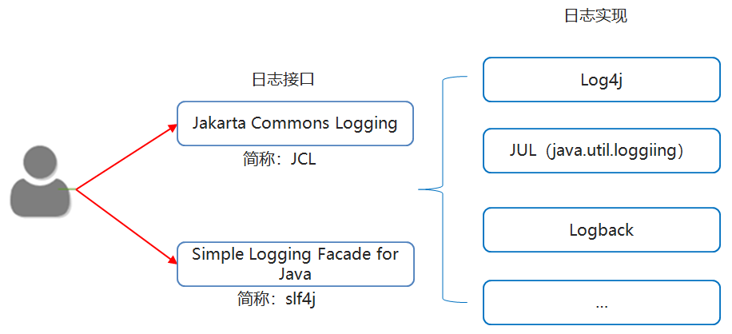

## 单元测试

#### 概述

  `JUnit` 是一个 `Java `编程语言的单元测试工具。`JUnit` 是一个非常重要的测试工具

#### 特点

`JUnit`是一个开放源代码的测试工具。

提供注解来识别测试方法。

`JUnit `在一个条中显示进度。如果**运行良好**则是**绿色**；如果**运行失败**，则变成**红色**。


编写测试方法该测试方法必须是公共的**无参数无返回值的非静态方法**

在测试方法上使用**@Test**注解标注该方法是一个测试方法

选中测试方法右键通过junit运行该方法


| **注解** | **含义**           |
| -------- | ------------------ |
| @Test    | 表示测试该方法     |
| @Before  | 在测试的方法前运行 |
| @After   | 在测试的方法后运行 |


## 日志



**日志技术与输出语句的区别**

|          | **输出语句**               | **日志技术**                             |
| -------- | -------------------------- | ---------------------------------------- |
| 取消日志 | 需要修改代码，灵活性比较差 | 不需要修改代码，灵活性比较好             |
| 输出位置 | 只能是控制台               | 可以将日志信息写入到文件或者数据库中     |
| 多线程   | 和业务代码处于一个线程中   | 多线程方式记录日志，不影响业务代码的性能 |


```properties
### log4j的配置文件,名字为log4j.properties, 放在src根目录下
log4j.rootLogger=debug,my,fileAppender

### direct log messages to my ###
log4j.appender.my=org.apache.log4j.ConsoleAppender
log4j.appender.my.ImmediateFlush = true
log4j.appender.my.Target=System.out
log4j.appender.my.layout=org.apache.log4j.PatternLayout
log4j.appender.my.layout.ConversionPattern=%d %t %5p %c{1}:%L - %m%n

# fileAppenderʾ
log4j.appender.fileAppender=org.apache.log4j.FileAppender
log4j.appender.fileAppender.ImmediateFlush = true
log4j.appender.fileAppender.Append=true
log4j.appender.fileAppender.File=D:/log4j-log.log
log4j.appender.fileAppender.layout=org.apache.log4j.PatternLayout
log4j.appender.fileAppender.layout.ConversionPattern=%d %5p %c{1}:%L - %m%n
```

```java
// 测试类
public class Log4JTest01 {

    //使用log4j的api来获取日志的对象
    //弊端：如果以后我更换日志的实现类，那么下面的代码就需要跟着改
    //不推荐使用
    //private static final Logger LOGGER = Logger.getLogger(Log4JTest01.class);

    //使用slf4j里面的api来获取日志的对象
    //好处：如果以后更换日志的实现类，那么下面的代码不需要跟着修改
    //推荐使用
    private static  final Logger LOGGER = LoggerFactory.getLogger(Log4JTest01.class);

    public static void main(String[] args) {
        //1.导入jar包
        //2.编写配置文件
        //3.在代码中获取日志的对象
        //4.按照日志级别设置日志信息
        LOGGER.debug("debug级别的日志");
        LOGGER.info("info级别的日志");
        LOGGER.warn("warn级别的日志");
        LOGGER.error("error级别的日志");
    }
}
```

#### 配置文件详解

+ 三个核心

  + `Loggers`(记录器)        日志的级别

    `Loggers`组件在此系统中常见的五个级别：`DEBUG`、`INFO`、`WARN`、`ERROR` 和 `FATAL`。

    `DEBUG < INFO < WARN < ERROR < FATAL`。

    `Log4j`有一个规则：只输出级别不低于设定级别的日志信息。

  + `Appenders`(输出源)   日志要输出的地方

    把日志输出到不同的地方，如控制台`Console`、文件`Files`等。

    + `org.apache.log4j.ConsoleAppender`（控制台）
    + `org.apache.log4j.FileAppender`（文件）

  + `Layouts`(布局)             日志输出的格式

    可以根据自己的喜好规定日志输出的格式

    常用的布局管理器：

    ​		`org.apache.log4j.PatternLayout`（可以灵活地指定布局模式）

    ​        `org.apache.log4j.SimpleLayout`（包含日志信息的级别和信息字符串）

    ​		`org.apache.log4j.TTCCLayout`（包含日志产生的时间、线程、类别等信息）

    ​	

+ 配置根`Logger`

  + 格式

    `log4j.rootLogger=日志级别，appenderName1，appenderName2，…`

  + 日志级别

    `OFF、FATAL、ERROR、WARN、INFO、DEBUG、ALL`或者自定义的级别。

  + `appenderName1`

    就是指定日志信息要输出到哪里。可以同时指定多个输出目的地，用逗号隔开。

    例如：log4j.rootLogger＝INFO，ca，fa

+ `ConsoleAppender`常用的选项

  + `ImmediateFlush=true`

    表示所有消息都会被立即输出，设为`false`则不输出，默认值是`true`。

  + `Target=System.err`

    默认值是`System.out`。

+ `FileAppender`常用的选项

  + `ImmediateFlush=true`

    表示所有消息都会被立即输出。设为false则不输出，默认值是`true`

  + `Append=false`

    `true`表示将消息添加到指定文件中，原来的消息不覆盖。

    `false`则将消息覆盖指定的文件内容，默认值是`true`。

  + `File=D:/logs/logging.log4j`

    指定消息输出到`logging.log4j`文件中

+ `PatternLayout`常用的选项

  + `ConversionPattern=%m%n`

    设定以怎样的格式显示消息

    

