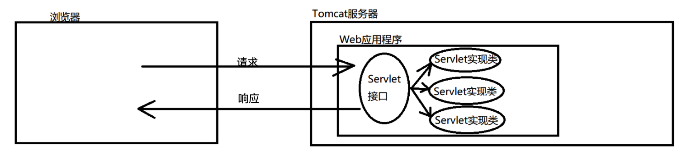
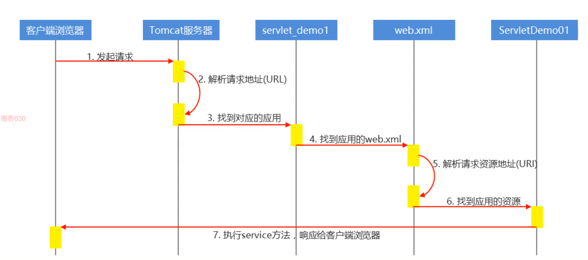
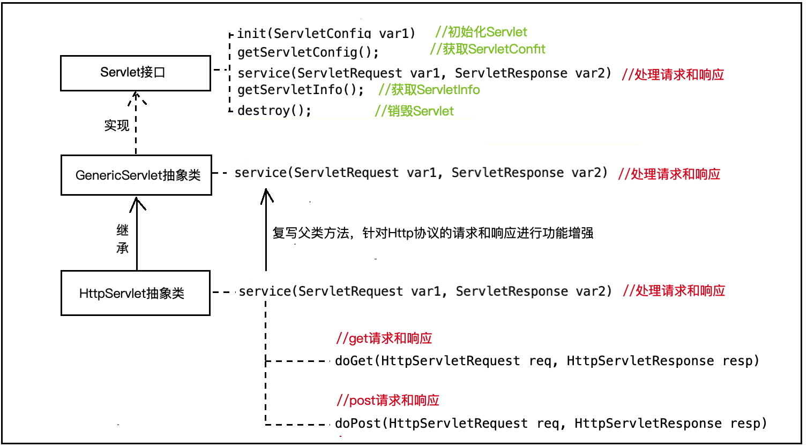
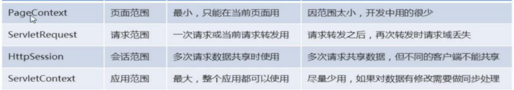

## Servlet

> Servlet是运行在Web服务器上的应用程序。Servlet本身是一个Java接口，它定义了浏览器访问服务器程序的规则，写服务器程序只需要按照需求复写Servlet方法即可。
>
> 


### Servlet的基本使用

#### 1. 编写Servlet实现类

```java
import javax.servlet.*;
import java.io.IOException;

public class Demo implements Servlet {
    @Override
    public void init(ServletConfig servletConfig) throws ServletException {
        
    }

    @Override
    public ServletConfig getServletConfig() {
        return null;
    }

    @Override
    public void service(ServletRequest servletRequest, ServletResponse servletResponse) throws ServletException, IOException {

    }

    @Override
    public String getServletInfo() {
        return null;
    }

    @Override
    public void destroy() {

    }
}
```

#### 2. 配置Servlet访问路径

要想在浏览器中能访问Servlet实现类，需要在web.xml文件中进行配置。

可使用`@WebServlet("value")`注解实现同样的功能。

```java
<!--配置ServletDemo1的全类名 -->
<servlet>
    <servlet-name>ServletDemo1</servlet-name>
    <servlet-class>cn.itheima.servlet.ServletDemo1</servlet-class>
</servlet>
<!--配置浏览器访问ServletDemo1的路径-->
<servlet-mapping>
    <servlet-name>ServletDemo1</servlet-name>
    <url-pattern>/ServletDemo1</url-pattern>
</servlet-mapping>
```

#### 3. 访问Sevlet

浏览器访问`服务器地址：端口\虚拟路径\Servlet映射路径`

#### 4. 执行流程

`init()`-->`service()`-->`destroy()`



---


### Servlet体系结构



- **HttpServletRequest对象**

  当浏览器访问服务器时，tomcat会对Http请求的数据进行解析，并封装为`HttpServletRequest(请求)`对象

- **HttpServletReponse对象**

  当服务器给浏览器返回数据时，需要将数据封装为`HttpServletReponse(响应)`对象，然后用`流(PrintWriter)`往浏览器进行输出。

---


### Servlet映射方式

一个Servlet可以通过不同的路径进行访问。

```xml
<!--一个servlet映射多个访问路径-->
<servlet>
    <servlet-name>ServletDemo4</servlet-name>
    <servlet-class>com.itheima.servlet.ServletDemo4</servlet-class>
</servlet>
<servlet-mapping>
    <servlet-name>ServletDemo4</servlet-name>
    <!--访问路径前面是servletDemo4,后面是什么无所谓-->
    <url-pattern>/servletDemo4</url-pattern>
    
    <!-- <url-pattern>*.do</url-pattern> -->
</servlet-mapping>
```

---


### Servlet创建时机

Servlet默认是在第一次访问时被创建，如果想要在服务器启动时被创建，需要在web.xml文件中进行配置。

添加`<load-on-startup>1</load-on-startup>` 配置即可，值越小优先级越高。

```xml
 <servlet>
     <servlet-name>ServletDemo4</servlet-name>
     <servlet-class>com.itheima.servlet.ServletDemo4</servlet-class>
     <load-on-startup>1</load-on-startup>
</servlet>
<servlet-mapping>
    <servlet-name>ServletDemo4</servlet-name>
    <url-pattern>/ServletDemo4</url-pattern>
</servlet-mapping>
```

---


### ServletConfig配置

`ServletConfig`是Servlet的配置对象，每一个Servlet都有专属的`ServletConfig`用来存储一些配置信息。当Servlet被创建时就会创建一个`ServletConfig`，同时Servlet被销毁时`ServletConfig`也随之销毁。

#### 配置ServletConfig

```xml
<servlet>
     <servlet-name>servlerConfigDemo</servlet-name>
     <servlet-class>com.itheima.servletconfig.ServletConfigDemo</servlet-class>
     <!--Servlet初始化参数-->
     <init-param>
         <param-name>encoding</param-name>
         <param-value>utf-8</param-value>
     </init-param>
</servlet>

<servlet-mapping>
    <servlet-name>servlerConfigDemo</servlet-name>
    <url-pattern>/servlerConfigDemo</url-pattern>
</servlet-mapping>
```

#### 获取上述配置的初始化参数

```java
public class ServletConfigDemo extends HttpServlet {

    private ServletConfig servletConfig;

    @Override
    public void init() throws ServletException {
        //获取ServletConfig
        this.servletConfig = getServletConfig();
    }

    @Override
    protected void doGet(HttpServletRequest req, HttpServletResponse resp) throws ServletException, IOException {
        //获取所有的配置名称
        Enumeration<String> keys = servletConfig.getInitParameterNames();
        while (keys.hasMoreElements()) {
            String key = keys.nextElement();
            //根据配置名称获取值
            String value = this.getInitParameter(key);//跟上课讲的有出入，局部配置的获取应该直接使用Servlet实例调用方法获取，下面的全局配置才应该使用ServletConfig或者ServletContext来调用方法获取
            //打印键和值
            System.out.println(key+":"+value);
        }
    }

    @Override
    protected void doPost(HttpServletRequest req, HttpServletResponse resp) throws ServletException, IOException {
        doGet(req,resp);
    }
}
```

---


### ServletContext对象

ServletContext代表整个Web应用(应用域)，每一个应用只有一个ServletContext对象。常用于配置和获取应用的全局初始化参数，可以实现Servlet之间的数据共享。

#### 配置全局参数

```xml
<!--配置全局编码-->
<context-param>
    <param-name>globalEncoding</param-name>
    <param-value>utf-8</param-value>
</context-param>

<!--配置全局描述信息-->
<context-param>
    <param-name>globalDesc</param-name>
    <param-value>utf-8</param-value>
</context-param> 
```

#### 获取全局参数

```java
//获取ServletContext
ServletContext servletContext = this.getServletContext();

//获取全局参数globalEncoding的值
String globalEncofing = servletContext.getInitParameter("globalEncoding");
System.out.println(globalEncofing);

//获取全局参数globalDesc的值
String globalDesc = servletContext.getInitParameter("globalDesc");
System.out.println(globalDesc); 
```

#### 获取真实路径

因为在本地编写代码的环境与项目发布后的资源环境可能会不一致，所以需要获取到资源的真实路径，避免出现因找不到资源而出现的运行异常

```java
//获取ServletContext对象
ServletContext servletContext = this.getServletContext();

//获取虚拟目录
String contextPath = servletContext.getContextPath();

//获取虚拟目录的绝对路径
String servletContextRealPath = servletContext.getRealPath("/");

//获取web/a.txt的绝对路径
String webPath = servletContext.getRealPath("/a.txt");

//获取web/WEB-INF/a.txt的绝对路径
String webInfPath = servletContext.getRealPath("/WEB-INF/a.txt");

//获取src/a.txt的绝对路径
String srcPath = servletContext.getRealPath("WEB-INF/classes/a.txt");
```

---


#### Servlet间数据共享

- 设置共享数据

  ```java
  public class Servlet1 extends HttpServlet {
      @Override
      protected void doGet(HttpServletRequest req, HttpServletResponse resp) throws ServletException, IOException {
          
          //获取ServletContext对象
  		ServletContext servletContext = this.getServletContext();
          
          //设置共享数据
          servletContext.setAttribute("username","zhangsan");
          servletContext.setAttribute("password","123");
      }
  
      @Override
      protected void doPost(HttpServletRequest req, HttpServletResponse resp) throws ServletException, IOException {
          doGet(req,resp);
      }
  }
  ```

- 获取共享数据

  ```java
  public class Servlet2 extends HttpServlet {
      @Override
      protected void doGet(HttpServletRequest req, HttpServletResponse resp) throws ServletException, IOException {
          
          //获取ServletContext对象
  		ServletContext servletContext = this.getServletContext();
          
          
          //获取username的值
         	Object username = servletContext.getAttribute("username");
          System.out.println(username);
          //获取password的值
          Object password = servletContext.getAttribute("password");
          System.out.println(password);
      }
  
      @Override
      protected void doPost(HttpServletRequest req, HttpServletResponse resp) throws ServletException, IOException {
          doGet(req,resp);
      }
  }
  ```

---


### Servlet注解开发

可简化XML配置

```java
//@WebServlet注解配置Servlet访问路径
@WebServlet("/ServletDemo")
public class ServletDemo5 extends HttpServlet {

    @Override
    protected void doGet(HttpServletRequest req, HttpServletResponse resp) throws ServletException, IOException {
		...
    }

    @Override
    protected void doPost(HttpServletRequest req, HttpServletResponse resp) throws ServletException, IOException {
        doGet(req,resp);
    }
}
```


### Serlvet请求

`Servlet`请求对应的是`ServletRequest`对象，其子类`HttpServletRequest`基于Http协议的规则对请求数据进行了封装。可使用`HttpServletRequest`对象的方法来获取请求数据，完成功能开发。

#### 获取路径

此处方法为`ServletRequest`子类`HttpServletRequest`中的方法

> `String getContextPath()`	获取虚拟目录路径
>
> `String getServletPath()`	获取Servlet的映射路径
>
> `String getRemoteAddr()`	获取访问者的ip地址
>
> `String getQueryString()`	获取请求的消息数据
>
> `String getRequestURI()`	获取统一资源标识符
>
> `String getRequestURL()`	获取统一资源定位符

#### 获取请求头信息

请求头是浏览器告诉服务器的一些请求配置信息，以键值对的形式存在。

> `public String getHeader(String name)`    获取一个请求头的值
> `public Enumeration<String> getHeaders(String name) `   获取一个请求头的多个值
> `public Enumeration<String> getHeadNames()`    获取所有请求头名称

#### 获取请求参数信息

> `public String getParameter(String name)`    根据参数名获取一个参数值
> `public String[] getParameterValues(String name) `   根据参数名获取多个参数值
> `public Enumeration<String> getParameterNames() `   获取所有的参数名称
> `public Map<String,String[]> getParameterMap() `   获取所有的参数名和参数值，并封装为Map集合

#### 请求数据封装对象

需要用到`beanutils`工具类，把jar包复制到`web/WEB-INF/lib`目录下

` BeanUtils.populate(Object o,Map<String,String[]> parameterMap)`  将参数的键值对封装为对象

注意：获取到的参数名称要与Bean对象的构造参数名称一致

#### 使用流读取请求数据

`BufferedReader getReader()`

`ServletInputStream getInputStream()`

#### 请求数据乱码解决

`req.setCharacterEncoding("utf-8")`

#### 请求转发-请求域

当客户端请求一个Servlet1时，Servlet1可以将请求转发给Servlet2，同时可以转发过程中共享数据。多次转发形成的一条请求链，叫做请求域。可以在请求域访问内共享数据。

` req.getRequestDispatcher("/servletRequestDemo").forward(req,resp);`

- 设置共享数据

```java
@WebServlet("/servletRequestDemo7")
public class ServletRequestDemo7 extends HttpServlet {
    @Override
    protected void doGet(HttpServletRequest req, HttpServletResponse resp) throws ServletException, IOException {
        //设置请求编码
        req.setCharacterEncoding("utf-8");

        //设置请求参数
        req.setAttribute("user","李四");
        req.getRequestDispatcher("/servletRequestDemo8").forward(req,resp);
    }

    @Override
    protected void doPost(HttpServletRequest req, HttpServletResponse resp) throws ServletException, IOException {
        doGet(req, resp);
    }
}
```

- 获取共享数据

```java
@WebServlet("/servletRequestDemo8")
public class ServletRequestDemo8 extends HttpServlet {
    @Override
    protected void doGet(HttpServletRequest req, HttpServletResponse resp) throws ServletException, IOException {
        //设置请求编码
        req.setCharacterEncoding("utf-8");

        //获取请求共享数据
        Object user = req.getAttribute("user");
        System.out.println(user);
    }

    @Override
    protected void doPost(HttpServletRequest req, HttpServletResponse resp) throws ServletException, IOException {
        doGet(req, resp);
    }
}
```

---


### Servlet响应

浏览器访问服务器后，服务器给客户端响应的数据会封装为ServletResponse对象，其子类HttpServletResponse对象，用于封装按照Http协议封装的响应数据。

#### 响应数据乱码解决

`resp.setContentType("text/html;charset=utf-8");`


- 使用字符流响应数据（响应字符）

`resp.getWriter().println(...)`

`resp.getWriter().write(...)`

- 使用字节流响应数据(响应文件)

`resp.getOutputStream().write(...)`


#### 定时刷新

`resp.setHeader("Refresh","3;url=/day03_Servlet/login.html");`

#### 重定向

重定向和请求转发不太一样，请求转发是只有一个请求，而重定向有两次请求。所以重定向不能通过请求域共享数据，只有在同一个请求链中才能通过请求域中心数据。

```java
resp.setStatus(302);		resp.setHeader("location",req.getContextPath()+"/servletResponseDemo");
```


#### ???文件下载

```html
<a href="/day03_Servlet/servletResponseDemo7">点击下载图片</a> 
```

```java
@WebServlet("/servletResponseDemo7")
public class ServletResponseDemo7 extends HttpServlet {
    @Override
    protected void doGet(HttpServletRequest req, HttpServletResponse resp) throws ServletException, IOException {
        //准备要下载的图片
        File file=new File("img/a.jpeg");

        //设置响应头，告诉浏览器以附件形式接受
        resp.setHeader("content-disposition","attachment;filename="+file.getName());

        //获取输出流对象
        ServletOutputStream out = resp.getOutputStream();
        //获取文件的绝对路径
        String imgPath = getServletContext().getRealPath(file.getPath());
        //获取输入流对象
        FileInputStream fis = new FileInputStream(imgPath);
        byte[] bs=new byte[1024];
        int len;
        while ((len=fis.read(bs))!=-1){
            out.write(bs,0,len);
        }
        fis.close(); 
    }

    @Override
    protected void doPost(HttpServletRequest req, HttpServletResponse resp) throws ServletException, IOException {
        doGet(req, resp);
    }
}
```


### 四大域对象



