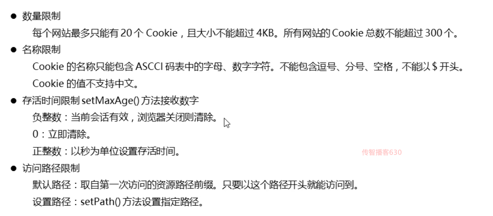
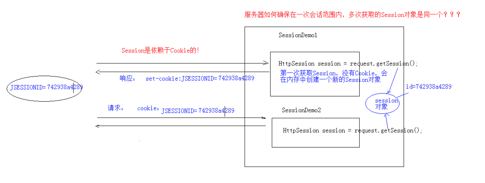
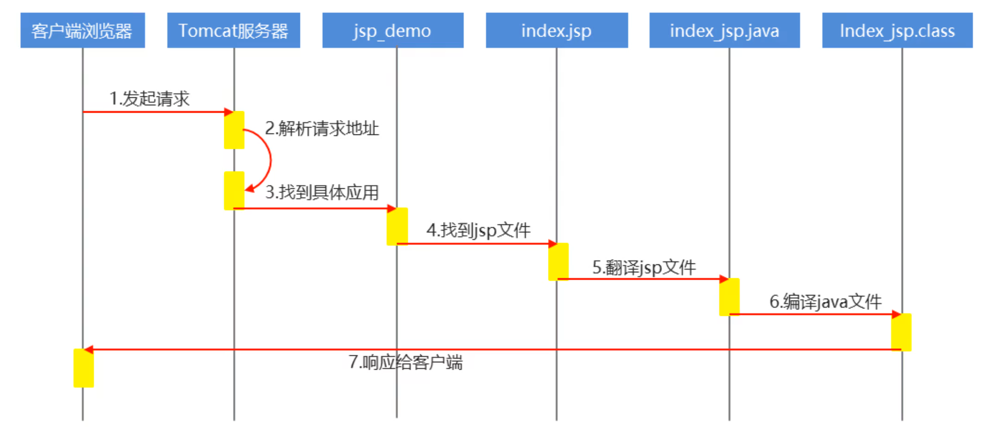
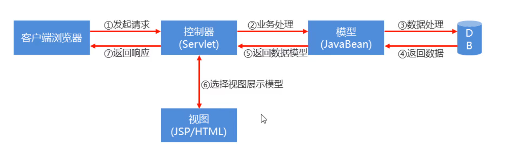

## Cookie

会话：浏览器和服务器之间的多次请求和响应

Cookie是由服务端创建，由若干个键值对组成的数据，并且随着响应以文件的形式将Cookie数据保存在客户端本地。当浏览器再次访问服务器时会携带Cookie数据，从而实现多次请求的数据共享。


### Cookie常见属性

| 属性名  | 作用             |
| ------- | ---------------- |
| name    | Cookie名称       |
| value   | Cookie的值       |
| path    | Cooke的路径      |
| domain  | Cookie的域名     |
| maxAge  | Cookie的存活时间 |
| version | Cookie的版本号   |
| comment | Cookie的描述信息 |

---

### 注意事项



---


```java
1. 一次可不可以发送多个cookie?  
    答：可以，使用response调用多次addCookie方法发送即可。

2. cookie在浏览器中保存多长时间？
    答：默认情况下，当浏览器关闭后，Cookie数据被销毁。
    如果需要持久化存储：
        setMaxAge(int seconds)
        	正数：指定cookie存活时间，时间到后，cookie文件自动失效
            负数：默认值
            零：删除cookie信息

3. Cookie能不能存储中文？
    答：不能直接存中文。但是需要采用URL编码进行后，可以存储
    //"中文" URL编码---> %E4%B8%AD%E6%96%87
    String encode = URLEncoder.encode("中文","utf-8");
    //"%E4%B8%AD%E6%96%87" URL编码---> "中文"
    String decode = URLDecoder.decode(encode, "utf-8");

4. Cookie共享问题
    1. 同一个Tomcat容器中部署多个Web项目，Cookie能在多个Web项目中共享吗？
        答： 默认情况下cookie不能共享。
        但是可以通过setPath(String path) 设置Cookie的访问范围，默认情况下，设置当前的虚拟目录。
        * 如果需要共享，可以将path设置为"/" 

    2. 不同的tomcat服务器间cookie能共享吗？
        答：也是可以的，但是需要设置访问域名。
        setDomain(String path)
            如果设置一级域名相同，那么多个服务器之间cookie可以共享
        setDomain(".baidu.com")
            那么tieba.baidu.com和news.baidu.com中cookie可以共享
```

---


## Session

Session是依赖于Cookie的，如图所示当客户端第一次请求服务端时没有Cookie,会在内存中创建一个Session对象并把sessionid通过Cookie存起来发给客户端；当客户端再次请求服务器时，会携带者sessionid到服务端找到对应的Session对象，以此来实现多次请求在服务端的数据共享。




### Session方法

```java
public HttpSession getSession();
	获取HttpSession
    注意：如果加上参数false，没有Session的话，不会自动创建。
public Object getAttribute(String name)  
    获取Session值
public void setAttribute(String name, Object value)
    设置Session值
public void removeAttribute(String name)
	移除Session值
```


## JSP

JSP（全称Java Server Pages），是一种动态网页开发技术。它既可以使用HTML标签来写页面，也可以写Java代码。其本质就是一个Servlet。

**jsp访问流程：**

1. 当客户端发送请求访问服务端的`index.jsp`页面
2. 服务器内部会把`.jsp`文件翻译成`.java`文件
3. 再编译`.java`文件生成`.class`文件
4. 由字节码完成请求与响应的操作



### jsp语法

`<%--这是注释--%>`

---

因为JSP本质上就是一个Servlet类，而我们使用Servlet的时候，其实就是对Servlet的service方法进行复写然后对请求和响应作出处理。

---

```jsp
<%--定义成员变量--%>
<%! int num=10;%>

<%--定义成员方法--%>
<%! 
    public void show(){
    	System.out.println("helloWorld");
	}
%>
<%--调用show方法--%>
<% show() %>

<%--定义局部变量--%>
<% int num=20; %>

<%--输出语句，往浏览器输出--%>
<%="成员变量："+this.num%>
<%="局部变量："+num%>
```


### jsp指令

JSP指令是用来设置与整个JSP页面相关的属性。常用指令page、include、tablib

- page指令：用来设置jsp页面的字符集、MIME响应类型、导入Java包等
- include指令：用于在当前jsp页面中引入静态或动态资源。
- tablib指令：引入第三方标签库，也可以是自定义标签

> page指令
>
> ```jsp
> <%--设置响应MIME类型,以及编码--%>
> <%@ page contentType="text/html;charset=utf-8" language="java" %>
> 
> <%--导入Java包--%>
> <%@ page import="java.util.ArrayList" %>
> 
> <%--设置jsp页面编码--%>
> <%@ page pageEncoding="utf-8"%>
> 
> <%--当页面发生错误时跳转到指定的error.jsp错误页面--%>
> <%@ page errorPage="error.jsp"%>
> ```

> include指令
>
> include 指令用于引入其他文件中的内容，使其合并到当前 JSP 页面，这些引入的文件可以是 JSP 页面、HTML 页面、文本文件或是一段 Java 代码
>
> ```jsp
> <!--将要嵌套的页面-->
> <%@ page contentType="text/html;charset=UTF-8" language="java" %>
> <html>
> <head>
>     <title>Title</title>
> </head>
> <body>
>     <%
>         SimpleDateFormat simpleDateFormat = new SimpleDateFormat("yyyy年MM月dd日--HH时mm分ss秒");
>         Date date = new Date();
>         out.println(simpleDateFormat.format(date));
>     %>
> </body>
> </html>
> ```
>
> ```jsp
> <!--将上方页面嵌套到此页面中-->
> <%@ page contentType="text/html;charset=UTF-8" language="java" %>
> <html>
> <head>
>     <title>JSP指令</title>
> 
> </head>
> 
> <body>
>     <h1>include指令引入 动态date.jsp资源</h1>
>     当前时间为：<%@include file="date.jsp"%>
> </body>
> </html>
> ```

### jsp内置对象

| 变量名      | 真实类型           | 作用                                     |
| ----------- | ------------------ | ---------------------------------------- |
| pageContext | PageContext        | 当前页面共享数据,获取其他8个内置对象     |
| request     | HttpServletRequest | 一次请求访问的多个资源共享数据(请求转发) |
| reponse     | HttpServletReponse | 响应对象                                 |
| session     | HttpSession        | 一次会话的多个请求间共享数据             |
| application | ServletContext     | 所有用户间共享数据                       |
| page        | Object             | 当前Servlet对象（this）                  |
| out         | JspWriter          | 输出对象把数据输出到页面上               |
| config      | ServletConfig      | Servlet的配置对象                        |
| exception   | Throwable          | 异常对象                                 |


### 四大域对象

| 域对象名称     | 作用范围                         | 备注     |
| -------------- | -------------------------------- | -------- |
| PageContext    | 只在当前页面共享数据             | 用的较少 |
| ServletRequest | 在同一条请求链中共享数据         | 用的较多 |
| HttpSession    | 在同一次会话的多次请求中共享数据 | 用的较多 |
| ServletContext | 在整个应用中共享数据             | 用的较少 |

---


## MVC模型

> MVC它只是一种开发设计原则，并不是新的技术。MVC只是用来指导我们改善应用程序的结构，从而得到更好的开发和维护效率。
>
> MVC是Module、View、Controller三个单词的缩写，也叫MVC三层模型，每一层负责完成不同的工作。

> Module(模型层): 模型层用于封装数据（JavaBean对象），和一些业务逻辑处理。
> Controller(控制层): 它控制着数据的流向
>     1.先接受用户的请求数据
>     2.将数据交给模型层处理
>     3.将处理后的数据交给视图层
> View(视图层):视图层用于展示数据


