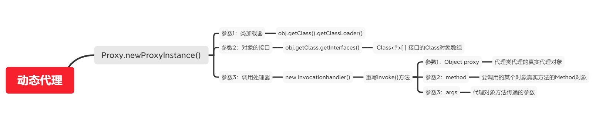

## JDBC基本使用

> JDBC是一套Java语言连接各厂商数据库的规范
>
> sun公司定义了规范，而各大数据库厂商去实现这套规范，并提供相应的jar包供开发人员使用。这套jar包称之为驱动jar包。

### 注册驱动

`com.mysql.jdbc.Driver`类中定义了静态代码块来注册驱动

```java
static {
    try {
        DriverManager.registerDriver(new Driver());
    } catch (SQLException var1) {
        throw new RuntimeException("Can't register driver!");
    }
}
```

所以在使用JDBC时可以使用

```java
Class.forName("com.mysql.jdbc.Driver");
```

来加载`Driver`类的字节码，从而执行静态代码块注册JDBC驱动

### 获取连接对象

```java
Connection conn = DriverManager.getConnection(url, username, password)
// url：固定写法——jdbc:mysql://localhost:3306/数据库名?characterEncoding=UTF-8
//使用本地数据库测试时，可以将url简写为jdbc:mysql:///数据库名?characterEncoding=UTF-8
```

### 获取执行对象

> 和数据库的连接对象。

执行对象：`Statement createStatement()`

预编译执行对象

```java
PrepareStatement prepareStatement = conn.prepareStatement("Select * from database where id = ?");
//设置占位符
prepareStatement.setInt(1);
```

**使用预编译执行对象可以防止SQL注入**


### 执行SQL语句

> 用于执行sql语句，增删改查的具体操作。

> 增删改操作，返回的是int值，代表影响行数。如果操作的影响行数为0，则代表操作失败。查询操作，返回值是ResultSet，结果集。

```java
ResultSet result = statement.executeQuery("sql");
int i = statement.executeUpdate("sql");
/*
使用Statement对象执行sql语句，会有被sql注入的风险。因为使用Statement对象执行sql，所有的参数是使用字符串拼接指定的参数。
*/

ResultSet result = prepareStatement.executeQuery();
int i = prepareStatement.executeUpdate();
/*
使用预编译对象，可以对sql提前编译，可以避免sql注入问题。
使用Connection中的prepareStatement(String sql)方法预编译sql，得到PreparedStatement对象。其中的sql如果有参数的话，参数位置用?表示，?就是一个占位符。除了?之外，就是指定sql时sql关键字语法，后期再给？赋值时，即使其中包含sql的关键字也不再当成sql语法看待，而是作为普通字符串处理。
*/
```


### 处理执行结果

结果集处理：结果集对象，用于封装查询语句的结果。

```java
while(result.next){
    //result.getXxx("xxx");
    int i = result.getInt("xxx");
}
```


### 释放资源

```java
finally {
            if (connection != null) {
                try {
                    connection.close();
                } catch (SQLException e) {
                    e.printStackTrace();
                }
            }if (statement != null) {
                try {
                    statement.close();
                } catch (SQLException e) {
                    e.printStackTrace();
                }
            }if (resultSet != null) {
                try {
                    resultSet.close();
                } catch (SQLException e) {
                    e.printStackTrace();
                }
            }
        }
```

### 事务管理

使用Connection对象中的API可以实现事务管理。

默认情况下，Connection的事务管理方式是自动提交。如果要手动提交，也就是手动管理事务，必须修改设置为不自动提交。

​	`setAutoCommit(boolean autoCommit)`// 设置为false代表不自动提交

​	`commit()`

​	`rollback()`

如果要让一组sql操作在同一个事务中，那么这组sql的执行必须使用同一个Connection。

> 事务需要添加到业务层，也就是Service层。因为业务层中的逻辑是一个整体，而DAO层是单个的数据库操作。业务层中可能一个业务方法会调用多个DAO方法组合到一起实现某个特殊需求，此时业务是整体，而不是单个sql操作是整体。


## JDBC高级

### 连接池

> 数据库连接池负责分配、管理和释放数据库连接，它允许应用程序重复使用一个现有的数据库连接，而不是再重新建立一个。这项技术能明显提高对数据库操作的性能。


## 设计模式

### 动态代理

```java
public class Main {
    public static void main(String[] args) {
        InvocationHandler handler = new InvocationHandler() {
            @Override
            public Object invoke(Object proxy, Method method, Object[] args) throws Throwable {
                System.out.println(method);
                if (method.getName().equals("morning")) {
                    System.out.println("Good morning, " + args[0]);
                }
                return null;
            }
        };
        Hello hello = (Hello) Proxy.newProxyInstance(
            Hello.class.getClassLoader(), // 传入ClassLoader
            new Class[] { Hello.class }, // 传入要实现的接口
            handler); // 传入处理调用方法的InvocationHandler
        hello.morning("Bob");
    }
}

interface Hello {
    void morning(String name);
}

```




## 连接池

