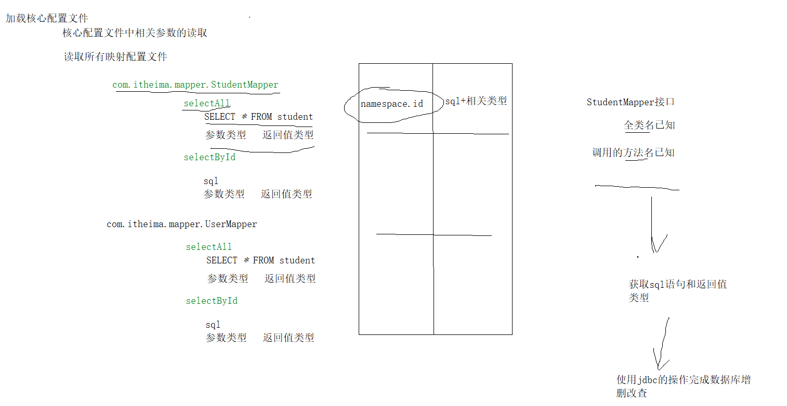

## 代理DAO

使用Mybatis动态生成DAO，可以省略DAO实现类的编写，减少代码量

### 代理DAO的规则

1. 映射配置文件的存储位置和名称要和DAO接口保持一致。（包名和文件存储路径一致。类名和映射配置文件名一致）
2. 映射配置文件中namespace属性的值，和DAO接口的全类名保持一致。
3. 映射配置中增删改查标签的id，和DAO接口中对应操作的方法名保持一致。
4. 映射配置中增删改查标签的参数类型和结果类型，和DAO接口中方法的参数类型和返回值类型保持一致。

### 获取DAO接口的实现对象

`getMapper(Class clazz)`



### 动态SQL

sql的条件不固定的时候，通过逻辑判断标签进行sql的最终确定。

#### where

此标签可以替代where关键字。

1. 如果条件都不满足，则where关键字不会出现
2. 第一个条件sql语句前的and关键字，会自动去除

#### if

通过test属性指定一个布尔类型的表达式，用于判断。判断成功才会把标签体的sql拼接到最终执行的sql上。

```xml
<if test="id != null">
```

#### foreach

属性：

- collection：用于指定集合类型
  - list：用于表示集合类型，固定写法
  - array：用于表示数组类型，固定写法
  - 属性名或者map的key值：用于表示集合在参数的属性位置或者参数为map时的key的名称

- open：sql语句拼接时开始的字符串

- close：sql语句拼接时结束的字符串

- item：遍历集合时，每一次遍历出的值存储的变量名

- separator：分隔符，各个值之间的分隔符

```xml
<!-- select * from student where id in(1,2,3,4) -->
<if test="list !=null and list.size() > 0">
       <foreach collection="list" open="id IN (" close=")" item="id" separator=",">
             #{id}
       </foreach>
</if>
```

```xml
<!-- insert into xxx values (?,?,?),(?,?,?),(?,?,?) 批量插入的演示-->
<insert id="batchInsert" parameterType="list">
        insert into student values 
        <foreach collection="list" item="student" separator=",">
            (#{student.id},#{student.name},#{student.age})
        </foreach>
</insert>
```

### 插件

MyBatis 允许在映射语句执行过程中的某一点进行拦截调用。增强Mybatis的功能

#### 分页插件

`PageHelper`

在mybatis核心配置文件中加入

```xml
<plugins>
    <plugin interceptor="com.github.pagehelper.PageInterceptor">
        <!-- 设置方言，如果不设置，插件也会自动进行判断
        <property name="helperDialect" value="mysql"/> -->
         <!-- 分页合理化参数，设置为true之后，会把分页页码的边界值判断加上，保证查询正确-->
        <property name="reasonable" value="true"/>
    </plugin>
</plugins>
```

##### API的调用

在查询语句执行之前，先调用分页助手的api进行分页的设置。

```java
PageHelper.startPage(页码数，页面大小);
//查询语句
Page<Student> list = studentMapper.selectAll();

//获取分页相关参数
PageInfo<Student> info = new PageInfo<>(list);
```

> 1. 分页设置后紧跟的第一条查询语句会自动进行分页。
> 2. 如果分页设置后有两条查询sql语句，仅第一条会分页。后面不会分页。也就是说。该分页设置的api仅会生效一次。
> 3. **当使用分页助手之后，查询结果就不再是List集合类型了，而是Page类型。分页插件底层会自动进行替换和封装。Page类型是ArrayList的子类，除了包含集合的功能之外，还加入了分页相关的所有参数的封装。**
> 4. 可以把Page对象用PageInfo对象进行封装，更利于我们使用分页相关参数

### 多表操作

#### 一对一

- 方法一

> resultMap标签：指定结果集和JavaBean的映射关系
> id标签：用于指定主键列和属性的对应关系
> 		column属性：结果集中的列名
> 		property属性：JavaBean中的属性名
> result标签：用于指定非主键列和属性的对应关系
> 		column属性：结果集中的列名
> 		property属性：JavaBean中的属性名
> association标签：用于指定一对一中对象中包含的对象的封装
> 		property属性：用于指定对象中包含的引用对象的属性名
> 		javaType属性：用于指定对象中包含的引用对象的类型
> 		id标签
> 		result标签

```xml
  <mapper namespace="com.itheima.table01.OneToOneMapper">
       <resultMap id="oneToOne" type="card">
           <id column="id" property="id" />
           <result column="number" property="number" />
           <association property="p" javaType="person">
               <id column="pid" property="id" />
               <result column="pname" property="name"/>
               <result column="age" property="age"/>
           </association>
       </resultMap>
   
       <select id="selectAll" resultMap="oneToOne">
           select c.*,p.name pname,p.age from card c,person p where c.pid = p.id
       </select>
   </mapper>
```

- 方法二

> resultMap标签：指定结果集和JavaBean的映射关系
> id标签：用于指定主键列和属性的对应关系
> 		column属性：结果集中的列名
> 		property属性：JavaBean中的属性名
> result标签：用于指定非主键列和属性的对应关系
> 		column属性：结果集中的列名
> 		property属性：JavaBean中的属性名
> association标签：用于指定一对一中对象中包含的对象的封装
> 		property属性：用于指定对象中包含的引用对象的属性名
> 		javaType属性：用于指定对象中包含的引用对象的类型
> 		select属性：用于指定另一个dao方法，调用该方法查询当前属性的值进行封装
> 		column属性：用于指定结果集中的哪一列的值当作一个参数使用，给select对应的方法传参

```xml
<mapper namespace="com.itheima.table01.OneToOneMapper">
<!--配置字段和实体对象属性的映射关系-->
<resultMap id="oneToOne" type="card">
    <id column="id" property="id" />
    <result column="number" property="number" />
    <association property="p"
                 javaType="person"
                 select="com.itheima.table01.PersonMapper.selectById"
                 column="pid">
    </association>
</resultMap>

<select id="selectAll" resultMap="oneToOne">
    select * from card
</select>
</mapper>
```

```xml
<mapper namespace="com.itheima.table01.PersonMapper">
    <select id="selectById" parameterType="int" resultType="Person">
        select * from person where id = #{pid}
    </select>
</mapper>
```

#### 一对多（多对多）

- 方法一

多表连接查询

```xml
<mapper namespace="com.itheima.table02.OneToManyMapper">
    <resultMap id="oneToMany" type="classes">
        <id column="cid" property="id"/>
        <result column="cname" property="name"/>

        <!--
            collection：一对多配置中，集合属性的配置方式
            property：被包含集合对象的属性名
            ofType：被包含集合对象泛型的数据类型
        -->
        <collection property="students"
                    ofType="student"
                    >
            <id column="id" property="id"></id>
            <result column="name" property="name"></result>
            <result column="age" property="age"></result>
        </collection>
    </resultMap>
    
    <select id="selectAll" resultMap="oneToMany">
        select s.*,c.name cname from student s,classes c where c.id = s.cid
    </select>
</mapper>
```

- 方法二

子查询

```xml
<mapper namespace="com.itheima.table02.OneToManyMapper">
    <resultMap id="oneToMany" type="classes">
        <id column="id" property="id"/>
        <result column="name" property="name"/>

        <!--
            collection：一对多配置中，集合属性的配置方式
            property：被包含集合对象的属性名
            ofType：被包含集合对象泛型的数据类型
			column：结果集中的指定列作为参数传入select指定的方法中
			select：指定另一个dao方法，执行之后的返回值赋值给当前属性
        -->
        <collection property="students"
                    ofType="student"
                    column="id"
                    select="com.itheima.table02.StudentMapper.selectAll">
        </collection>

    </resultMap>
    <select id="selectAll" resultMap="oneToMany">
            select * from classes
    </select>
</mapper>
```

```xml
<mapper namespace="com.itheima.table02.StudentMapper">

    <select id="selectAll" resultType="student" parameterType="int">
            select * from student where cid=#{cid}
    </select>
</mapper>
```

