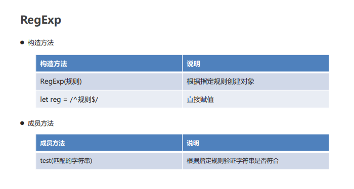
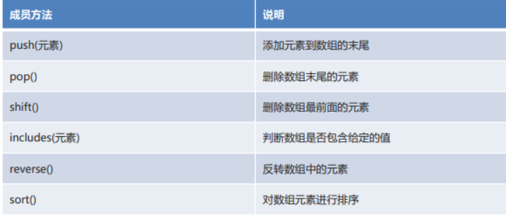
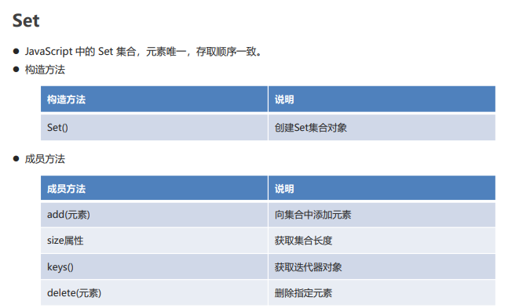
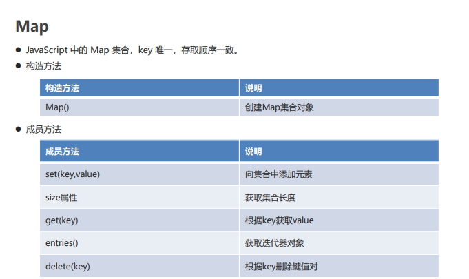
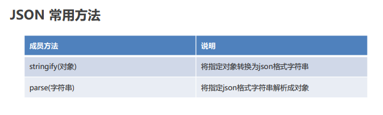

## 面向对象

>  JS是一款支持面向对象的语言，而不是一款纯面向对象的语言。

---

### 类

#### 类定义格式

```js
class demo{
    //构造方法
    constructor(var...){
        this.var = var;
        ...
    }
    //方法
    show(){
        document.write(this.var+"...");
    }
}
//创建类的对象
let d = new dame("test");
//调用类的方法
d.show	
```

#### 继承

- 继承：让类与类产生子父类的关系，子类可以使用父类有权限的成员。

- 继承关键字：extends

- 顶级父类：Object

```js
class demo2 extends demo{
    constructor(var1,var2){
        super(var1);
        this.var2 = var2;
    }
    
    childShow(){
        document.write("childShow:"+var1+var2);
    }
}
//使用基本与java一致
```

#### 字面量类

##### 定义格式

```js
let 对象名 = {
    //变量值声明
    变量名:变量值,
    变量名:变量值,
    ....
    //方法定义
    方法名:function(参数列表){
        方法体;
        return 返回值;
    }
    
}
```

##### 使用

```js
对象名.变量名;
对象名.方法名();
```

## JS内置对象

#### - Number

- `parseFloat()` 将传入的字符串转换为浮点数
- `parseint()`将传入的字符串转换为整数

---

#### - Math

- `ceil() `向上取整
- `floor()`向下取整
- `round()`四舍五入为整数
- `random()`随机数，返回值为[0,1)之间的浮点数
- `pow(x,y)`幂运算：x的y次方

---

#### - Date

##### 构造方法

- `Date()`根据当前时间创建对象
- `Date(value)`根据指定毫秒值创建对象
- `Date(year,month,[day,hours,minutes,seconds,milliseconds])`根据指定字段创建对象（月份是0-11）

##### 成员方法

- `getFullYear()`获取年份
- `getMonth()获取月份
- `getDate()`获取天数
- `getHours()`获取小时
- `getMinutes()`获取分钟
- `getSeconds()`获取秒数
- `getTime()`返回据1970年1月1日至今的毫秒数
- `toLocaleString()`返回本地日期格式的字符串

---

#### - String

##### 构造方法

- `String（value）`根据指定字符串创建对象
- `let s ="字符串" `直接赋值

##### 成员方法

- `length属性 `获取字符串长度
- `charAt（index）`获取指定索引处的字符
- `indexOf（value）`获取指定字符串出现的索引位置，找不到为-1
- `substring（start，end）`根据指定索引范围截取字符串（含头不含尾）
- `split（value）`根据指定规则切割字符串
- `replace（old，new）`返回数组使用新字符串替换老字符串

---

#### - RegExp

正则表达式：字符串匹配规则



#### - Array



#### - Set



#### - Map



#### - Json

`JSON(JavaScript Object Notation)`：是一种轻量级的数据交换格式。



---


## BOM

> `BOM(Browser Object Model)`：浏览器对象模型。
>
> 将浏览器的各个组成部分封装成不同的对象，方便进行操作。

---

### Windows窗口对象

#### 定时器

- `setTimeout(功能，毫秒值)`：设置一次性定时器。返回一个唯一标识
- `clearTimeout(标识)`：取消一次性定时器。
- `setInterval(功能，毫秒值)`：设置循环定时器。返回一个唯一标识
- `clearInterval(标识)`：取消循环定时器。

#### 加载事件

- `window.onload`：在页面加载完毕后触发此事件的功能。

---

### Location地址栏对象

#### `href` 属性

浏览器的地址栏。可以通过为该属性设置新的 URL，使浏览器读取并显示新的 URL 的内容

---


##  Js封装

> 将复杂的座机代码封装到一个js文件中，方便复用;例如将获取元素封装到js文件，使用时直接调用

- **封装：**将复杂的操作进行封装隐藏，对外提供更加简单的操作。

- **获取元素的方法**
  - `document.getElementById(id值)`：根据 id 值获取元素 
  - `document.getElementsByName(name值)`：根据 name 属性值获取元素们 
  - `document.getElementsByTagName(标签名)`：根据标签名获取元素们

