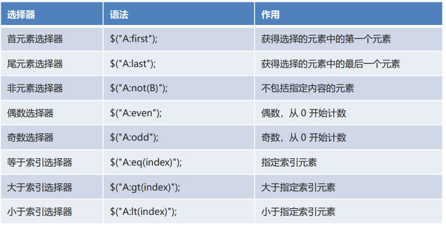

## JQuery

一款JS函数库，对原生JS进行了封装

Write less ,Do more

JQuery重点封装了对于JS中元素查找相关的API。同时还对其他操作进行封装。主要使用了面向对象的思想进行了封装。

---

### 编写流程

1. 导入jquery的js文件
2. 通过$函数查找页面元素或者将原生js对象装换为jquery对象
3. 使用jquery对象进行实际业务操作

> JQuery方式获取出来的对象和原生的JS的dom对象并不是同一类型，使用方式也不一样。

---

### JQ对象->?JS对象

#### 区别

JQ对象和JS对象不通用，JQ对象不能使用JS的属性和函数，同时JS对象也不能使用JQ对象的属性和函数。JQ对象在使用时，更贴近面向对象的使用方式，JQ对象一般通过调用函数的方式实现功能。而JS对象一般直接使用  `对象.属性`  方式进行操作。

---

#### 互相转换

##### JQ对象--->JS对象

​			此时把JQ对象看成一个JS对象的数组或者集合使用。

​			`JQ对象[索引]` 或者` JQ对象.get(索引)`

##### JS对象--->JQ对象

​			通过`$()`函数，把JS对象传入即可。

​			`let   jq对象`  =  `$(js对象);`

---

### <p id="jq_事件">JQ中的事件</p>

> 把js中事件属性的名称中的on去掉，作为函数名使用。通过传参指定要执行的逻辑。


---

#### 事件的绑定与解绑

##### 绑定

调用事件的方法时则相当于事件的绑定（<a href="#jq_事件">JQ中的事件绑定</a>），另，JQ提供了另外的绑定方法，两种方式皆可以绑定事件

JQ中提供的时间绑定方法：

`JQ对象.on(事件名称,执行的功能);`

---

##### 解绑

`jq对象.off(事件名称);`

**off中不传参会把指定对象上的所有已绑定事件都解绑。**

---

#### 事件的切换

> 需要给同一个对象绑定多个事件，而且多个事件还有先后顺序关系。

- 单独定义

```js
$(元素).事件方法名1(要执行的功能); 
$(元素).事件方法名2(要执行的功能);
 …
```

- 链式定义

```js
$(元素).事件方法名1(要执行的功能)
 	.事件方法名2(要执行的功能); 
…
```

---

#### hover()函数

模拟了一个鼠标悬停的事件。需要传入两个函数，第一个函数代表鼠标进入及悬停在组件上的时候执行的函数。第二个函数代表鼠标移出执行的函数。

```js
$("#div").hover(function (){
    $(this).css("background","red");
},function(){
    $(this).css("background","blue");
});
```

---


### 遍历

> 在jq对象上调用任何函数，都相当于在jq对象对应的所有元素上都调用了这个函数。也就是说，jq对象自带遍历效果。但是这种遍历效果只能用于“设置类”的方法，“获取类”方法不能使用这种方式。

1. 传统方式（js原生语法）

```js
for(let i = 0; i < 容器对象长度; i++){
       执行功能; 
} 
```

2. 对象.each()方法

> 在函数中，也以使用this关键字获取遍历出的元素。this也是每次遍历出的js元素对象。

```js
容器对象.each(function(index,ele){ //index：索引；ele：遍历出来的元素
         执行功能; 
});
```

3. $.each()方法

> 被遍历的容器可以是jq对象也可以是普通的js数组。
>
> 函数中是没有break和continue关键字的，如果在each中需要break或者continue，需要通过函数的返回值控制。如果返回是true，代表continue；如果返回是false，代表break
>

```js
$.each(容器对象,function(index,ele){
        执行功能;
}); 
```

4. for of语句 （js原生语法）

```js
for(ele of 容器对象){
         执行功能; 
}
```

---


### JQ选择器

> 类似于CSS的选择器，可以帮助获取元素
>
> 选择器的语法:`$()`

具体用法可参考jQuery文档；下面列举几个典型：

#### 基本选择器


- `#id`根据id属性选择元素
- `element`根据元素标签选择元素
- `.class`根据元素的class属性选择元素
- `*`选择全部元素，多用于结合上下文来搜索
- `selector1,selector2,selector3,...`将每一个选择器匹配到的元素合并后一起返回。

#### 层级选择器


#### 属性选择器


#### 过滤器选择器

> 分为以下几种类型：基本、内容、可见性、子元素、表单、表单对象属性
>
> 具体查看文档，以下列举部分：

`:not(选择器) `对选择器进行取反

**基本**



**表单对象属性**


---


### DOM操作

#### 入口函数

页面加载完成的函数，称为入口函数。即当html的DOM结构加载完成后才会执行JS的方法

```js
$(function(){
	//此处可以编写页面加载完成后执行的逻辑
})
```

---

#### 操作文本


以上方法相当于js原生语法的`innerHtml`属性

---

#### 操作对象(文档处理)

> 理解为操作解析后的DOM树结构*？？？*
>
> 具体翻文档，下面把所有的方法都列出来了


- 内部插入
  `append（content|fn）`

  >  往元素中添加一个子元素，放到所有元素的最后
  > 			append的参数，可以直接编写html标签，作为元素使用
  > 			例如：$("#div").append("<span>test</span>");

  `appendTo（content）`
  `prepend（content|fn）`
  `prependTo（content）`

- 外部插入
  `after（content|fn）`
  `before（content|fn）`
  `insertAfter（content）`
  `insertBefore（content）`

- 包裹
  `wrap（htmllele|fn）`
  `unwrap（）`
  `wrapAll（html|ele）`
  `wrapInner（htmllele |fn）`

- 替换
  `replace With（content|fn）`
  `replaceAll（selector）`

- 删除
  `empty（）`清空所有子元素，调用者不会被删除
  `remove（[expr]）` 移除自己，无需父元素就可以删除

  `detach（[expr]）`

- 复制
  `clone（[Even[，deepEven]）`

---

#### 操作样式


---

#### 操作属性


> `prop()`：该方法用于获取一些状态相关的属性，能够把默认的`false`、`true`设置上。隐含的属性也能获取。
>
> 一般用于设置一些**固有属性**，**非固有属性推荐使用`attr()`**。
>
> *固有属性*：在html规范中，已经约定好了此元素具有的属性。通过查看html文档能够在属性列表中看到的属性才是固有属性。

---

### 效果API

> 使用`show()`和`hide()`方法可以使元素显示或隐藏。这两个方法可以传入播放时长携带动画效果。
	
`show()`:只有元素处于隐藏状态才能调用show显示它
	`hide()`:只有元素处于显示状态才能调用hide隐藏它

