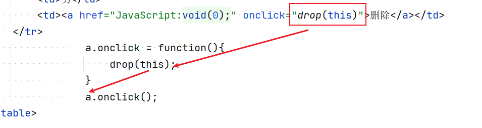

## js基础

客户端脚本语言，弱类型，运行在浏览器，无需编译，解析执行

### 组成

- ECMAScript：简称ES，现主流使用的ES5或ES6版本
- JS = ES（规定基本语法）+ DOM（规定文档操作）+ BOM（规定浏览器端组件操作）


### 引入方式

- 内部引入

```html
<script>
	alter("hello");
    ...
</script>
```

- 外部引入

```html
<script src = "xxx.js"></script>
```

>注意：
>
>1. 标签不能是自闭合的
>2. 标签内部不能编写js代码，否则会被忽略掉

---


### 基础语法

#### 注释

```js
//单行注释

/*
多行注释
*/
```


#### 弹窗和输出

`alert`：弹出警告框

`confirm`：弹出确认框

`prompt`：弹出输入框

`console.log()`：在控制台输出内容

`document.write()`: 往当前页面中写出内容。支持html格式标签。往页面文档中追加数据。


#### 变量

`let`  局部变量

`const`：常量

`var`：所有类型变量定义。老版本中的关键字

> ***js是弱类型语言，定义变量时不必指定数据类型**
>
> 变量的数据类型，仅和当前变量中存储的数据的类型相关。是可以随时发生变化的。


#### 数据类型

分为引用类型、原始类型。

**原始类型包含：Undefined、Null、Boolean、Number 、Bigint和 String**

typeof运算符：可以实时计算出某个变量当前的数据类型。


#### 运算符

与java不同的运算符：==与===的区别：

> == ：比较两个变量的值是否相同，和类型无关。
>
> ===：比较两个变量的类型和值是否都相同

其他运算符与java一致


#### 类型转换

1. 其他类型转boolean

   ​	使用!进行取反操作，可以把其他数据类型转为boolean

   > 数字类型，只有0和NaN会转为false，其余为true
   >
   > undefined会转为false
   >
   > 字符串类型，空字符串会转为false，其余长度大于零的字符串转为true
   >
   > 空对象（null）转为false，非空对象转为true

2. 字符串转数字

   ​	使用+（正号）运算符进行转换。

   ​	如果是非数字字符串，转换为NaN。

3. boolean转数字

   ​	true为1，false为0


#### 数组

在JS中，数组实际上是一个对象。

JS中的数组没有数据类型和长度的限制。更像Java中的一个`List\<Object>`

**定义**

```javascript
let arr1 = [1,2,3];
let arr2 = new Array();
```

**方法**

`push()`：向数组末尾添加一个元素。

`pop()`：从数组末尾删除一个元素并返回


#### 函数

把一段代码块封装到函数中，通过函数名称可以重复调用。

在js中，函数实际是一个对象。Function类

##### 定义方式

```js
function 函数名称(参数列表){
    函数体
}

//匿名函数：
let 函数名称 = function (参数列表){
    函数体
}
```

##### 函数的特征

1. 函数的声明**无需指定返回值类型和参数类型。**

2. 函数的**参数声明实际只有象征意义**。参数的实际个数和类型都是随意的。函数内部**可以使用arguments数组获取实际参数**

   ```js
   function getSum(num1,num2){
       return arguments[0] + num2;// 使用arguments[0]相当于获取的就是num1的值
   }
   ```

3. js中的**函数没有重载**，如果定义多个同名函数，后边定义的会覆盖前面定义的

4. 由于函数是对象，所以**函数本身可以进行引用传递**。

   ```js
   function getSum(num1,num2){
       return num1 + num2;
   }
   let getSum2 = getSum;// 此时getSum2也是一个函数类型的对象。
   
   //调用方法
   let result = getSum2(10,20);
   document.write(result + "<br>");
   ```


#### DOM操作

DOM就是把HTML文档加载进内存，形成一颗树形结构。html中的标签、属性、文本...都会封装为节点对象（Node）。而在Node中，又进行了细分。

> - Document：代表整个文档。
>
> - Element：代表元素对象。
>
> - Attribute：代表属性对象。
>
> - Text：代表文本对象。
>
> > **上述对象都是Node的子类对象。**


DOM操作主要就是通过对象的API操作dom树的增删改查。也就是动态的对html页面进行控制。

##### 获取元素

`getElementById()`							最常用   根据id属性值获取元素对象.

`getElementsByTagName()`  	 		根据元素名称获取元素对象们，返回数组

`getElementsByClassName()`  	 	根据class属性值获取元素对象们，返回数组

`getElementsByName()`   				  根据name属性值获取元素对象们，返回数组

`子元素对象.parentElement属性`   	获取当前元素的父元素


##### 文本操作

`innerText`

`innerHTML`（常用）

上述两个属性都能设置标签的标签体内容。只不过innerText用于指定纯文本，不支持html标签。innerHTML支持html标签。


#### 事件

类似web中的Listener监听器。

##### 事件监听机制

当某个关心的操作发生时，自动调用提前设定好的一段逻辑。这套机制就是事件监听机制。

“关心的操作”的发生就是事件。


##### 事件编写要素

1. 关心的元素是谁
2. 关心的操作是什么(事件类型)
3. 触发的逻辑是什么（通过函数表示）


##### onfocus和onblur

- `onfocus`获取焦点事件，`onblur`失去焦点事件。

  ​	焦点：一个元素如果获取了焦点，那么它就可以跟用户进行交互。只有获取了焦点的元素才能失去焦点。

- `onload`图片或者窗口加载的事件，当某个图片或窗口加载完毕后执行。

- `onsubmit`表单提交事件，在表单提交之前触发。可以用于做表单校验。


##### 事件绑定方式

- **在html标签内部，通过onXXX属性指定**

html元素的属性，值都是字符串。该字符串会被底层js引擎封装到一个函数对象中作为函数体使用。然后把函数对象赋值给dom元素对象。如果在此处要调用自定义的函数，要写小括号。

- **通过dom操作获取到元素对象，给onXXX属性赋值**

元素对象的onXXX属性，本身数据类型就是Function类型的。所以给它赋值的时候直接赋值为一个函数即可。所以如果指定自定义函数，不能添加小括号


#### js中的this

在js中，this用于函数中获取调用该函数的对象。谁调用了这个函数，this就是谁。

举例：  

```js
let  a = document.getElementById("id");
a.onclick = function(){
    alert("单击事件");

};

js引擎底层会判断，如果a标签被点击了。则引擎会调用该函数。
a.onclick();// 此时，onclick函数是a这个变量调用的。所以在此函数中，如果使用this，则this就是这个a。
```




