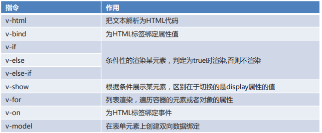
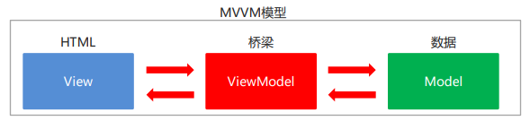
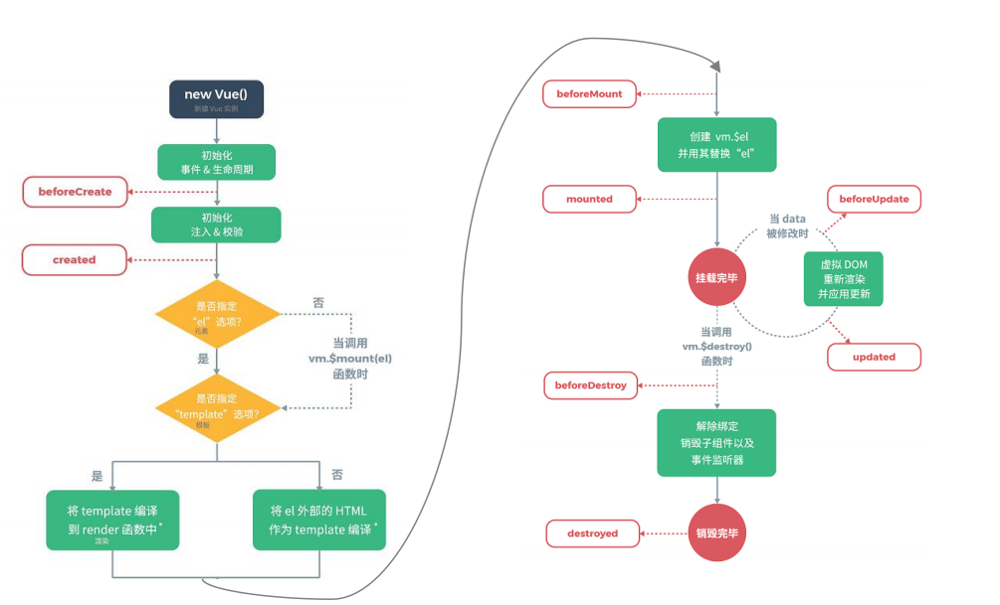
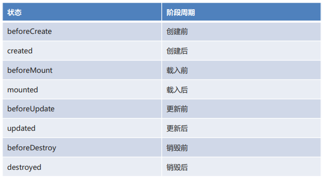

## VUE

### VUE简介

vue是一款主要关注于视图的渐进式前端框架，采用MVVM的思想进行设计。

M：model，数据模型。在vue的data部分体现 

V：View，视图。在vue中通过el管理一块视图。

VM：ViewModel，用于绑定数据和视图。在vue中实际就是vue对象本身。

> 在vue中，vue对象中的data就是模型层。html元素就是视图层。vue对象就是vm。

#### 使用流程

1. 导入`vue`的js文件
2. 创建VUE入口对象

```html
<html>
    <body>
        <div id="div">
            {{msg}}
        </div>
    </body>
    <script src="js/vue.js"></script>
    <script>
        new Vue({
        	el:"#div",
        	data:{
            	msg:"Hello Vue"
       		}
   		 });
    </script>
</html>
```

#### 参数介绍

> - VUE核心对象：每一个VUE程序都是从一个VUE和新对象开始的
> - 选项列表：
>   - el选项：用于接收获取到页面中的元素。(根据常用选择器获取)。
>   - data选项：用于保存当前Vue对象中的数据。在视图声明的变量需要在此处赋值。
>   - methods选项：用于定义方法。方法可以直接通过对象名调用，this代表当前Vue对象。
> - 数据绑定
>   - 在视图部分获取脚本部分的数据。
>     {{变量名}}

---


### Vue指令

**Vue指令：**在vue中定义了一套专门操作视图相关的属性，都以v-开头。这些属性只有在vue对象管理的元素中可以使用。具有一些特殊的功能的属性。


#### 常用指令




#### 文本操作

- `{{}}`   插值表达式，在标签体中使用。把vue的模型数据中的值获取出来

- **`v-html`**：指令，用于把vue的模型数据中的值获取出来作为标签体使用。支持html标签的解析。相当于innerHTML

- `v-text`：相当于innerText，不支持html标签


#### 属性绑定

`v-bind`：把vue的模型数据中的值，设置给指定的属性。(单向绑定)

`v-bind`可以使用在**属性名前添加`:`的方式替代**


#### 条件渲染

- `v-if`：条件性的渲染某元素，判定为真时渲染,否则不渲染。*控制元素是否加载进DOM树*

- `v-else`：条件性的渲染。

- `v-else-if`：条件性的渲染。

- `v-show`：根据条件展示某元素，区别在于切换的是display属性的值。*控制元素的display属性，也就是是否显示。*


#### 条件渲染

`v-for`：列表渲染，遍历操作，可以**重复渲染当前元素**，遍历容器的元素或者对象的属性。


#### 事件绑定

`v-on`：使用vue入口对象中声明的方法，绑定到当前元素的事件上。事件对应的函数可以加括号也可以不加

`v-on`可以使用`@`符号替代


#### 表单绑定

- **表单绑定**
  v-model：在表单元素上创建双向数据绑定。（和`bind`类似，但具有双向效果）

  *注意：v-bind只绑定数据到视图。当数据更改时，视图会刷新。而视图修改时，数据不变。只是单向绑定。*

- **双向数据绑定**
  更新data数据，页面中的数据也会更新。
  更新页面数据，data数据也会更新。

- **MVVM模型(Model View View Model)：是MVC模式的改进版**
  在前端页面中，JS对象表示Model，页面表示View，两者做到了最大限度的分离。
  将Model和View关联起来的就是ViewModel，它是桥梁。
  ViewModel负责把Model的数据同步到View显示出来，还负责把View修改的数据同步回Model。

  

---


## Vue高级

### 自定义组件

> 组件是可复用的 Vue 实例，且带有一个名字。每一个组件，实际上就是一个Vue对象，它有自己独立的数据、方法、属性...
>
> 对于自定义组件来说，它无需指定el属性，而是通过template指定它对应的视图模板。
>
> 规则是视图模板必须只有一个根标签。
>
> 组件的数据模型是通过函数返回的，目的就是组件在复用时，数据都是独立的。

定义格式：

```js
Vue.component(组件名称, {
 props:组件的属性,
 data: 组件的数据函数,
 template: 组件解析的标签模板
})
```


### Vue生命周期




生命周期的八个阶段：



> created：此时对象的数据模型已经初始化完毕。是我们修改数据最早的时机。
>
> mounted：虚拟dom已经挂载完毕并替换到真实dom中。
>
> vue渲染的dom树，是一个虚拟的dom。在挂载时，把虚拟dom中的数据都处理完毕后，替换页面中原始的dom树进行页面展示。
>
> 生命周期方法，无需定义在methods中，而是和el、data这些属性并列进行定义。一旦定义完毕，vue对象会在生命周期执行到对应阶段时自动触发这些函数的执行。


### VUE的异步操作

`axios`:axios是基于`promise`的一个浏览器端js客户端工具，用于发送异步请求。基于AJAX

> - **promise**用于封装未来要执行的一些逻辑，通过回调函数告知我们是否执行成功。回调函数如下：
>   - then：代表逻辑正常执行，可以把结果传递给我们。
>   - catch：代表逻辑执行出错，可以把异常传递给我们。		
>   - finally：代表无论如何最终都要执行的一段逻辑。
>
> - axios的get或者post请求函数，返回值就是一个promise对象。
>
> - 当请求成功，响应回来时，回调then方法，同时把response对象传递过来。
>
> response包含的信息如下：（data需要重点关注，其余的了解即可）
>
> ```js
> {
>   // `data` 表示服务器返回的响应数据，我们以json的方式接收，推荐服务器返回json即可
>   data: {},
>   // `status` 是响应状态码
>   status: 200,
>   // `headers` 代表响应头信息
>   // 例如: `response.headers['content-type']`
>   headers: {}
> }
> ```
>
> - 当请求失败，响应回来，回调catch方法，同时会把异常对象传递过来。
>
> 异常对象中，包含了response对象和request对象。主要关注response对象。
>
> 通过error.response.status，可以拿到错误的状态码，以定位具体错误类型。


#### 请求的发送方式

##### get请求

第一种方式：

```js
axios.get('/user?ID=12345&name=zs')
```

第二种方式：

```js
axios.get('/user', {//此处的params是一个固定的key，不能修改
    params: {
      ID: 12345,
      name:"zs"
    }
  })
```


##### post请求

第一种方式

```js
axios.post('/user',"ID=12345&name=zs")
```

第二种方式

```js
axios.post('/user', {// post无需通过params指定，直接json封装参数即可
    firstName: 'Fred',
    lastName: 'Flintstone'
  })
```

> 注意：get和post中的第一种发送方式底层请求时，请求头中content-type，也就是**请求的数据类型都是表单类型**，即：`application/x-www-form-urlencoded`。在后台可以使用`request.getParameter`获取参数。
>
> 第二种方式，**底层content-type不是表单格式**，而是`application/json`。**不能**用request.getParameter获取参数。**必须把请求整体作为一个json字符串转为对象使用**。
>
> 可以使用如下代码强制发送表单格式数据。（没必要）
>
> ```
> const params = new URLSearchParams();
> params.append('param1', 'value1');
> params.append('param2', 'value2');
> axios.post('/foo', params);
> ```

> https://github.com/axios/axios
>
> [axios中文文档|axios中文网 | axios (axios-js.com)](


## Element Ui

> Element：网站快速成型工具。是饿了么公司前端开发团队提供的一套基于Vue的网站组件库。
>
> **使用Element前提必须要有Vue。**
>
> **具体使用参考Element官网**
>
> Element官网：https://element.eleme.cn/#/zh-CN


### 开发步骤

> 1. 引入Vue文件
> 2. 引入element样式文件
> 3. 引入element js文件
> 4. 编写element组件
> 5. 通过VUE和新对象加载元素


### 基础布局

*栅格布局*；将页面分成最多24个部分，自由切分

```html
          <el-row>
            <el-col :span="12"><div class="grid-content bg-purple"></div></el-col>
            <el-col :span="12"><div class="grid-content bg-purple-light"></div></el-col>
          </el-row>
```


### 容器布局

`<el-container>`：外层容器。当子元素中包含 `<el-header>` 或 `<el-footer>` 时，全部子元素会垂直上下排列，否则会水平左右排列。

> <el-container>` 的子元素只能是后四者或者是自己本身，后四者的父元素也只能是 `<el-container>

`<el-header>`：顶栏容器。

`<el-aside>`：侧边栏容器。

`<el-main>`：主要区域容器。

`<el-footer>`：底栏容器


### 表单组件

- 属性：
  - model：指定当前表单整体绑定的模型数据。一般是一个json对象。表单的各种数据相关功能，都需要该属性绑定支持。	
  - rules：表单校验的规则。可以完成表单项数据的校验。
    - 校验时，el-form-item的prop属性指定的名称，就是校验规则中json对象的key 的名称。
    - 校验规则由数组定义，可以定义一组不同的校验规则和触发方式及错误提示信息。
  - ref：给当前的表单对象起一个引用名称，后续我们如果在代码中要获取当前表单对象，可以使用ref引用它。

> 箭头函数：类似于java中的Lamda表达式。用于简写匿名函数。在js中，箭头函数没有自己的this关键字。如果在箭头函数中使用this，相当于在箭头函数外使用this。

---


### 表格组件

- 属性
  - data：指定一个json对象数组。数组中每个json对象代表表格中的一行记录。json对象的key和el-table-column的prop属性要对应起来。element会自动把每一行和每一列填充的表格中。

- 获取当前行数据

  - 作用域插槽

  - ```html
    <el-table-column
      label="操作"
      width="180">
        <template slot-scope="scope">
            <el-button
                    @click="handleEdit(scope.row)">编辑</el-button>
            <el-button
                    @click="handleDelete(scope.row)">删除</el-button>
        </template>
    </el-table-column>
    ```

  在表格列中，使用template标签的slot-scope属性可以指定一个作用域插槽变量。该变量中封装了当前行的数据。用row属性获取。

### 导航栏组件


## 补充

如果将表单双向绑定到数据，在编辑表单的时候，数据也会发生变化，如果一组数据绑定了多个表单，例如同时绑定了展示数据与Dialog编辑数据表单，在修改dialog表单时，页面表单数据也会发生变化，所以可以使用以下方法解决：

```js
this.editFormData = JSON.parse(JSON.stringify(row));
```


