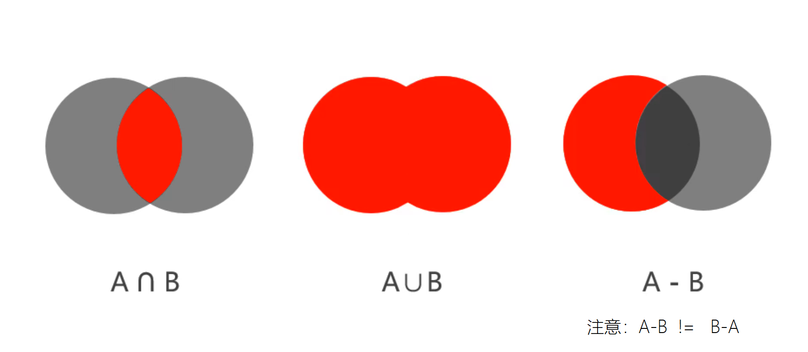
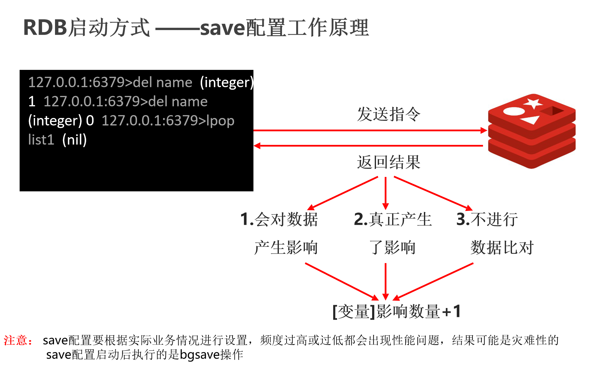
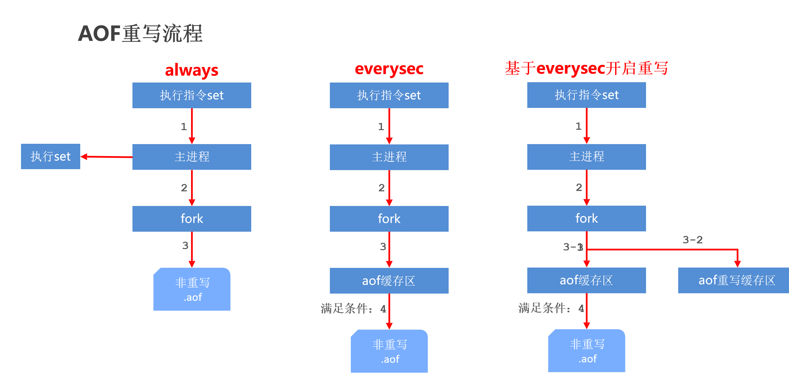
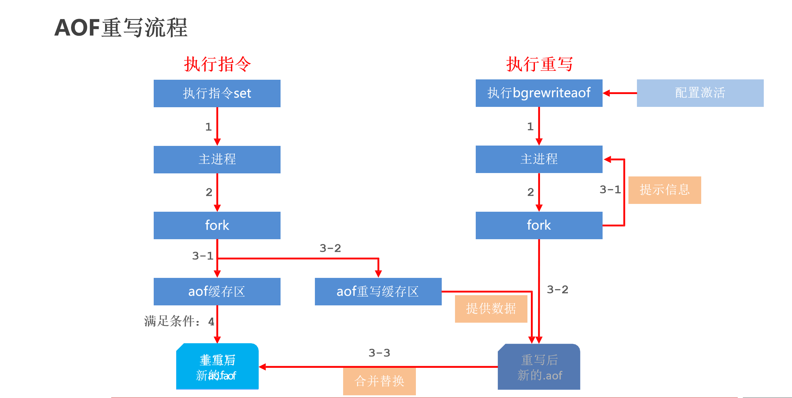

## redis

### NoSql概念

NoSQL：即 Not-Only SQL（ 泛指非关系型的数据库），作为关系型数据库的补充，使用内存进一步加快访问的速度，但是并不会替换原有关系数据库的地位。 作用：应对基于海量用户和海量数据前提下的数据处理问题。起缓存作用。

目前市面上常见的Nosql产品：Redis、memcache、HBase、MongoDB

**作用**：支撑大数据量高并发的使用场景。

**使用场景**：

1. 作为缓存，加快某些高频访问数据的查询速度。
2. 实时刷新的数据展示。
3. 时效性数据的存储。
4. 分布式集群中session的共享。


### redis

概念：Redis (REmote DIctionary Server) 是用 C 语言开发的一个开源的高性能键值对（key-value）数据库 ，存储在内存中，是单线程系统。  


#### 配置项

> 1. `daemonize` `no/yes`   是否在后台启动redis
> 2. `logfile` 指定日志文件路径，如果设定了logfile，那么控制台将不再输出日志。
> 3. `loglevel ` 日志级别   `debug|verbose|notice|warning`
> 4. `bind ` 绑定ip地址
> 5. `port`  指定绑定的端口号。默认为6379
> 6. `dir`  临时文件存储的位置
> 7. `timeout`  超时时间
> 8. `maxclients`   最大连接的客户端数量，默认为0，代表不限制。


#### 数据类型

- String 字符串
- list 列表集合
- set 无序集合
- hash key-value形式的map集合
- sorted set 有序集合


#### redis命令

> 服务端启动：
>
> ​	指定端口启动：`redis-server --port 6379`
>
> ​	指定配置文件启动：`redis-server redis.conf`
>
> 客户端启动：
>
> ​	redis-cli [-h host] [-p port]


##### String相关

> String类型每个key存储单个字符串类型数据

- 添加/修改数据 :`set key value`
- 获取数据：`get key` 
- 删除数据：`del key`（通用操作）
- 判定性添加数据：`setnx key value`
- 添加/修改多个数据：`mset key1 value1 key2 value2 ....`
- 获取多个数据：`mget key1 key2 ....`
- 获取数据字符个数：`strlen key`
- 追加数据到原始信息后补（如果原始心存在就追加，否则创建）：`append key value`

**String扩展操作**

- 设置数值数据增加指定范围的值:
  - `incr key` 
  - `incrby key increment`
  - `incrbyfloat key increment`
- 设置数值数据减少指定范围的值：
  - `decr key`
  - `decrby key increment`
- 设置数据具有指定的生命周期
  - `setex key seconds value` 
  - `psetex key milliseconds value`

>- 数据操作不成功的反馈与数据正常操作之间的差异
>
>  - > 表示运行结果是否成功 
>    >
>    > ​	(integer) 0 → false 失败 
>    >
>    > ​	(integer) 1 → true 成功 
>    >
>    > 表示运行结果值 
>    >
>    > ​	(integer) 3 →  3个
>    >
>    > ​	(integer) 1 →  1个 
>
>- 数据未获取到时，对应的数据为（nil），等同于null 
>
>- 数据最大存储量：512MB 
>
>-  string在redis内部存储默认就是一个字符串，当遇到增减类操作incr，decr时会转成数值型进行计算
>
>- 按数值进行操作的数据，如果原始数据不能转成数值，或超越了redis 数值上限范围，将报错 
>
>  - 最大值：9223372036854775807（java中Long型数据最大值，Long.MAX_VALUE） 
>
>- redis所有的操作都是原子性的，采用单线程处理所有业务，命令是一个一个执行的，因此无需考虑并发带来的数据影响

---


##### Hash相关

> 底层使用哈希表结构实现数据存储,每个key存储一个键值对
>
> - key 
>   - filed1 value1 
>   - filed2 value2
>   - .....
>
> 如果field数量较少，存储结构优化为类数组结构
>
> 如果field数量较多，存储结构使用HashMap结构

- 添加/修改数据：`hset key field value`
- 获取数据：
  - `hget key field`
  - `hgetall key`
- 删除数据：`hdel key field1 [field2 ...]`
- 设置filed的值，如果改field存在则不做任何操作：`hsetnx key filed value`
- 添加/修改多个数据：`hmset key filed value field1 value1 ...`
- 获取多个数据：`hmget key field1 field2 ...`
- 获取哈希表中字段的数量：`hlen key`
- 获取哈希表中是否存在指定的字段：`hexists key field`

**扩展操作**

- 获取哈希表中所有的字段名或字段名
  - 字段名：`hkeys key`
  - 字段值：`hvals key`
- 设置指定字段的数值数据增加指定范围的值
  - `hincrby key field increment`
  - `hincrbyfloat key field increment`

>- hash类型中value只能存储字符串，不允许存储其他数据类型，不存在嵌套现象。如果数据未获取到，对应的值为（nil）。
>
>- 每个 hash 可以存储 2^32 - 1 个键值对
>  hash类型十分贴近对象的数据存储形式，并且可以灵活添加删除对象属性。但hash设计初衷不是为了存储大量对象而设计 的，不可滥用，更不可以将hash作为对象列表使用。
>
>- hgetall 操作可以获取全部属性，如果内部field过多，遍历整体数据效率就很会低，有可能成为数据访问瓶颈。

---


##### list相关

> 可以用list模拟**栈**、**队列**等数据结构

> 一个key可以存储多个值，且可以双向存储、双向取值


- 添加数据：
  - `lpush key value1 [value2 ....]`
  - `rpush key value1 [value2....]`
- 获取数据
  - `lrange key start stop`
  - `lindex key index`
  - `llen key`
- 获取并移除数据
  - `lpop key`
  - `rpop key`

**扩展**

- 移除指定数据`lrem key count value`
- 规定时间内获取并移除数据
  - `blpop key1 [key2 ...] timeout`
  - `brpop key1 [key2 ...] timeout`
  - `brpoplpush source destination timeout`

> - list中保存的数据都是string类型的，数据总容量是有限的，最多2^32 - 1 个元素(4294967295)。
>
> - list具有索引的概念，但是操作数据时通常以队列的形式进行入队出队操作，或以栈的形式进行入栈出栈操作
>
> - 获取全部数据操作结束索引设置为-1
>
> - list可以对数据进行分页操作，通常第一页的信息来自于list，第2页及更多的信息通过数据库的形式加载

---


##### set相关

> 与hash存储结构完全相同，仅存储键，不存储值（nil），并且值是不允许重复的

- 添加数据:`sadd key member1 [member2]`
- 获取全部数据:`xxxxxxxxxx smembers key`
- 删除数据:`srem key member1 [member2]`
- 获取集合数据总量:`scard key`
- 判断集合中是否包含指定数据:`sismember key member`
- 随机获取集合中指定数量的数据:`srandmember key [count]`
- 随机获取集中的某个数据并将该数据移除集合:`spop key [count]`

**扩展操作**

- 求两个集合的交、并、差集

  - ```redis
    sinter key1 [key2 …]  
    sunion key1 [key2 …]  
    sdiff key1 [key2 …]
    ```

- 求两个集合的交、并、差集并存储到指定集合中

  - ```redis
    sinterstore destination key1 [key2 …]  
    sunionstore destination key1 [key2 …]  
    sdiffstore destination key1 [key2 …]
    ```

- 将指定数据从原始集合中移动到目标集合中

  - ```redis
    xxxxxxxxxx smove source destination member
    ```



> set 类型不 允许数据重复，如果添加的数据在 set 中已经存在，将只保留一份。
>
> set 虽然与hash的存储结构相同，但是无法启用hash中存储值的空间。

---


##### key相关（通用操作）

- 删除指定key

```bash
del key
```

- 获取key是否存在

```bash
exists key
```

- 获取key的类型

```bash
type key
```

- 排序

```bash
sort
```

- 改名

```bash
rename key newkey
renamenx key newkey
```

**扩展操作**

***时效性相关***

- 为指定key设置有效期

```bash
expire key seconds
pexpire key milliseconds
expireat key timestamp
pexpireat key milliseconds-timestamp
```

- 获取key的有效时间

```bash
ttl key
pttl key
```

- 切换key从时效性转换为永久性

```bash
persist key
```

***查询相关***

- 查询key

```bash
keys pattern
```

- 查询模式规则

`*`匹配任意数量的任意符号

`?`配合一个任意符号	

`[]`匹配一个指定符号

```bash
keys *  keys    查询所有
it*  keys       查询所有以it开头
*heima          查询所有以heima结尾
keys ??heima    查询所有前面两个字符任意，后面以heima结尾 查询所有以
keys user:?     user:开头，最后一个字符任意
keys u[st]er:1  查询所有以u开头，以er:1结尾，中间包含一个字母，s或t
```


#### 数据库的基本操作

- 切换数据库

​	redis默认提供了0-15共16个数据库空间

```
select index
```

- 其他操作

```
ping //返回pong为正常
```

- 数据移动

```
move key db
```

- 数据总量

```
dbsize
```

- 数据清除

```
flushdb  flushall
```


### Jedis

> Jedis是用于java语言连接redis服务，并提供对应的API,内部的API和redis的命令是一致的。
>

jar包（基于maven）

```xml
<dependency>
<groupId>redis.clients</groupId>
<artifactId>jedis</artifactId>
<version>2.9.0</version>
</dependency>
```

连接流程

```java
Jedis jedis = new Jedis("localhost", 6379);//连接redis服务
jedis.set("name", "itheima");  jedis.get("name");//执行redis命令
jedis.close();//关闭连接
```


##### Jedis连接池

- `JedisPool`：Jedis提供的连接池技术 

- `poolConfig`:连接池配置对象 

- `host:redis`服务地址

- `port:redis`服务端口号

JedisPool构造器如下：

```java
public JedisPool(GenericObjectPoolConfig poolConfig, String host, int port) {
	this(poolConfig, host, port, 2000, (String)null, 0, (String)null);
}
```

获取jedis对象：(下面代码没写全)

```java
ResourceBundle bundle = ResourceBundle.getBundle("redis");//用于读取properties文件，且不必写全后缀
bundle.getString("redis.maxTotal");//获取键为`redis.maxTotal`的值
JedisPoolConfig jpoolconfig = = new JedisPoolConfig();//获取jdeis连接池配置对象
jpoolconfig.setMaxTotal(maxTotal);//设置最大连接数
jpoolconfig.setMaxIdle(maxIdel);//设置最大空闲数
JedisPool jp = new JedisPool(jpoolconfig,bundle.getString("redis.host"),bundle.getString("redis.port"));
```

获取连接对象

```java
Jedis jedis = jedisPool.getResource();
```


### 持久化

> 利用永久性存储介质将数据进行保存，在特定的时间将保存的数据进行恢复的工作机制称为持久化 。
>
> 持久化用于防止数据的意外丢失，确保数据安全性。
>
> **储存方式：**
>
> 1. 存储数据快照，就是把某一时刻的数据全部拷贝存储到文件中。   
> 2. 存储所有的操作，把文件从创建开始到目前某一时刻为止的所有操作都记录下来，使用日志实现。


#### RDB

> 快照形式存储数据
>
> 把**所有数据**存储到硬盘的文件中，可以通过配置文件中的dbfilename参数指定文件的名称。如果服务器停止，下次启动时会自动加载文件中的内容到内存。
>


##### RDB三种方式

1. save指令，阻塞式指令，如果数据较多，备份时间过长，会导致大量指令等待。不推荐使用

2. bgsave指令，非阻塞式指令。会在后台开启一个新进程执行备份。推荐使用

3. 使用配置文件结合save配置完成自动化备份。后台使用的也是bgsave指令，只不过是自动执行而已。

   ```
   # 在900秒内，如果有至少一个key发生了改变，就会触发一次保存
   save 900 1
   # 在300秒内，如果有至少10个key发生了改变，就会触发一次保存
   save 300 10
   # 在60秒内，如果有至少10000个key发生了改变，就会触发一次保存
   save 60 10000
   ```




##### save相关配置

设置本地数据库文件名，默认值为 dump.rdb，通常设置为dump-端口号.rdb

```properties
dbfilename filename
```

设置存储.rdb文件的路径，通常设置成存储空间较大的目录中，目录名称data

```properties
dir path
```

设置存储至本地数据库时是否压缩数据，默认yes，设置为no，节省 CPU 运行时间，但存储文件变大

```properties
rdbcompression yes|no
```

设置读写文件过程是否进行RDB格式校验，默认yes，设置为no，节约读写10%时间消耗，单存在数据损坏的风险

```properties
rdbchecksum yes|no
```

##### bgsave相关配置

后台存储过程中如果出现错误现象，是否停止保存操作，默认yes

```properties
stop-writes-on-bgsave-error yes|no
```

##### 自动持久化配置

设置自动持久化的条件，满足限定时间范围内key的变化数量达到指定数量即进行持久化

```properties
save second changes 
#second：监控时间范围
#changes：监控key的变化量
```


##### RDB三种启动方式对比

| 方式           | save指令 | bgsave指令 |
| -------------- | -------- | ---------- |
| 读写           | 同步     | 异步       |
| 阻塞客户端指令 | 是       | 否         |
| 额外内存消耗   | 否       | 是         |
| 启动新进程     | 否       | 是         |

##### RDB特殊启动形式

服务器运行过程中重启

```bash
debug reload
```

关闭服务器时指定保存数据

```bash
shutdown save
```

---


#### AOF

> **AOF**(append only file)持久化：以**独立日志**的方式记录每次写命令，重启时再重新执行AOF文件中命令 达到恢复数据的目的。**与RDB相比可以简单理解为由记录数据改为记录数据产生的变化**
>
> AOF的主要作用是解决了数据持久化的实时性


##### 启动AOF相关配置

开启AOF持久化功能，默认no，即不开启状态

```properties
appendonly yes|no
```

AOF持久化文件名，默认文件名为appendonly.aof，建议配置为appendonly-端口号.aof

```properties
appendfilename filename
```

AOF持久化文件保存路径，与RDB持久化文件保持一致即可

```properties
dir
```

AOF写数据策略，默认为everysec

```properties
appendfsync always|everysec|no
```

###### AOF执行策略

AOF写数据三种策略(appendfsync)

- **always**(每次）：每次写入操作均同步到AOF文件中数据零误差，性能较低，不建议使用。


- **everysec**（每秒）：每秒将缓冲区中的指令同步到AOF文件中，在系统突然宕机的情况下丢失1秒内的数据 数据准确性较高，性能较高，建议使用，也是默认配置


- **no**（系统控制）：由操作系统控制每次同步到AOF文件的周期，整体过程不可控


##### AOF重写

> AOF文件重 写是将Redis进程内的数据转化为写命令同步到新AOF文件的过程。

###### AOF重写作用

- 降低磁盘占用量，提高磁盘利用率
- 提高持久化效率，降低持久化写时间，提高IO性能
- 降低数据恢复用时，提高数据恢复效率

###### AOF重写规则

- 进程内具有时效性的数据，并且数据已超时将不再写入文件


- 非写入类的无效指令将被忽略，只保留最终数据的写入命令

- 对同一数据的多条写命令合并为一条命令

  为防止数据量过大造成客户端缓冲区溢出，对list、set、hash、zset等类型，每条指令最多写入64个元素

###### AOF重写方式

1. 手动重写

```
bgrewriteaof
```

2. 自动重写

配置

```properties
auto-aof-rewrite-min-size size
auto-aof-rewrite-percentage percentage
```

自动重写触发比对参数（ 运行指令info Persistence获取具体信息 ）

```properties
aof_current_size  
#当前数据大小
aof_base_size
#基准数据大小
```

 自动重写触发条件公式：







#### RDB与AOF区别

| 持久化方式   | RDB                | AOF                |
| ------------ | ------------------ | ------------------ |
| 占用存储空间 | 小（数据级：压缩） | 大（指令级：重写） |
| 存储速度     | 慢                 | 快                 |
| 恢复速度     | 快                 | 慢                 |
| 数据安全性   | 会丢失数据         | 依据策略决定       |
| 资源消耗     | 高/重量级          | 低/轻量级          |
| 启动优先级   | 低                 | 高                 |

**如何选择？**

> - 对数据非常敏感，建议使用默认的AOF持久化方案
>
> AOF持久化策略使用everysecond，每秒钟fsync一次。该策略redis仍可以保持很好的处理性能，当出 现问题时，最多丢失0-1秒内的数据。
>
> 注意：由于AOF文件存储体积较大，且恢复速度较慢
>
> - 数据呈现阶段有效性，建议使用RDB持久化方案
>
> 数据可以良好的做到阶段内无丢失（该阶段是开发者或运维人员手工维护的），且恢复速度较快，阶段 点数据恢复通常采用RDB方案
>
> 注意：利用RDB实现紧凑的数据持久化会使Redis降的很低，慎重总结

- RDB与AOF的选择实际上是在做一种权衡，每种都有利有弊
- 如不能承受数分钟以内的数据丢失，对业务数据非常敏感，选用AOF
- 如能承受数分钟以内的数据丢失，且追求大数据集的恢复速度，选用RDB
- 灾难恢复选用RDB
- 双保险策略，同时开启 RDB和 AOF，重启后，Redis优先使用 AOF 来恢复数据，降低丢失数据的量


