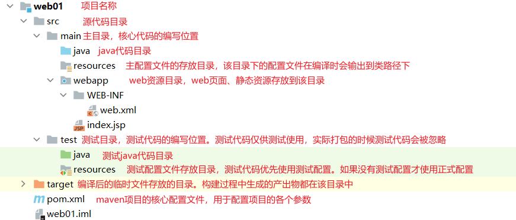
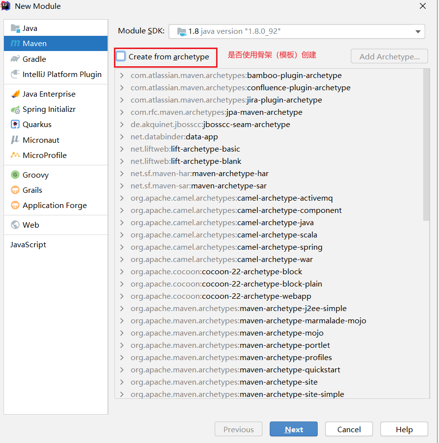
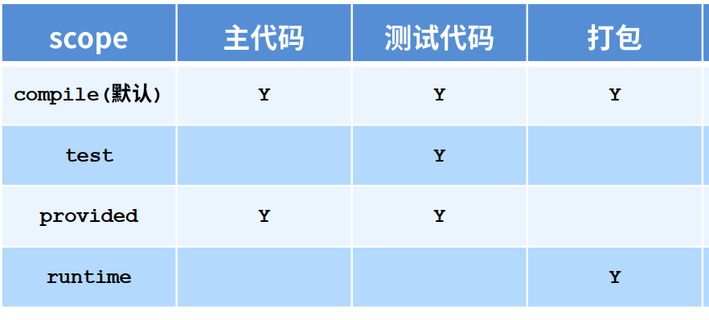

## Maven基础

### 定义

maven是一款纯java语言编写的项目管理工具。主要用于使用面向对象的思想管理项目开发。

maven把项目通过一个模型，pom模型（项目对象模型）进行抽象。

### 作用

#### 依赖管理

依赖：如果在项目开发中，需要使用到其他的资源。例如：开源jar包、资源库……此时我们称我们的项目，依赖了这些资源。这些资源，可以简称为依赖。对这些资源的管理也就是依赖管理。

例如：maven能够高效解决依赖冲突、依赖版本控制……等问题


#### 项目构建

项目开发中的各个关键操作（阶段），都属于项目构建的一部分。例如：编译、测试、打包、部署……如果我们手动操作，这些步骤将会非常繁琐，会拉低开发效率。而maven可以通过命令达到“一键构建”的效果。


### 环境搭建

#### 安装

maven解压即安装。（不要放到有中文和空格的目录下）

#### 环境变量

*依赖java，需要保证配置了java的环境变量*

`JAVA_HOME`：配置jdk的根目录

`MAVEN_HOME`：配置maven的根目录

path中添加：`%MAVEN_HOME%\bin`

> 安装完毕之后，使用`mvn -v` 命令，可以查看maven相关版本信息。


### 仓库

>  仓库就是一个目录（文件夹），内部存储了大量的maven中需要使用的资源文件（jar包、源码、文档、maven插件...）

#### 本地仓库

​		在本地计算机上的一个目录，maven使用的依赖相关资源都会存储在仓库中。使用的时候从仓库中获取。

#### 远程仓库

- 中央仓库

> maven官方团队维护的一个仓库，部署在互联网上供所有开发人员使用。maven中央仓库中存储了几乎开源世界所有的jar包。
>
> 中央仓库服务器部署在国外，访问速度非常慢。

- 私服

> 一些公司或组织，自己搭建的服务器，用于缓存maven中央仓库中的资源。这些服务器称为私人服务器（私服）。一般来说，公司内部的私服搭建在局域网内的，我们从局域网的私服中获取资源是非常快速的。私服的资源，也是从中央仓库下载而来的。

---

> **资源加载优先级**：
>
> 优先从本地仓库获取，如果本地没有，则从私服获取。
>
> 如果私服中存在，则直接返回给本地仓库，本地仓库会存储一份。
>
> 如果私服中不存在，则私服从中央仓库下载，本地仓库从私服下载。私服和本地仓库中会存储一份。下一次获取时，本地仓库中就已经存在该资源了。而局域网中其他用户获取也可以直接从私服获取了。

> 私服中，有一些大型的公司或组织，会把自己的私服部署在互联网中。免费供开发者使用。这些服务器我们称为镜像服务器。例如：阿里云镜像服务器……
>
> 所以一般会把这类服务器作为中央仓库的镜像使用，下载资源时，如果想从中央仓库获取，则换到从镜像服务器获取。


### 坐标

仓库中资源非常多，想要唯一的定位某一个资源。需要通过坐标来体现。

```xml
<dependency>
    <!--组织名称，全球唯一，其实就是之前包名，一般是公司域名反写-->
    <groupId>junit</groupId>
    <!--项目名称，在组织中唯一-->
    <artifactId>junit</artifactId>
    <!--版本号，是一个字符串-->
    <version>4.12</version>
</dependency>
```

> 查找坐标https://mvnrepository.com/


### 仓库相关配置

1. 找到mvn\conf\settings.xml。即maven的核心配置文件。

2. 配置本地仓库的路径（可以使用其他人提供的离线仓库）。

   ```xml
   <localRepository>本地仓库目录</localRepository>
   ```

3. 配置镜像服务器，在mirrors标签下配置mirror标签

   ```xml
   	  <mirror>
             <id>nexus-aliyun</id>
             <mirrorOf>*</mirrorOf>
             <name>Nexus aliyun</name>
             <url>http://maven.aliyun.com/nexus/content/groups/public</url>
         </mirror>
         <mirror>
             <id>nexus-osc</id>
             <mirrorOf>*</mirrorOf>
             <name>Nexus osc</name>
             <url>http://maven.oschina.net/content/groups/public/</url>
         </mirror>
   ```

4. 配置jdk版本和源码字符集编码，在profiles标签中配置

```xml
		<profile>
		    <id>jdk-1.8</id>
		    <activation>
		        <activeByDefault>true</activeByDefault>
		        <jdk>1.8</jdk>
		    </activation>
		    <properties>
		        <maven.compiler.source>1.8</maven.compiler.source>
		        <maven.compiler.target>1.8</maven.compiler.target>
		        <maven.compiler.compilerVersion>1.8</maven.compiler.compilerVersion>
		        <project.build.sourceEncoding>UTF-8</project.build.sourceEncoding>
		    </properties>
		</profile>
```

---


### Maven项目的目录结构详解




> 这些目录结构，实际开发时，根据具体情况，可以缺失一部分。例如：项目中没有测试代码，就可以没有测试目录。或者项目中有测试代码，但是没有测试配置，就可以没有测试的resources目录


### Maven命令

所有命令以`mvn`开头

- `compile`  编译，只编译main中的代码。
- `test`     
  - 编译main中的代码 
  - 编译test中的代码 
  - 执行test中的所有测试用例  
  - 生成测试报告
- `package` 
  -  执行`test`命令执行的所有操作 
  - 把测试成功之后的编译的结果达成对应的包（根据配置可能是jar或者war）
  - 测试目录中的所有内容不会参与最终的打包
- `install`  
  -  执行package命令执行的所有操作 
  -  把打成的包，安装到本地仓库中。作为一个依赖资源供其他人使用。

- `clean`  清理命令。把target目录整个删除掉


### IDEA配置

设置字符集编码为GBK，防止乱码

```
-DarchetypeCatalog=internal -Dfile.encoding=GBK
```

#### 创建项目




#### 打包方式

> maven中的pom.xml文件中的packaging代表当前项目的打包方式，默认为jar。普通java项目打jar包即可。web项目需要设置为war。


#### 插件

在maven项目中加入tomcat插件，运行web项目

在pom.xml中，`build`标签下，通过`plugins`中的`plugin`设置插件

```xml
<build>
  <finalName>maven_web</finalName>
    <!--设置插件-->
    <plugins>
      <!--具体的插件配置-->
      <plugin>
        <groupId>org.apache.tomcat.maven</groupId>
        <artifactId>tomcat7-maven-plugin</artifactId>
        <version>2.1</version>
        <configuration>
            <!--tomcat的端口号-->
            <port>80</port>
            <!--项目的虚拟目录-->
            <path>/</path>
          </configuration>
      </plugin>
    </plugins>
</build>
```

> `tomcat7`版本get传参如果传中文会乱码。
>
> ```java
> // 解决方案。把乱码字符串通过iso的编码还原为二进制，然后用u8重新解析。
> name = new String(request.getParameter("name").getBytes("ISO-8859-1"),"utf-8");
> ```


#### 依赖管理

在`maven`中，可以使用坐标引入依赖。


##### 直接依赖

在pom 文件中，直接通过坐标引入的依赖叫做直接依赖。

##### 间接依赖

通过坐标引入的依赖，它的内部又依赖了其他的资源。这些资源也会被项目依赖。由于是通过直接依赖的资源传递过来的，所以这些资源叫做间接依赖。

##### 依赖冲突

在一个项目中，同一个类引入了多次，导致类加载器无法确定加载哪一个类文件，就会报错。这就是依赖冲突。

默认情况下，maven会自动解决依赖冲突。

规则：

1. 直接依赖优先于间接依赖
2. 直接依赖的间接依赖之间，谁先声明，谁优先


##### 依赖作用范围

通过`dependcy`的`scope`标签控制




- `test`：仅在测试时使用，编译及最终打包都不使用这些jar包。目前只有`junit`可以设置为test。

- `provided`：仅供代码编译和测试使用。最终打包时不参与。servlet和jsp的jar包必须这么设置。

- `runtime`：进在运行时参与，也就是只打包。jdbc中数据库驱动类jar包这么设置。