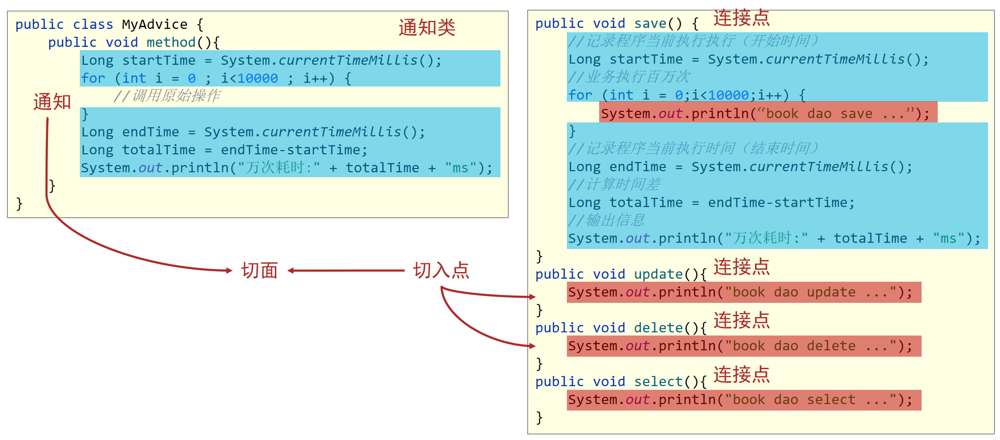

## AOP

- AOP(Aspect Oriented Programming)面向切面编程，一种编程范式，指导开发者如何组织程序结构

- OOP(Object Oriented Programming)面向对象编程

- 作用：在不惊动原始设计的基础上为其进行功能增强。简单的说就是在不改变方法源代码的基础上对方法进行功能增强。
- Spring理念：无入侵式/无侵入式

### 核心概念



- 目标对象（Target）：就是我们要增强的方法所在的对象。
- 连接点（JoinPoint）：正在执行的方法，例如：update()、delete()、select()等都是连接点。所有有可能被增强的方法都是连接点。
- 切入点（Pointcut）：进行功能增强了的方法，例如:update()、delete()方法，select()方法没有被增强所以不是切入点，但是是连接点。
  - 在SpringAOP中，一个切入点可以只描述一个具体方法，也可以匹配多个方法
    - 一个具体方法：com.itheima.dao包下的BookDao接口中的无形参无返回值的save方法
    - 匹配多个方法：所有的save方法，所有的get开头的方法，所有以Dao结尾的接口中的任意方法，所有带有一个参数的方法
- 通知（Advice）：在切入点前后执行的操作，也就是增强的共性功能
  - 在SpringAOP中，功能最终以方法的形式呈现
- 通知类：通知方法所在的类叫做通知类
- 切面（Aspect）：描述通知与切入点的对应关系，也就是哪些通知方法对应哪些切入点方法。
- 代理对象（Proxy）：Spring会使用动态代理的方式产生一个代理对象，替代原有对象执行逻辑。
- 织入（Weaving）：Spring通过动态代理产生代理对象的过程叫做织入。


### 坐标

```xml
    <dependency>
        <groupId>org.aspectj</groupId>
        <artifactId>aspectjweaver</artifactId>
        <version>1.9.4</version>
    </dependency>
```


### 实现流程

---

定义接口

```java
public interface BookDao {
    public void save();
    public void update();
}
```

定义实现类

```java
@Repository
public class BookDaoImpl implements BookDao {

    @OverRide
    public void save() {
        System.out.println(System.currentTimeMillis());
        System.out.println("book dao save ...");
    }
    
    @OverRide
    public void update(){
        System.out.println("book dao update ...");
    }
}
```

---

定义通知类，制作通知的方法，定义切入点表达式、配置切面(绑定切入点与通知关系)

```java
//通知类必须配置成Spring管理的bean
@Component
@Aspect
public class MyAdvice {
    
    //设置切入点，@Pointcut注解要求配置在方法上方
    @Pointcut("execution(void com..BookDao.update())")
    private void pt(){}

    //设置在切入点pt()的前面运行当前操作(前置通知)
    @Before("pt()")
    public void method(){
        System.out.println(System.currentTimeMillis());
    }
}
```

---

在配置类中进行Spring注解包扫描和开启AOP功能

```java
@Configuration
@ComponentScan("classpath:com.xxx")
//开启注解开发AOP功能
@EnableAspectJAutoProxy
public class SpringConfig {
}
```


### 工作流程

> 1. Spring容器启动
> 2. 读取所有切面配置中的切入点
> 3. 初始化bean，判定bean对应的类中的方法是否匹配到任意切入点
>    - 匹配失败，创建原始对象
>    - 匹配成功，创建原始对象（目标对象）的代理对象
> 4. 获取bean执行方法
>    - 获取的bean是原始对象时，调用方法并执行，完成操作
>    - 获取的bean是代理对象时，根据代理对象的运行模式运行原始方法与增强的内容，完成操作


### 切入点表达式

切入点表达式标准格式：动作关键字(访问修饰符  返回值  包名.类/接口名.方法名(参数) 异常名）

```java
@PointCut("execution(public User com.xxx.service.UserService.findById(int))")
```

- 动作关键字：描述切入点的行为动作，例如execution表示执行到指定切入点
- 访问修饰符：public，private等，可以省略
- 返回值：写返回值类型
- 包名：多级包使用点连接
- 类/接口名：
- 方法名：
- 参数：直接写参数的类型，多个类型用逗号隔开
- 异常名：方法定义中抛出指定异常，可以省略

#### 通配符

> 目的：可以使用通配符描述切入点，快速描述。

* `*`：**单个**独立的任意符号，可以独立出现，也可以作为前缀或者后缀的匹配符出现

- `..` ：**任意个**连续的任意符号，可以独立出现，常用于简化包名与参数的书写

- `+`：专用于匹配子类类型

#### 书写技巧

- 所有代码按照标准规范开发，否则以下技巧全部失效
- 描述切入点通**常描述接口**，而不描述实现类
- 访问控制修饰符针对接口开发均采用public描述（**可省略访问控制修饰符描述**）
- 返回值类型对于增删改类使用精准类型加速匹配，对于查询类使用\*通配快速描述
- **包名**书写**尽量不使用..匹配**，效率过低，常用\*做单个包描述匹配，或精准匹配
- **接口名/类名书写名称与模块相关的**采用`\*`匹配，例如UserService书写成`*Service`，绑定业务层接口名
- **方法名**书写以**动词**进行**精准匹配**，名词采用*匹配，例如`getById`书写成`getBy*`
- 参数规则较为复杂，根据业务方法灵活调整
- 通常**不使用异常**作为匹配规则


### AOP通知分类

AOP通知共分为5种类型

- 前置通知：在切入点方法执行之前执行

  > @Before("xxx()")
  >
  > 作用：设置当前通知方法与切入点之间的绑定关系，当前通知方法在原始切入点方法前运行

- 后置通知：在切入点方法执行之后执行，无论切入点方法内部是否出现异常，后置通知都会执行。

  > @After("xxx()")
  >
  > 作用：设置当前通知方法与切入点之间的绑定关系，当前通知方法在原始切入点方法后运行

- **环绕通知：**手动调用切入点方法并对其进行增强的通知方式。

  > @Around("xxx()")
  >
  > 作用：设置当前通知方法与切入点之间的绑定关系，当前通知方法在原始切入点方法前后运行

- 返回后通知：在切入点方法执行之后执行，如果切入点方法内部出现异常将不会执行。

  > @AfterReturning("xxx()")
  >
  > 作用：设置当前通知方法与切入点之间的绑定关系，当前通知方法在原始切入点方法正常执行完毕后运行

- 抛出异常后通知：在切入点方法执行之后执行，只有当切入点方法内部出现异常之后才执行。

  > @AfterThrowing("xxx()")
  >
  > 设置当前通知方法与切入点之间的绑定关系，当前通知方法在原始切入点方法运行抛出异常后执行


### AOP切入点数据获取

#### 获取参数

- JoinPoint对象描述了连接点方法的运行状态，可以获取到原始方法的调用参数
- ProccedJointPoint是JoinPoint的子类，用在Around注解上
- API：getArgs（）：返回参数数组


#### 获取返回值

> 说明：在返回后通知和环绕通知中都可以获取到连接点方法的返回值

- 抛出异常后通知可以获取切入点方法中出现的异常信息，使用形参可以接收对应的异常对象

```java
@AfterReturning(value = "pt()",returning = "ret")
public void afterReturning(String ret) { //变量名要和returning="ret"的属性值一致
    System.out.println("afterReturning advice ..."+ret);
}
```

- 环绕通知中可以手工书写对原始方法的调用，得到的结果即为原始方法的返回值

```java
@Around("pt()")
public Object around(ProceedingJoinPoint pjp) throws Throwable {
    // 手动调用连接点方法，返回值就是连接点方法的返回值
    Object ret = pjp.proceed();
    return ret;
}
```

#### 2.3 获取异常

> 说明：在抛出异常后通知和环绕通知中都可以获取到连接点方法中出现的异常

- 抛出异常后通知可以获取切入点方法中出现的异常信息，使用形参可以接收对应的异常对象

```java
@AfterThrowing(value = "pt()",throwing = "t")
public void afterThrowing(Throwable t) {//变量名要和throwing = "t"的属性值一致
    System.out.println("afterThrowing advice ..."+ t);
}
```

- 抛出异常后通知可以获取切入点方法运行的异常信息，使用形参可以接收运行时抛出的异常对象


### Spring事务管理

- 事务作用：在数据层保障一系列的数据库操作同成功同失败
- Spring事务作用：在数据层或业务层保障一系列的数据库操作同成功同失败

#### 配置类设置事务管理器

```java
    @Bean
    public PlatformTransactionManager transactionManager(DataSource dataSource){
        DataSourceTransactionManager dataSourceTransactionManager = new DataSourceTransactionManager();
        dataSourceTransactionManager.setDataSource(dataSource);
        return dataSourceTransactionManager;
    }
```

#### 注意事项

1. Spring注解式事务通常添加在业务层接口中而不会添加到业务层实现类中，降低耦合
2. 注解式事务可以添加到业务方法上表示当前方法开启事务，也可以添加到接口上表示当前接口所有方法开启事务

#### 开启注解式事务驱动

```java
@EnableTransactionManagement
```

### 事务配置


#### 事务传播行为

