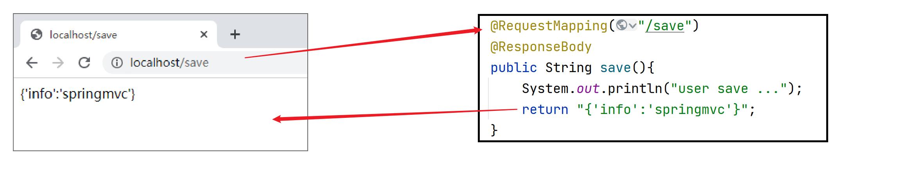
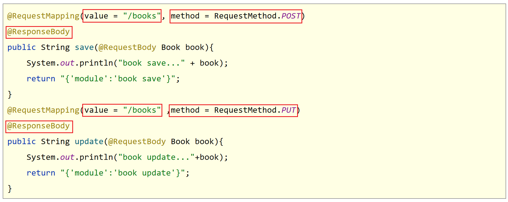

## Spring MVC

SpringMVC是一种基于Java实现MVC模型的轻量级Web框架

使用SpringMVC需要导入同时Servlet坐标，springMvc自动依赖Spring相关坐标，可以圣罗spring相关坐标的导入

### SpringMvc配置类

SpringMvc配置类本质还是一个Spring配置类

```java
@Configuration
//理论来讲通常只扫描Controller层即可
@ComponentScan("com.xxx.controller")
public class SpringMvcConfig {
}
```


### Controller层

```java
//定义表现层控制器bean
//@Controller
//@ResponseBody
@RestController//相当于以上两个注解
public class UserController {
    //设置映射路径为/save，即外部访问路径
    @RequestMapping("/save")
    //设置当前操作返回结果为指定json数据（本质上是一个字符串信息）
   
    public String save(){
        System.out.println("user save ...");
        return "{'info':'springmvc'}";
    }
}
```

对于SpringMVC而言，Controller方法返回值默认表示要跳转的页面，没有对应的页面就会报错。如果不想跳转页面而是响应数据，那么就需要在方法上使用@ResponseBody注解。


### 容器配置类

加载SpringMvc配置，并设置SpringMvc请求拦截的路径

```java
public class ServletContainersInitConfig extends AbstractDispatcherServletInitializer { 
    protected WebApplicationContext createServletApplicationContext() { 
        AnnotationConfigWebApplicationContext ctx = new AnnotationConfigWebApplicationContext();
        ctx.register(SpringMvcConfig.class);
        return ctx;  
    }   
    protected WebApplicationContext createRootApplicationContext() {  
        AnnotationConfigWebApplicationContext ctx = new AnnotationConfigWebApplicationContext();      
        ctx.register(SpringConfig.class);        
        return ctx;  
    }   
    protected String[] getServletMappings() { 
        return new String[]{"/"}; 
    }
}
```

**简化配置：**

```java
public class ServletContainersInitConfig extends AbstractAnnotationConfigDispatcherServletInitializer{
    protected Class<?>[] getServletConfigClasses() {
        return new Class[]{SpringMvcConfig.class}
    };
    protected String[] getServletMappings() {
        return new String[]{"/"};
    }
    protected Class<?>[] getRootConfigClasses() {
        return new Class[]{SpringConfig.class};
    }
}
```


### 常用注解及常用类

#### 常用注解

| 名称              | 类型             | 位置                            | 作用                                                         | 参数                                              |
| ----------------- | ---------------- | ------------------------------- | ------------------------------------------------------------ | ------------------------------------------------- |
| `@Controller`     | 类注解           | SpringMVC控制器类定义上方       | 设定SpringMVC的核心控制器                                    |                                                   |
| `@RequestMapping` | 方法注解、类注解 | SpringMVC控制器方法定义上方     | 设置当前控制器方法请求访问路径，如果设置在类上统一设置当前控制器方法请求访问路径前缀 |                                                   |
| `@ResponseBody`   | 方法注解         | SpringMVC控制器方法定义上方     | 设置当前控制器方法响应内容为当前返回值，无需解析             |                                                   |
| @RequestParam     | 形参注解         | SpringMVC控制器方法形参定义前面 | 绑定请求参数与处理器方法形参间的关系                         | required：是否为必传参数 defaultValue：参数默认值 |
| @EnableWebMvc     | 配置类注解       | SpringMVC配置类定义上方         | 开启SpringMVC多项辅助功能                                    |                                                   |
| @RequestBody      | 形参注解         | SpringMVC控制器方法形参定义前面 | 将请求中请求体所包含的数据传递给请求参数，此注解一个处理器方法只能使用一次 |                                                   |
| @DateTimeFormat   | 形参注解         | SpringMVC控制器方法形参前面     | 设定日期时间型数据格式                                       | pattern：指定日期时间格式字符串                   |
|                   |                  |                                 |                                                              |                                                   |
|                   |                  |                                 |                                                              |                                                   |


#### 常用类

##### AbstractDispatcherServletInitializer类

AbstractDispatcherServletInitializer类是SpringMVC提供的快速初始化Web3.0容器的抽象类

> AbstractDispatcherServletInitializer提供三个接口方法供用户实现
>
> - createServletApplicationContext()方法，创建Servlet容器时，加载SpringMVC对应的bean并放入WebApplicationContext对象范围中，而WebApplicationContext的作用范围为ServletContext范围，即整个web容器范围。
> - getServletMappings()方法，设定SpringMVC对应的请求映射路径，设置为/表示拦截所有请求，任意请求都将转入到SpringMVC进行处理。
> - createRootApplicationContext()方法，如果创建Servlet容器时需要加载非SpringMVC对应的bean，使用当前方法进行，使用方式同createServletApplicationContext()


### 工作流程分析

#### 启动服务器初始化过程

1. 服务器启动，执行`ServletContainersInitConfig`类，初始化web容器
2. 执行`createServletApplicationContext`方法，创建了`WebApplicationContext`对象
3. 加载`SpringMvcConfig`配置类
4. 执行`@ComponentScan`加载对应的bean
5. 加载UserController，每个`@RequestMapping`的名称对应一个具体的方法
6. 执行`getServletMappings`方法，定义所有的请求都通过SpringMVC


#### 单次请求过程

1. 发送请求
2. web容器发现所有请求都经过SpringMVC，将请求交给SpringMVC处理
3. 解析请求路径
4. 匹配请求路径执行对应的方法
5. 执行方法
6. 检测到有`@ResponseBody`直接将方法的返回值作为响应求体返回给请求方




### 请求与响应

#### 请求方式

##### GET请求传递普通参数

普通参数：url地址传参，地址参数名与形参变量名相同，定义形参即可接收参数

contorller层代码：

```java
//普通参数：请求参数与形参名称对应即可完成参数传递
//请求地址：`http://localhost/commonParam?name=zs&age=23`
@RequestMapping("/commonParam")
@ResponseBody
public String commonParam(String name ,int age){
    System.out.println("普通参数传递 name ==> "+name);
    System.out.println("普通参数传递 age ==> "+age);
    return "{'module':'common param'}";
}
```

###### GET请求中文乱码问题解决

在pom.xml添加tomcat7插件处配置UTF-8字符集，解决GET请求中文乱码问题。

```xml
<build>
    <plugins>
      <plugin>
        <groupId>org.apache.tomcat.maven</groupId>
        <artifactId>tomcat7-maven-plugin</artifactId>
        <version>2.1</version>
        <configuration>
          <port>80</port><!--tomcat端口号-->
          <path>/</path> <!--虚拟目录-->
          <uriEncoding>UTF-8</uriEncoding><!--访问路径编解码字符集-->
        </configuration>
      </plugin>
    </plugins>
  </build>
```


##### POST请求传递普通参数

普通参数：form表单post请求传参，表单参数名与形参变量名相同，定义形参即可接收参数

```java
//普通参数：请求参数与形参名称对应即可完成参数传递
//请求地址：http://localhost/commonParam
@RequestMapping("/commonParam")
@ResponseBody
public String commonParam(String name ,int age){
    System.out.println("普通参数传递 name ==> "+name);
    System.out.println("普通参数传递 age ==> "+age);
    return "{'module':'common param'}";
}
```

###### POST请求中文乱码处理

在加载SpringMVC配置的配置类中指定字符过滤器。

```java
public class ServletContainersInitConfig extends AbstractAnnotationConfigDispatcherServletInitializer {
    protected Class<?>[] getRootConfigClasses() {
        return new Class[0];
    }

    protected Class<?>[] getServletConfigClasses() {
        return new Class[]{SpringMvcConfig.class};
    }

    protected String[] getServletMappings() {
        return new String[]{"/"};
    }

    //乱码处理
    @Override
    protected Filter[] getServletFilters() {
        CharacterEncodingFilter filter = new CharacterEncodingFilter();
        filter.setEncoding("UTF-8");
        return new Filter[]{filter};
    }
}
```


### 五种类型参数传递

#### 五种类型参数介绍

- 普通参数
- POJO类型参数
- 嵌套POJO类型参数
- 数组类型参数
- 集合类型参数

####  普通参数*

普通参数：当请求参数名与形参变量名不同，使用@RequestParam绑定参数关系

```java
//普通参数：请求参数名与形参名不同时，使用@RequestParam注解关联请求参数名称与形参名称之间的关系
//请求地址：http://localhost:/commomParamDifferentName?name=sz&age=13
@RequestMapping("/commonParamDifferentName")
@ResponseBody
public String commonParamDifferentName(@RequestParam("name") String userName , int age){
    System.out.println("普通参数传递 userName ==> "+userName);
    System.out.println("普通参数传递 age ==> "+age);
    return "{'module':'common param different name'}";
}
```

#### POJO类型参数*

POJO参数：请求参数名与形参对象属性名相同，定义POJO类型形参即可接收参数

```java
public class User {    
    private String name;    
    private int age;    
    ///省略getter setter
}
```

```java
//POJO参数：请求参数与形参对象中的属性对应即可完成参数传递
//请求地址：http://localhost:/pojoParam?name=zs&age=15
@RequestMapping("/pojoParam")
@ResponseBody
public String pojoParam(User user){
    System.out.println("pojo参数传递 user ==> "+user);
    return "{'module':'pojo param'}";
}
```

**注意事项**：请求参数key的名称要和POJO中属性的名称一致，否则无法封装

#### 嵌套POJO类型参数

POJO对象中包含POJO对象

```java
public class User {
    private String name;
    private int age;
    private Address address;
    //省略getter setter方法
}
public class Address {
    private String province;
    private String city;
    private Address address;
}
```

嵌套POJO参数：请求参数名与形参对象属性名相同，按照对象层次结构关系即可接收嵌套POJO属性参数

```java
//嵌套POJO参数：嵌套属性按照层次结构设定名称即可完成参数传递
//请求地址：http://localhost://pojoContainParam?name=zs%age=15&address.city=bejing&address.province=beijing
@RequestMapping("/pojoContainPojoParam")
@ResponseBody
public String pojoContainPojoParam(User user){
    System.out.println("pojo嵌套pojo参数传递 user ==> "+user);
    return "{'module':'pojo contain pojo param'}";
}
```

####  数组类型参数

数组参数：请求参数名与形参对象属性名相同且请求参数为多个，定义数组类型即可接收参数

```java
//数组参数：同名请求参数可以直接映射到对应名称的形参数组对象中
//请求地址:http://localhost/arrayParam?likes=qqq&likes=www
@RequestMapping("/arrayParam")
@ResponseBody
public String arrayParam(String[] likes){
    System.out.println("数组参数传递 likes ==> "+ Arrays.toString(likes));
    return "{'module':'array param'}";
}
```

#### 集合类型参数

集合保存普通参数：请求参数名与形参集合对象名相同且请求参数为多个，@RequestParam绑定参数关系

```java
//集合参数：同名请求参数可以使用@RequestParam注解映射到对应名称的集合对象中作为数据
//请求地址：http://localhost/listParam?likes=qqq&likes=www
@RequestMapping("/listParam")
@ResponseBody
public String listParam(@RequestParam List<String> likes){
    System.out.println("集合参数传递 likes ==> "+ likes);
    return "{'module':'list param'}";
}
```


### json相关

数据参数传递

#### json数据参数介绍

- json普通数组（["","","",...]）
- json对象（{key:value,key:value,...}）
- json对象数组（[{key:value,...},{key:value,...}]）

#### 传递json普通数组

1. 添加json数据转换相关坐标

```xml
<dependency>
    <groupId>com.fasterxml.jackson.core</groupId>
    <artifactId>jackson-databind</artifactId>
    <version>2.9.0</version>
</dependency>
```

2. 设置发送json数据（请求body中添加json数据）

请求地址：http://localhost/listParamForJson

请求体：`["game","music","travel"]`

3. 开启自动转换json数据的支持

```java
@Configuration
@ComponentScan("com.itheima.controller")
//开启json数据类型自动转换
@EnableWebMvc
public class SpringMvcConfig {
}
```

> @EnableWebMvc注解功能强大，该注解整合了多个功能，此处仅使用其中一部分功能，即json数据进行自动类型转换

4. 在Controller中编写方法接收json参数

```java
//集合参数：json格式
//1.开启json数据格式的自动转换，在配置类中开启@EnableWebMvc
//2.使用@RequestBody注解将外部传递的json数组数据映射到形参的集合对象中作为数据
@RequestMapping("/listParamForJson")
@ResponseBody
public String listParamForJson(@RequestBody List<String> likes){
    System.out.println("list common(json)参数传递 list ==> "+likes);
    return "{'module':'list common for json param'}";
}
```

#### 传递json对象

POJO参数：json数据与形参对象属性名相同，定义POJO类型形参即可接收参数

请求地址：http://localhost/pojoParamForJson

请求体：

```json
{
    "name":"sz",
    "age":"15"
}
```

```java
//POJO参数：json格式
//1.开启json数据格式的自动转换，在配置类中开启@EnableWebMvc
//2.使用@RequestBody注解将外部传递的json数据映射到形参的实体类对象中，要求属性名称一一对应
@RequestMapping("/pojoParamForJson")
@ResponseBody
public String pojoParamForJson(@RequestBody User user){
    System.out.println("pojo(json)参数传递 user ==> "+user);
    return "{'module':'pojo for json param'}";
}
```

#### 传递json对象数组

POJO集合参数：json数组数据与集合泛型属性名相同，定义List类型形参即可接收参数

请求地址：http://localhost/listPojoParamForJson

请求体：

```json
[
    {"name":"zs","age":15},
    {"name":"ls","age":"16"}
]
```

```java
//集合参数：json格式
//1.开启json数据格式的自动转换，在配置类中开启@EnableWebMvc
//2.使用@RequestBody注解将外部传递的json数组数据映射到形参的保存实体类对象的集合对象中，要求属性名称一一对应
@RequestMapping("/listPojoParamForJson")
@ResponseBody
public String listPojoParamForJson(@RequestBody List<User> list){
    System.out.println("list pojo(json)参数传递 list ==> "+list);
    return "{'module':'list pojo for json param'}";
}
```

####  @RequestBody与@RequestParam区别

- 区别
  @RequestParam用于接收url地址传参，表单传参【application/x-www-form-urlencoded】
  @RequestBody用于接收json数据【application/json】
- 应用
  后期开发中，发送json格式数据为主，@RequestBody应用较广
  如果发送非json格式数据，选用@RequestParam接收请求参数


### 日期类型参数传递

```java
//日期参数 http://localhost:80/dataParam?date=2088/08/08&date1=2088-08-18&date2=2088/08/28 8:08:08
//使用@DateTimeFormat注解设置日期类型数据格式，默认格式yyyy/MM/dd
@RequestMapping("/dataParam")
@ResponseBody
public String dataParam(Date date,
                  @DateTimeFormat(pattern="yyyy-MM-dd") Date date1,
                  @DateTimeFormat(pattern="yyyy/MM/dd HH:mm:ss") Date date2){
    System.out.println("参数传递 date ==> "+date);
    System.out.println("参数传递 date1(yyyy-MM-dd) ==> "+date1);
    System.out.println("参数传递 date2(yyyy/MM/dd HH:mm:ss) ==> "+date2);
    return "{'module':'data param'}";
}
```

@DateTimeFormat注解

#### 工作原理

- 其内部依赖Converter接口

```java
public interface Converter<S, T> {
    @Nullable
    T convert(S var1);
}
```

- 请求参数年龄数据（String→Integer）
- json数据转对象（json → POJO）
- 日期格式转换（String → Date）

> 传递日期类型参数必须在配置类上使用@EnableWebMvc注解。其功能之一：根据类型匹配对应的类型转换器。


### 响应

#### 跳转页面（不常用）

```java
@Controller
public class UserController {

    //响应页面/跳转页面
    //返回值为String类型，设置返回值为页面名称，即可实现页面跳转
    @RequestMapping("/toJumpPage")
    public String toJumpPage(){
        System.out.println("跳转页面");
        return "page.jsp";
    }
}
```

```java
<%@ page contentType="text/html;charset=UTF-8" language="java" %>
<html>
    <head>
        <title>Title</title>
    </head>
    <body>
        <h2>Hello Spring MVC!</h2>
    </body>
</html>
```

#### 文本数据

```java
//响应文本数据
//返回值为String类型，设置返回值为任意字符串信息，即可实现返回指定字符串信息，需要依赖@ResponseBody注解
@RequestMapping("/toText")
@ResponseBody
public String toText(){
    System.out.println("返回纯文本数据");
    return "response text";
}
```

#### json数据(*)

```java
//响应POJO对象
//返回值为实体类对象，设置返回值为实体类类型，即可实现返回对应对象的json数据，需要依赖@ResponseBody注解和@EnableWebMvc注解
@RequestMapping("/toJsonPOJO")
@ResponseBody
public User toJsonPOJO(){
    System.out.println("返回json对象数据");
    User user = new User();
    user.setName("itcast");
    user.setAge(15);
    return user;
}
```

```java
//响应POJO集合对象
//返回值为集合对象，设置返回值为集合类型，即可实现返回对应集合的json数组数据，需要依赖@ResponseBody注解和@EnableWebMvc注解
@RequestMapping("/toJsonList")
@ResponseBody
public List<User> toJsonList(){
    System.out.println("返回json集合数据");
    User user1 = new User();
    user1.setName("传智播客");
    user1.setAge(15);

    User user2 = new User();
    user2.setName("黑马程序员");
    user2.setAge(12);

    List<User> userList = new ArrayList<User>();
    userList.add(user1);
    userList.add(user2);

    return userList;
}
```

> 需要添加jackson-databind依赖以及在SpringMvcConfig配置类上添加@EnableWebMvc注解


### REST风格

#### REST介绍

- REST（Representational State Transfer），表现形式状态转换
  - 传统风格资源描述形式
    	http://localhost/user/getById?id=1
    	http://localhost/user/saveUser
  - REST风格描述形式
    	http://localhost/user/1
    	http://localhost/user
- 优点：
  - 隐藏资源的访问行为，无法通过地址得知对资源是何种操作
  - 书写简化

#### RESTful介绍

- 按照REST风格访问资源时使用**行为动作**区分对资源进行了何种操作
  http://localhost/users		查询全部用户信息	（查询）
  http://localhost/users/1		查询指定用户信息（查询）
  http://localhost/users		添加用户信息（新增/保存）
  http://localhost/users		修改用户信息（修改/更新）
  http://localhost/users/1		删除用户信息（删除）
- 根据REST风格对资源进行访问称为RESTful

#### 注意事项

- 上述行为是约定方式，约定不是规范，可以打破，所以称REST风格，而不是REST规范
- 描述模块的名称通常使用复数，也就是加s的格式描述，表示此类资源，而非单个资源，例如：users、books、accounts……


#### 快速入门

> 做法：在Controller中定义方法时设定"http请求动作(请求方式)"和"设定请求参数（路径变量）"

```java
@Controller
public class UserController {

    //设置当前请求方法为POST，表示REST风格中的添加操作
    @RequestMapping(value = "/users",method = RequestMethod.POST)
    @ResponseBody
    public String save(){
        System.out.println("user save...");
        return "{'module':'user save'}";
    }

    //设置当前请求方法为DELETE，表示REST风格中的删除操作
    //@PathVariable注解用于设置路径变量（路径参数），要求路径上设置对应的占位符，并且占位符名称与方法形参名称相同
    @RequestMapping(value = "/users/{id}",method = RequestMethod.DELETE)
    @ResponseBody
    public String delete(@PathVariable Integer id){
        System.out.println("user delete..." + id);
        return "{'module':'user delete'}";
    }

    //设置当前请求方法为PUT，表示REST风格中的修改操作
    @RequestMapping(value = "/users",method = RequestMethod.PUT)
    @ResponseBody
    public String update(@RequestBody User user){
        System.out.println("user update..."+user);
        return "{'module':'user update'}";
    }

    //设置当前请求方法为GET，表示REST风格中的查询操作
    //@PathVariable注解用于设置路径变量（路径参数），要求路径上设置对应的占位符，并且占位符名称与方法形参名称相同
    @RequestMapping(value = "/users/{id}" ,method = RequestMethod.GET)
    @ResponseBody
    public String getById(@PathVariable Integer id){
        System.out.println("user getById..."+id);
        return "{'module':'user getById'}";
    }

    //设置当前请求方法为GET，表示REST风格中的查询操作
    @RequestMapping(value = "/users",method = RequestMethod.GET)
    @ResponseBody
    public String getAll(){
        System.out.println("user getAll...");
        return "{'module':'user getAll'}";
    }
}
```

#### @PathVariable介绍

- 名称：@PathVariable
- 类型：形参注解
- 位置：SpringMVC控制器方法形参定义前面
- 作用：绑定路径参数与处理器方法形参间的关系，要求路径参数名与形参名一一对应


#### @RequestBody、@RequestParam、@PathVariable区别和应用

- 区别
  @RequestParam用于接收url地址传参或表单传参
  @RequestBody用于接收json数据
  @PathVariable用于接收路径参数，使用{参数名称}描述路径参数
- 应用
  后期开发中，发送请求参数超过1个时，以json格式为主，@RequestBody应用较广
  如果发送非json格式数据，选用@RequestParam接收请求参数
  采用RESTful进行开发，当参数数量较少时，例如1个，可以采用@PathVariable接收请求路径变量，通常用于传递id值


### 3 REST快速开发【重点】

#### 3.1 代码中的问题



> 以上截图中的代码和我们之前写的UserController中的方法类似，其中图中两个方法都有三处是有问题的，可以进行优化。存在的问题如下：

问题1：每个方法的@RequestMapping注解中都定义了访问路径/books，重复性太高。

问题2：每个方法的@RequestMapping注解中都要使用method属性定义请求方式，重复性太高。

问题3：每个方法响应json都需要加上@ResponseBody注解，重复性太高。

#### 3.2 Rest快速开发

> 解决以上三个问题

解决问题1：在Controller类上使用@RequestMapping定义共同的访问路径。

```java
@Controller
@RequestMapping("/books")
public class BookController {
    
    @RequestMapping(method = RequestMethod.POST)
    public String save(@RequestBody Book book){
        System.out.println("book save..." + book);
        return "{'module':'book save'}";
    }
    @RequestMapping(value = "/{id}" ,method = RequestMethod.DELETE)
    public String delete(@PathVariable Integer id){
        System.out.println("book delete..." + id);
        return "{'module':'book delete'}";
    }
    @RequestMapping(method = RequestMethod.PUT)
    public String update(@RequestBody Book book){
        System.out.println("book update..."+book);
        return "{'module':'book update'}";
    }
    @RequestMapping(value = "/{id}" ,method = RequestMethod.GET)
    public String getById(@PathVariable Integer id){
        System.out.println("book getById..."+id);
        return "{'module':'book getById'}";
    }

    @RequestMapping(method = RequestMethod.GET)
    public String getAll(){
        System.out.println("book getAll...");
        return "{'module':'book getAll'}";
    }
}
```

解决问题2：使用@GetMapping  @PostMapping  @PutMapping  @DeleteMapping代替@RequestMapping(method=RequestMethod.XXX)

```java
@Controller   
@RequestMapping("/books")
public class BookController {

//    @RequestMapping( method = RequestMethod.POST)
    @PostMapping//使用@PostMapping简化Post请求方法对应的映射配置
    public String save(@RequestBody Book book){
        System.out.println("book save..." + book);
        return "{'module':'book save'}";
    }

//    @RequestMapping(value = "/{id}" ,method = RequestMethod.DELETE)
    @DeleteMapping("/{id}")  //使用@DeleteMapping简化DELETE请求方法对应的映射配置
    public String delete(@PathVariable Integer id){
        System.out.println("book delete..." + id);
        return "{'module':'book delete'}";
    }

//    @RequestMapping(method = RequestMethod.PUT)
    @PutMapping   //使用@PutMapping简化Put请求方法对应的映射配置
    public String update(@RequestBody Book book){
        System.out.println("book update..."+book);
        return "{'module':'book update'}";
    }

//    @RequestMapping(value = "/{id}" ,method = RequestMethod.GET)
    @GetMapping("/{id}")    //使用@GetMapping简化GET请求方法对应的映射配置
    public String getById(@PathVariable Integer id){
        System.out.println("book getById..."+id);
        return "{'module':'book getById'}";
    }

//    @RequestMapping(method = RequestMethod.GET)
    @GetMapping      //使用@GetMapping简化GET请求方法对应的映射配置
    public String getAll(){
        System.out.println("book getAll...");
        return "{'module':'book getAll'}";
    }
}
```

- 名称：@GetMapping  @PostMapping  @PutMapping  @DeleteMapping
- 类型：方法注解
- 位置：基于SpringMVC的RESTful开发控制器方法定义上方
- 作用：设置当前控制器方法请求访问路径与请求动作，每种对应一个请求动作，例如@GetMapping对应GET请求
- 属性：
  value（默认）：请求访问路径


解决问题3：在Controller类上使用@RestController注解，等同于@Controller与@ResponseBody两个注解组合功能

```java
@RestController     //使用@RestController注解替换@Controller与@ResponseBody注解，简化书写
@RequestMapping("/books")
public class BookController {
    //方法省略了没写
}
```

- 名称：@RestController
- 类型：类注解
- 位置：基于SpringMVC的RESTful开发控制器类定义上方
- 作用：设置当前控制器类为RESTful风格，等同于@Controller与@ResponseBody两个注解组合功能

