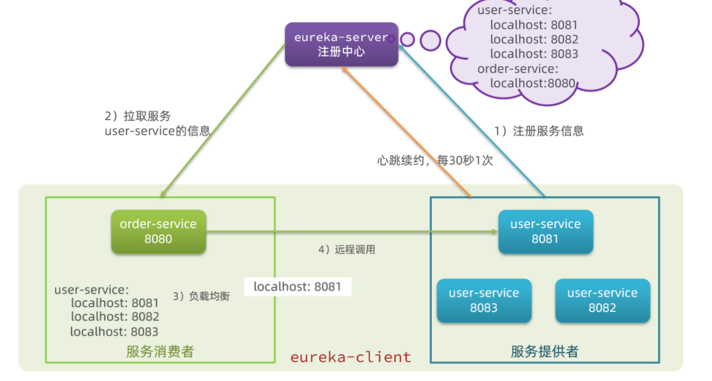
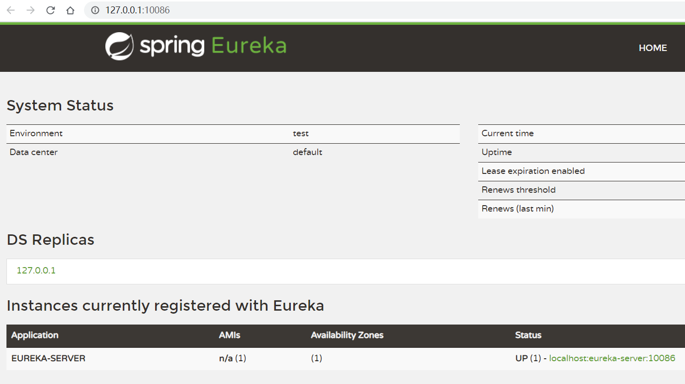
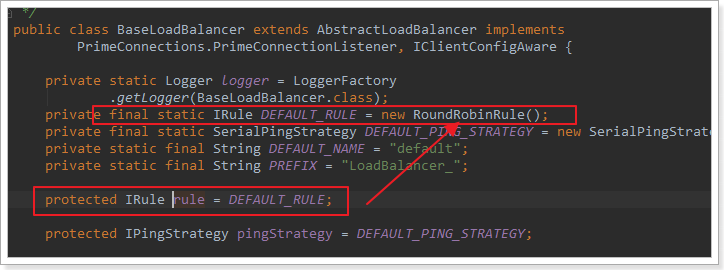

## SpringCloud


### RestTemplate

>  `RestTemplate`是`spring`内置`Http`请求对象，可以在项目中直接使用`@Autowired`注入使用，也可以切换底层实现：
	`HttpClient`
	`OkHttp`
	`JDK`原生的`URLConnection`（默认的）


RestTemplate的使用：*以查询订单中的用户信息为例*

```java
    public Order queryOrderById(Long orderId) {
        // 查询订单
        Order order = orderMapper.findById(orderId);
		//使用restTemplate对象中的getForObject方法获取user对象
        //T getForObject(String requestUrl, Class<T> targetObj)
        //发送get请求时使用getForObject，同理，发送post请求时使用postForObject()
        User user = restTemplate.getForObject("http://localhost/user/" + order.getUserId(), User.class);
		
        order.setUser(user);
        // 返回
        return order;
    }
```


#### 提供者与消费者

在服务调用关系中，会有两个不同的角色：

**服务提供者**：一次业务中，被其它微服务调用的服务。（提供接口给其它微服务）

**服务消费者**：一次业务中，调用其它微服务的服务。（调用其它微服务提供的接口）


> 但是，服务提供者与服务消费者的角色并不是绝对的，而是相对于业务而言。
>
> 如果服务A调用了服务B，而服务B又调用了服务C，服务B的角色是什么？
>
> - 对于A调用B的业务而言：A是服务消费者，B是服务提供者
> - 对于B调用C的业务而言：B是服务消费者，C是服务提供者
>
> 因此，服务B既可以是服务提供者，也可以是服务消费者。


### Eureka

假如我们的服务提供者user-service部署了多个实例，如图：


---


> **引入：**
>
> - **order-service在发起远程调用的时候，该如何得知user-service实例的ip地址和端口？**
>   - user-service服务实例启动后，将自己的信息注册到eureka-server（Eureka服务端）。这个叫服务注册
>   - eureka-server保存服务名称到服务实例地址列表的映射关系
>   - order-service根据服务名称，拉取实例地址列表。这个叫服务发现或服务拉取
> - **有多个user-service实例地址，order-service调用时该如何选择？**
>   - order-service从实例列表中利用负载均衡算法选中一个实例地址
>   - 向该实例地址发起远程调用
> - **order-service如何得知某个user-service实例是否依然健康，是不是已经宕机？**
>   - user-service会每隔一段时间（默认30秒）向eureka-server发起请求，报告自己状态，称为心跳
>   - 当超过一定时间没有发送心跳时，eureka-server会认为微服务实例故障，将该实例从服务列表中剔除
>   - order-service拉取服务时，就能将故障实例排除了


#### Eureka的结构



---


#### 搭建Eureka-server

> eureka-server是一个单独的微服务


##### 创建新模块

在父模块中创建一个子模块

##### 引入依赖

引入SpringCloud为eureka提供的starter依赖：

```xml
<dependency>
    <groupId>org.springframework.cloud</groupId>
    <artifactId>spring-cloud-starter-netflix-eureka-server</artifactId>
</dependency>
```

##### 编写启动类

给eureka-server服务编写一个启动类，一定要添加一个`@EnableEurekaServer`注解，开启eureka的注册中心功能：

```java
package cn.itcast.eureka;

import org.springframework.boot.SpringApplication;
import org.springframework.boot.autoconfigure.SpringBootApplication;
import org.springframework.cloud.netflix.eureka.server.EnableEurekaServer;

@SpringBootApplication
@EnableEurekaServer
public class EurekaApplication {
    public static void main(String[] args) {
        SpringApplication.run(EurekaApplication.class, args);
    }
}
```

##### 编写配置文件

编写一个application.yml文件，内容如下：

```yml
server:
  port: 10086
spring:
  application:
    name: eureka-server
eureka:
  client:
    service-url: 
      defaultZone: http://127.0.0.1:10086/eureka
```

##### 启动服务

启动微服务，在浏览器访问：http://127.0.0.1:10086

成功结果如下：




#### 服务注册

##### 引入依赖

在需要注册到eureka的微服务的pom文件中，引入依赖：

```xml
        <dependency>
            <groupId>org.springframework.cloud</groupId>
            <artifactId>spring-cloud-starter-netflix-eureka-client</artifactId>
        </dependency>
```

##### 配置文件

修改application.yml文件，添加服务名称、eureka地址：

```yml
spring:
  application:
    name: userservice
eureka:
  client:
    service-url:
      defaultZone: http://127.0.0.1:10086/eureka
```

##### 启动多个相同服务实例

首先，复制原来的user-service启动配置：


---

填写信息


---

现在，SpringBoot窗口会出现两个user-service启动配置：


不过，第一个是8081端口，第二个是8082端口。

查看eureka-server管理页面：


#### 服务发现

##### 引入依赖

服务发现、服务注册统一都封装在eureka-client依赖，因此这一步与服务注册时一致。

依赖：

```xml
<dependency>
    <groupId>org.springframework.cloud</groupId>
    <artifactId>spring-cloud-starter-netflix-eureka-client</artifactId>
</dependency>
```

##### 配置文件

服务发现也需要知道eureka地址，因此第二步与服务注册一致，都是配置eureka信息：

修改application.yml文件，添加服务名称、eureka地址：

```yml
spring:
  application:
    name: orderservice
eureka:
  client:
    service-url:
      defaultZone: http://127.0.0.1:10086/eureka
```

##### 服务拉取和负载均衡

在服务中拉取已经注册的微服务，并且实现负载均衡

只需添加一些注解即可

###### 负载均衡

在配置类中的`Resttemplate`工厂方法上添加注解`@LoadBalanced`


###### 服务发现

在需要访问其他微服务的方法中直接将`url`中的`ip地址及端口`替换为服务名称


spring会自动帮助我们从eureka-server端，根据userservice这个服务名称，获取实例列表，而后完成负载均衡。


### Ribbon负载均衡

**原理剖析**

SpringCloud底层其实是利用了一个名为Ribbon的组件，来实现负载均衡功能的。

---

#### 源码跟踪

为什么我们只输入了service名称就可以访问了呢？之前还要获取ip和端口。

显然有人帮我们根据service名称，获取到了服务实例的ip和端口。它就是`LoadBalancerInterceptor`，这个类会在对`RestTemplate`的请求进行拦截，然后从`Eureka`根据服务id获取服务列表，随后利用负载均衡算法得到真实的服务地址信息，替换服务id。

源码跟踪：

##### LoadBalancerIntercepor


可以看到这里的intercept方法，拦截了用户的HttpRequest请求，然后做了几件事：

- `request.getURI()`：获取请求uri，本例中就是 http://user-service/user/8
- `originalUri.getHost()`：获取uri路径的主机名，其实就是服务id，`user-service`
- `this.loadBalancer.execute()`：处理服务id，和用户请求。

这里的`this.loadBalancer`是`LoadBalancerClient`类型，继续跟入。

##### LoadBalancerClient

继续跟入execute方法：


代码是这样的：

- getLoadBalancer(serviceId)：根据服务id获取ILoadBalancer，而ILoadBalancer会拿着服务id去eureka中获取服务列表并保存起来。
- getServer(loadBalancer)：利用内置的负载均衡算法，从服务列表中选择一个。本例中，可以看到获取了8082端口的服务


放行后，再次访问并跟踪，发现获取的是8081：

 

果然实现了负载均衡。


##### 负载均衡策略IRule

在刚才的代码中，可以看到获取服务使通过一个`getServer`方法来做负载均衡:

 

继续跟入：


继续跟踪源码chooseServer方法，发现这么一段代码：

 

看看这个rule是谁：

 

这里的rule默认值是一个`RoundRobinRule`，看类的介绍：

 

这不就是轮询的意思嘛。

到这里，整个负载均衡的流程我们就清楚了。


##### 总结

SpringCloudRibbon的底层采用了一个拦截器，拦截了RestTemplate发出的请求，对地址做了修改。用一幅图来总结一下：


基本流程如下：

- 拦截我们的`RestTemplate`请求http://userservice/user/1
- `RibbonLoadBalancerClient`会从请求url中获取服务名称，也就是user-service
- `DynamicServerListLoadBalancer`根据`user-service`到`eureka`拉取服务列表
- `eureka`返回列表，`localhost:8081、localhost:8082`
- `IRule`利用内置负载均衡规则，从列表中选择一个，例如`localhost:8081`
- `RibbonLoadBalancerClient`修改请求地址，用localhost:8081替代userservice，得到http://localhost:8081/user/1，发起真实请求


#### 负载均衡策略

负载均衡的规则都定义在`IRule`接口中，而IRule有很多不同的实现类：


规则的含义如下：

| **内置负载均衡规则类**    | **规则描述**                                                 |
| ------------------------- | ------------------------------------------------------------ |
| RoundRobinRule            | 简单轮询服务列表来选择服务器。它是Ribbon默认的负载均衡规则。 |
| AvailabilityFilteringRule | 对以下两种服务器进行忽略：   （1）在默认情况下，这台服务器如果3次连接失败，这台服务器就会被设置为“短路”状态。短路状态将持续30秒，如果再次连接失败，短路的持续时间就会几何级地增加。  （2）并发数过高的服务器。如果一个服务器的并发连接数过高，配置了AvailabilityFilteringRule规则的客户端也会将其忽略。并发连接数的上限，可以由客户端的<clientName>.<clientConfigNameSpace>.ActiveConnectionsLimit属性进行配置。 |
| WeightedResponseTimeRule  | 为每一个服务器赋予一个权重值。服务器响应时间越长，这个服务器的权重就越小。这个规则会随机选择服务器，这个权重值会影响服务器的选择。 |
| **ZoneAvoidanceRule**     | 以区域可用的服务器为基础进行服务器的选择。使用Zone对服务器进行分类，这个Zone可以理解为一个机房、一个机架等。而后再对Zone内的多个服务做轮询。 |
| BestAvailableRule         | 忽略那些短路的服务器，并选择并发数较低的服务器。             |
| RandomRule                | 随机选择一个可用的服务器。                                   |
| RetryRule                 | 重试机制的选择逻辑                                           |

默认的实现就是ZoneAvoidanceRule，是一种轮询方案


##### 自定义负载均衡策略

两种方式：

1. 在order-service中的OrderApplication类中，定义一个新的IRule：

```java
@Bean
public IRule randomRule(){
    return new RandomRule();
}
```

2. 配置文件方式：在order-service的application.yml文件中，添加新的配置也可以修改规则：

```yml
userservice: # 给某个微服务配置负载均衡规则，这里是userservice服务
  ribbon:
    NFLoadBalancerRuleClassName: com.netflix.loadbalancer.RandomRule # 负载均衡规则 
```

**注意**，一般用默认的负载均衡规则，不做修改。


#### 饥饿加载

Ribbon默认是采用懒加载，即第一次访问时才会去创建LoadBalanceClient，请求时间会很长。

而饥饿加载则会在项目启动时创建，降低第一次访问的耗时，通过下面配置开启饥饿加载：

```yaml
ribbon: 
  eager-load: 
    enabled: true
    clients: userservice
```


### Nacos注册中心

https://nacos.io/zh-cn/docs/what-is-nacos.html

国内公司一般都推崇阿里巴巴的技术，比如注册中心，SpringCloudAlibaba也推出了一个名为Nacos的注册中心。

[Nacos](https://nacos.io/)是阿里巴巴的产品，现在是[SpringCloud](https://spring.io/projects/spring-cloud)中的一个组件。相比[Eureka](https://github.com/Netflix/eureka)功能更加丰富，在国内受欢迎程度较高。


#### 服务注册到nacos

> Nacos是SpringCloudAlibaba的组件，而SpringCloudAlibaba也遵循SpringCloud中定义的服务注册、服务发现规范。因此使用Nacos和使用Eureka对于微服务来说，并没有太大区别。
>
> 主要差异在于：
>
> - 依赖不同
> - 服务地址不同

##### 引入依赖

在父工程的pom文件中的`<dependencyManagement>`中引入`SpringCloudAlibaba`的依赖：

```xml
<dependency>
    <groupId>com.alibaba.cloud</groupId>
    <artifactId>spring-cloud-alibaba-dependencies</artifactId>
    <version>2.2.6.RELEASE</version>
    <type>pom</type>
    <scope>import</scope>
</dependency>
```

然后在项目中微服务模块的pom文件中引入`nacos-discovery`依赖：

```xml
<dependency>
    <groupId>com.alibaba.cloud</groupId>
    <artifactId>spring-cloud-starter-alibaba-nacos-discovery</artifactId>
</dependency>
```

> **注意**：不要忘了注释掉eureka的依赖。


##### 配置nacos地址

在子模块的`application.yml`中添加nacos地址：

```yaml
spring:
  cloud:
    nacos:
      server-addr: localhost:8848
```

> **注意**：不要忘了注释掉eureka的地址


##### 重启

重启微服务后，登录nacos管理页面，可以看到微服务信息：


#### 服务分级存储模型

一个**服务**可以有多个**实例**，假如这些实例分布于全国各地的不同机房，Nacos就将同一机房内的实例 划分为一个**集群**。

也就是说一个服务可以包含多个集群，如杭州、上海，每个集群下可以有多个实例，形成分级模型，如图：


微服务互相访问时，应该尽可能访问同集群实例，因为本地访问速度更快。当本集群内不可用时，才访问其它集群。例如：


杭州机房内的order-service应该优先访问同机房的user-service。


#### 配置集群

修改服务的`application.yml`文件，添加集群配置：

```yaml
spring:
  cloud:
    nacos:
      server-addr: localhost:8848
      discovery:
        cluster-name: HZ # 集群名称
```

重启两个实例后，可以在`nacos`控制台看到下面结果：


再次复制一个服务启动配置，添加属性：

```sh
-Dserver.port=8083 -Dspring.cloud.nacos.discovery.cluster-name=SH
```

配置如图所示：


启动UserApplication3后再次查看nacos控制台：


#### 同集群优先的负载均衡

默认的`ZoneAvoidanceRule`并不能实现根据同集群优先来实现负载均衡。

因此`Nacos`中提供了一个`NacosRule`的实现，可以优先从同集群中挑选实例。

1）给服务配置集群信息

修改服务的`application.yml`文件，添加集群配置：

```yml
spring:
  cloud:
    nacos:
      server-addr: localhost:8848
      discovery:
        cluster-name: HZ # 集群名称
```


2）修改负载均衡规则

修改服务的`application.yml`文件，修改负载均衡规则：

```yaml
userservice:
  ribbon:
    NFLoadBalancerRuleClassName: com.alibaba.cloud.nacos.ribbon.NacosRule # 负载均衡规则 
```


#### 权重配置

> 实际部署中会出现这样的场景：
>
> 服务器设备性能有差异，部分实例所在机器性能较好，另一些较差，我们希望性能好的机器承担更多的用户请求。
>
> 但默认情况下`NacosRule`是同集群内随机挑选，不会考虑机器的性能问题。
>
> 因此，`Nacos`提供了权重配置来控制访问频率，权重越大则访问频率越高。
>
> 在`nacos`控制台，找到`服务`的实例列表，点击编辑，即可修改权重：


在弹出的编辑窗口，修改权重：


> **注意**：如果权重修改为0，则该实例永远不会被访问


#### 环境隔离

`Nacos`提供了`namespace`来实现环境隔离功能。

- `nacos`中可以有多个`namespace`
- `namespace`下可以有`group`、`service`等
- 不同`namespace`之间相互隔离，例如不同`namespace`的服务互相不可见


##### 创建namespace

默认情况下，所有`service`、`data`、`group`都在同一个`namespace`，名为`public`：


我们可以点击页面新增按钮，添加一个`namespace`：


然后，填写表单：


就能在页面看到一个新的`namespace`：


##### 给微服务配置namespace

给微服务配置`namespace`只能通过修改配置来实现。

例如，修改`服务`的`application.yml`文件：

```yaml
spring:
  cloud:
    nacos:
      server-addr: localhost:8848
      discovery:
        cluster-name: HZ
        namespace: 492a7d5d-237b-46a1-a99a-fa8e98e4b0f9 # 命名空间，填ID
```


重启服务后，访问控制台，可以看到下面的结果：


此时访问order-service，因为`namespace`不同，会导致找不到userservice，控制台会报错：


### Nacos与Eureka的区别

Nacos的服务实例分为两种类型：

- 临时实例：如果实例宕机超过一定时间，会从服务列表剔除，默认的类型。

- 非临时实例：如果实例宕机，不会从服务列表剔除，也可以叫永久实例。


配置一个服务实例为永久实例：

```yaml
spring:
  cloud:
    nacos:
      discovery:
        ephemeral: false # 设置为非临时实例
```


Nacos和Eureka整体结构类似，服务注册、服务拉取、心跳等待，但是也存在一些差异：


- Nacos与eureka的共同点
  - 都支持服务注册和服务拉取
  - 都支持服务提供者心跳方式做健康检测

- Nacos与Eureka的区别
  - Nacos支持服务端主动检测提供者状态：临时实例采用心跳模式，非临时实例采用主动检测模式
  - 临时实例心跳不正常会被剔除，非临时实例则不会被剔除
  - Nacos支持服务列表变更的消息推送模式，服务列表更新更及时
  - Nacos集群默认采用AP方式，当集群中存在非临时实例时，采用CP模式；Eureka采用AP方式


