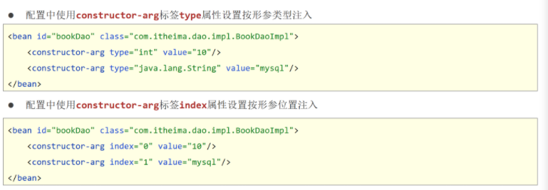

## Spring框架

充分解耦

- 使用IoC容器管理bean（IOC)
- 在IoC容器内将有依赖关系的bean进行关系绑定（DI）
- 使用对象时不仅可以直接从IoC容器中获取，并且获取到的bean已经绑定了所有的依赖关系

```xml
<!--坐标-->
 <dependency>
        <groupId>org.springframework</groupId>
        <artifactId>spring-context</artifactId>
        <version>5.2.10.RELEASE</version>
  </dependency>
```


### IOC

控制反转（Inversion of Control）：

​	使用对象时，由主动new产生对象转换为由**外部**提供对象，此过程中对象创建控制权由程序转移到外部，此思想称为控制反转。通俗的讲就是“**将new对象的权利交给Spring，从Spring中获取对象使用**”

### DI

依赖注入（Dependency Injection）:

​	在容器中建立bean与bean之间的依赖关系的整个过程，称为依赖注入。


### Bean

#### 基础配置

```xml
<bean id="唯一id" class="全类名"/>
```

##### 别名

别名可以当作id使用，可以配置多个，使用逗号|分号|空格分隔

```xml
<bean id="唯一id" name="别名1 别名2" class="全类名"/>
```

##### 作用范围配置

```xml
<bean id="唯一id" class="全类名" scope="???"/>
```

> `scope`的取值不仅仅只有`singleton`和`prototype`，还有`request、session、application、 websocket` ，表示创建出的对象放置在web容器(tomcat)对应的位置。比如：request表示保存到request域中。
>
> singleton表示单例
>
> prototype表示每次调用都创建一个，但容器不会管理


#### 实例化Bean的方式

即创建对象的方法

##### -构造方法方式

```xml
<bean id="唯一id" class="全类名"/>
```

> 此方式会去调用类的空参构造创建实例对象

##### -静态工厂方式

```xml
<bean id="唯一id" class="工厂类全类名" factory-method="创建目标对象的方法"/>
```

> 策略设计模式 

##### -实例工厂方式

```xml
<bean id="工厂类id" class="工厂类全类名"/>

<bean id="目标类id" factory-method="工厂类创建目标对象方法名" factory-bean="工厂类id"/>
```

##### -实现FactoryBean\<T\>接口

```java
public class DemoFactoryBean implements FactoryBean<DemoDao> {
    public DemoDao getObject() throws Exception {
        return new DemoDaoImpl();
    }

    public Class<?> getObjectType() {
        return UserDao.class;
    }
}
```

```xml
<bean id="唯一id" class="工厂类全类名"/>
```

> 策略设计模式
>
> 当工厂模式实现了`FactoryBean`时，Spring会自动识别


#### Bean的生命周期

##### Bean生命周期控制

###### XML配置

```xml
<!--init-method：设置bean初始化生命周期回调函数,此处填写init方法名-->
<!--destroy-method：设置bean销毁生命周期回调函数，仅适用于单例对象，此处填写destory方法名-->
<bean id="唯一id" class="全类名" init-method="初始化方法名" destroy-method="销毁方法名"/>
```

###### 实现`InitializingBean`、`DisposableBean`接口

```java
public class Demo implements InitializingBean, DisposableBean {
  
    public void Demo() {
        System.out.println("set .....");
    }
    public void destroy() throws Exception {
        System.out.println("service destroy");
    }
    public void afterPropertiesSet() throws Exception {
        System.out.println("service init");
    }
}
```

> 方法构造完成以后调用`afterPropertiesSet()`方法，销毁时调用`destroy()`


##### Bean销毁时机

- 容器关闭前触发bean的销毁
- 关闭容器方式：
  - 手工关闭容器
    `ConfigurableApplicationContext`接口`close()`操作
  - 注册关闭钩子，在虚拟机退出前先关闭容器再退出虚拟机
    `ConfigurableApplicationContext`接口`registerShutdownHook()`操作

```java
public class AppForLifeCycle {
    public static void main( String[] args ) {
        //此处需要使用实现类类型，ApplicationContext接口没有close方法
        ClassPathXmlApplicationContext ctx = new ClassPathXmlApplicationContext("applicationContext.xml");

        BookDao bookDao = (BookDao) ctx.getBean("bookDao");
        bookDao.save();
        //注册关闭钩子函数，在虚拟机退出之前回调此函数，关闭容器
        ctx.registerShutdownHook();
        //关闭容器
        //ctx.close();
    }
}
```


### 依赖注入的两种方式

- setter注入
  - 简单类型
  - **引用类型(常用)**
- 构造器注入
  - 简单类型
  - 引用类型

#### Setter注入

##### 引用类型

```xml
<bean id="唯一id" class="全类名"/>

<bean id="唯一id" class="全类名">
    <property name="setter属性" ref="引用类型（id）"/>
</bean>
```

##### 基本类型

```xml
<bean id="唯一id" class="全类名">
	<property name="Setter属性" value="值"/>
</bean>
```


#### 构造器注入

##### 引用类型

```xml
<bean id="唯一id" class="全类名"/>

<bean id="唯一id" class="全类名">
	<constructor-arg name="构造形参名称" ref="引用类型（id）" 
</bean>
```

##### 简单类型

```xml
<bean id="唯一id" class="全类名">
	<constructor-arg name="构造形参名称" value="值" 
</bean>
```




#### 依赖注入方式选择

1. 强制依赖使用构造器进行，使用setter注入有概率不进行注入导致null对象出现
2. 可选依赖使用setter注入进行，灵活性强
3. Spring框架倡导使用构造器，第三方框架内部大多数采用构造器注入的形式进行数据初始化，相对严谨
4. 如果有必要可以两者同时使用，使用构造器注入完成强制依赖的注入，使用setter注入完成可选依赖的注入
5. 实际开发过程中还要根据实际情况分析，如果受控对象没有提供setter方法就必须使用构造器注入
6. **自己开发的模块推荐使用setter注入**


#### 依赖自动装配

- IOC容器根据bean所依赖的资源在容器中自动查找并注入到bean中的过程称为自动装配
- 自动装配方式
  - **按类型（常用）**
  - 按名称
  - 按构造方法
  - 不启用自动装配

> 配置中使用bean标签autowire属性设置自动装配的类型

```xml
<bean id="唯一id" class="全类名" autowire="byType"/>
```

##### 依赖自动装配特征

1. 自动装配用于引用类型依赖注入，不能对简单类型进行操作
2. 使用按类型装配时（byType）必须保障容器中相同类型的bean唯一，推荐使用
3. 使用按名称装配时（byName）必须保障容器中具有指定名称的bean，因变量名与配置耦合，不推荐使用
4. 自动装配优先级低于setter注入与构造器注入，同时出现时自动装配配置失效


#### 集合注入

#####  注入数组类型数据

```xml
<property name="array">
    <array>
        <value>100</value>
        <value>200</value>
        <value>300</value>
    </array>
</property>
```

##### 注入List类型数据

```xml
<property name="list">
    <list>
        <value>itcast</value>
        <value>itheima</value>
        <value>boxuegu</value>
        <value>chuanzhihui</value>
    </list>
</property>
```

##### 注入Set类型数据

```xml
<property name="set">
    <set>
        <value>itcast</value>
        <value>itheima</value>
        <value>boxuegu</value>
        <value>boxuegu</value>
    </set>
</property>
```

#####  注入Map类型数据

```xml
<property name="map">
    <map>
        <entry key="country" value="china"/>
        <entry key="province" value="henan"/>
        <entry key="city" value="kaifeng"/>
    </map>
</property>
```

##### 注入Properties类型数据

```xml
<property name="properties">
    <props>
        <prop key="country">china</prop>
        <prop key="province">henan</prop>
        <prop key="city">kaifeng</prop>
    </props>
</property>
```

> 说明：property标签表示setter方式注入，构造方式注入constructor-arg标签内部也可以写\<array>、\<list>、\<set>、\<map>、\<props>标签