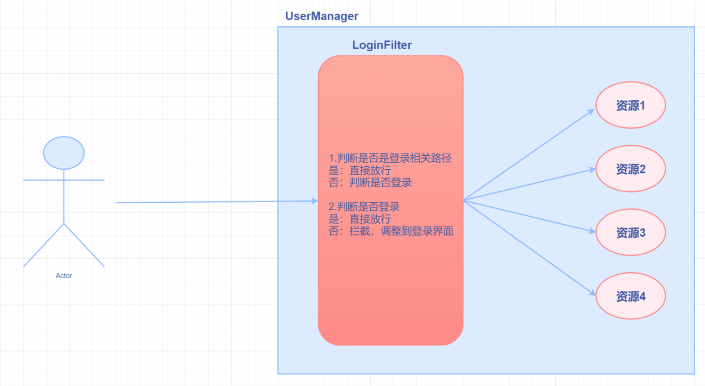

## EL表达式

获取域对象的数据

`${}`

> 1.EL表达式可以获取四大域的数据,依次从小到大的域中查找指定键名对应的值，如果找到了就不再往下找.
> 2.EL表达式可以获取八大隐式对象

### 获取不同类型的数据

#### 基本数据类型

```jsp
<% requst.setAttribute("num",10);%>

${num}
```

#### 自定义对象

```jsp
<% 
	Student stu = new Student();
	requst.setAttribute("stu",stu)
%>

${stu}
${stu.name} <%--获取自定义Javabean对象时，直接使用（对象名.属性名）即可，el表达式会自动调用相应的get方法--%>
${stu.age}
```

#### list集合

```jsp
<%
ArrayList<Student> list=new ArrayList<>();
list.add(new Student("张三",20));
list.add(new Student("李四",30));
request.setAttribute("list",list);
%>

获取list集合：${list}  <br>
获取list集合的0索引学生：${list[0]}<br>
获取list集合的1索引学生姓名：${list[1].name}<br>
```

#### map集合

```jsp
<%
Map<String,String> map=new HashMap<>();
map.put("孙悟空","花果山");
map.put("猪八戒","高老庄");
map.put("沙和尚","流沙河");
request.setAttribute("map",map);
%>


获取map集合：${map}  <br>
获取map集合中键对应的值：${map["孙悟空"]}  <br>
					或${map.孙悟空}
```

#### EL中的运算符

```wiki
算数运算符：+ - * / %
比较运算符：== != > >= < <=
逻辑运算符：&& || !
空运算符：empty
    功能：用于判断集合、数组、字符串是否为null并且长度是否为0
    ${empty list}
```

​	根据域中存储的数据，让单选框选中男或女

```jsp
<%request.setAttribute("gender","女");%>
<input type="radio" value="男" ${gender=="男"?"checked":""}> 男
<input type="radio" value="女"${gender=="女"?"checked":""}> 女
```

---


## JSTL

`Java Server Pages Standarded Tag LibraryJSP标准标签库`,用来简化在JSP页面中Java代码的编写

### 导包

```jsp
<%@ taglib prefix="tagName" uri="http://java.sun.com/jsp/jstl/core" %>
```

### 常用标签

```jsp
<!--if标签：相当于Java的if语句-->
<c:if test="${number%2==0}"> 
    ${number}是偶数
</c:if>

<!--choose标签：相当于Java的switch语句-->
<c:choose>
    <c:when test="${number==1}">星期一</c:when>
    <c:when test="${number==2}">星期二</c:when>
    <c:when test="${number==3}">星期三</c:when>
</c:choose>

<!--foreach标签：相当于Java的for循环-->
<c:forEach begin="0" end="${list.size()}" step="1" var="i">
    <c:if test="${list[i]!=null}">
        ${list[i].name},${list[i].age}<br>
    </c:if>
</c:forEach>

<!--foreach标签：类似Java增强for循环-->
<c:forEach items="${list}" var="element">
    ${element.name},${element.age}<br>
</c:forEach>
```


## 过滤器Filter

拦截过滤指定页面的请求，具体应用如：设置项目全局编码、根据是否登录来判断是否允许客户访问



使用过滤器需要实现`Filter`接口重写`doFilter`方法，并且配置XML相关字段或者使用注解`@WebFilter("要过滤的路径")`

例：

```java
@WebFilter("/*")
public class FilterDemo implements Filter {
    @Override
    public void doFilter(ServletRequest servletRequest, ServletResponse servletResponse, FilterChain filterChain) throws IOException, ServletException {
        System.out.println("FilterDemo1过滤器执行了");
        servletResponse.setContentType("text/html;charset=utf-8");
        filterChain.doFilter(servletRequest,servletResponse);
    }
}
```

#### 过滤器拦截配置

> 1. 具体资源路径： /index.jsp 
>     只有访问index.jsp资源时，过滤器才会被执行
> 2. 拦截目录： /user/*    
>     访问/user下的所有资源时，过滤器都会被执行
> 3. 后缀名拦截： *.jsp        
>     访问所有后缀名为jsp资源时，过滤器都会被执行
> 4. 拦截所有资源：/*        
>     访问所有资源时，过滤器都会被执行

#### 过滤器生命周期

> 1. `init`:在服务器启动后，会创建Filter对象，然后调用init方法。只执行一次。用于加载资源
> 2. `doFilter`:每一次请求被拦截资源时，会执行。执行多次
> 3. `destroy`:在服务器关闭后，Filter对象被销毁。如果服务器是正常关闭，则会执行destroy方法。只执行一次。用于释放资源


## 监听器Listener

### 监听器详解

https://www.cnblogs.com/zhangyanran/p/10082180.html

### 种类

#### 监听对象的创建和销毁

一、 ServletContextListener -- 监听servletContext对象的创建以及销毁

    1.1    contextInitialized(ServletContextEvent arg0)   -- 创建时执行
    
    1.2    contextDestroyed(ServletContextEvent arg0)  -- 销毁时执行

二、HttpSessionListener  -- 监听session对象的创建以及销毁

    2.2   sessionCreated(HttpSessionEvent se)   -- 创建时执行
    
    2.2   sessionDestroyed(HttpSessionEvent se) -- 销毁时执行

三、ServletRequestListener -- 监听request对象的创建以及销毁

    3.1    requestInitialized(ServletRequestEvent sre) -- 创建时执行
    
    3.2    requestDestroyed(ServletRequestEvent sre) -- 销毁时执行

#### 监听对象属性的改变

四、ServletContextAttributeListener  -- 监听servletContext对象中属性的改变

    4.1    attributeAdded(ServletContextAttributeEvent event) -- 添加属性时执行
    
    4.2    attributeReplaced(ServletContextAttributeEvent event) -- 修改属性时执行
    
    4.3    attributeRemoved(ServletContextAttributeEvent event) -- 删除属性时执行

五、HttpSessionAttributeListener  --监听session对象中属性的改变

    5.1    attributeAdded(HttpSessionBindingEvent event) -- 添加属性时执行
    
    5.2    attributeReplaced(HttpSessionBindingEvent event) -- 修改属性时执行
    
    5.3    attributeRemoved(HttpSessionBindingEvent event) -- 删除属性时执行

六、ServletRequestAttributeListener  --监听request对象中属性的改变

    6.1    attributeAdded(ServletRequestAttributeEvent srae) -- 添加属性时执行
    
    6.2    attributeReplaced(ServletRequestAttributeEvent srae) -- 修改属性时执行
    
    6.3    attributeRemoved(ServletRequestAttributeEvent srae) -- 删除属性时执行

#### 监听session对象的状态（自感知监听器）

七、 HttpSessionActivationListener -- session对象中属性的钝化与活化

    7.1    sessionWillPassivate(HttpSessionEvent se) -- 钝化之前调用
    
    7.2    sessionDidActivate(HttpSessionEvent se)  -- 活化之后调用

八、HttpSessionBindingListener  -- 实例对象与session的绑定与解绑

    8.1    valueBound(HttpSessionBindingEvent event) -- 绑定时调用
    
    8.2    valueUnbound(HttpSessionBindingEvent event) -- 解绑时调用
#### 原文链接

https://blog.csdn.net/qq_41685990/article/details/80359597


