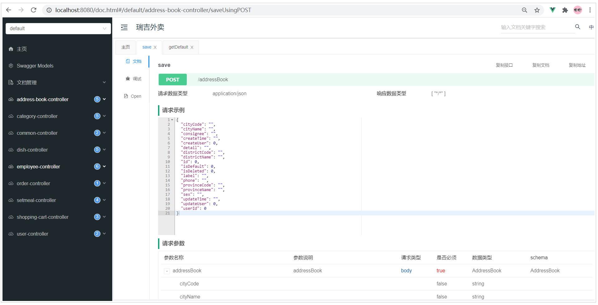

## Swagger

https://doc.xiaominfo.com/knife4j/documentation/get_start.html

Swagger 是一个规范和完整的框架，用于生成、描述、调用和可视化 RESTful 风格的 Web 服务。功能主要包含以下几点:

- 使得前后端分离开发更加方便，有利于团队协作

- 接口文档在线自动生成，降低后端开发人员编写接口文档的负担

- 接口功能测试

>  使用Swagger只需要按照它的规范去定义接口及接口相关的信息，再通过Swagger衍生出来的一系列项目和工具，就可以做到生成各种格式的接口文档，以及在线接口调试页面等等。

>  直接使用Swagger, 需要按照Swagger的规范定义接口, 实际上就是编写Json文件，编写起来比较繁琐、并不方便, 。而在项目中使用，我们一般会选择一些现成的框架来简化文档的编写，而这些框架是基于Swagger的，如knife4j。knife4j是为Java MVC框架集成Swagger生成Api文档的增强解决方案。而我们要使用kinfe4j，需要在pom.xml中引入如下**依赖**即可： 

**knife4j mvn依赖坐标：**

```xml
<dependency>
    <groupId>com.github.xiaoymin</groupId>
    <artifactId>knife4j-spring-boot-starter</artifactId>
    <version>3.0.2</version>
</dependency>
```


### 使用方式

使用knife4j自动生成接口文档，主要需要操作以下几步:

**1). 导入knife4j的maven坐标**

```xml
<dependency>
    <groupId>com.github.xiaoymin</groupId>
    <artifactId>knife4j-spring-boot-starter</artifactId>
    <version>3.0.2</version>
</dependency>
```

**2). 导入knife4j相关配置类**

直接在`WebMvcConfig`配置类中声明即可。

1. 在该配置类中加上两个注解 `@EnableSwagger2` `@EnableKnife4j` ,开启`Swagger`和`Knife4j`的功能。

2. 在配置类中声明一个`Docket`类型的bean, 通过该bean来指定生成文档的信息。

```java
@Slf4j
@Configuration
@EnableSwagger2
@EnableKnife4j
public class WebMvcConfig extends WebMvcConfigurationSupport {
    @Bean
    public Docket createRestApi() {
        // 文档类型
        return new Docket(DocumentationType.SWAGGER_2)
                .apiInfo(apiInfo())
                .select()
                .apis(RequestHandlerSelectors.basePackage("com.example.controller"))
                .paths(PathSelectors.any())
                .build();
    }
	
    private ApiInfo apiInfo() {
        return new ApiInfoBuilder()
                .title("标题")
                .version("版本")
                .description("描述")
                .build();
    }
}
```

> 注意： `Docket`声明时，指定的有一个包扫描的路径，该路径指定的是`Controller`所在包的路径。因为`Swagger`在生成接口文档时，就是根据这里指定的包路径，自动的扫描该包下的`@Controller`， `@RestController`， `@RequestMapping`等`SpringMVC`的注解，依据这些注解来生成对应的接口文档。


**3). 设置静态资源映射**

由于Swagger生成的在线文档中，涉及到很多静态资源，这些静态资源需要添加静态资源映射，否则接口文档页面无法访问。因此需要在 `WebMvcConfig`*（webmvc配置类）*类中的`addResourceHandlers`*(指定静态资源)*方法中增加如下配置。

```java
registry.addResourceHandler("doc.html").addResourceLocations("classpath:/META-INF/resources/");
registry.addResourceHandler("/webjars/**").addResourceLocations("classpath:/META-INF/resources/webjars/");
```


**4). 在LoginCheckFilter*（登录过滤器，放行相关资源路径）*中设置不需要处理的请求路径**

需要将Swagger及Knife4j相关的静态资源直接放行，无需登录即可访问，否则我们就需要登录之后，才可以访问接口文档的页面。

在原有的不需要处理的请求路径中，再增加如下链接： 

```java
"/doc.html",
"/webjars/**",
"/swagger-resources",
"/v2/api-docs"
```

 


###  查看接口文档

经过上面的集成配置之后，项目集成Swagger及Knife4j就已经完成了，接下来可以重新启动项目，访问接口文档，访问链接为： http://localhost:8080/doc.html

 

可以看到，在所有的Controller中提供的所有的业务增删改查的接口，全部都已经自动生成了，通过接口文档可以看到请求的url、请求方式、请求参数、请求实例、响应的参数，响应的示例。 并且呢，我们也可以通过这份在线的接口文档，对接口进行测试。

 


注意： 由于我们服务端的Controller中的业务增删改查的方法，都是必须登录之后才可以访问的，所以，我们在测试时候，也是需要先访问登录接口。登录完成之后，我们可以再访问其他接口进行测试。


我们不仅可以在浏览器浏览生成的接口文档，Knife4j还支持离线文档，对接口文档进行下载，支持下载的格式有：markdown、html、word、openApi。

 


###  常用注解

#### 问题说明

在上面直接访问Knife4j的接口文档页面，可以查看到所有的接口文档信息，但是这些接口文档分类及接口描述都是Controller的类名(驼峰命名转换而来)及方法名，而且在接口文档中，所有的请求参数，响应数据，都没有中文的描述，并不知道里面参数的含义，接口文档的可读性很差。

 


#### 注解介绍

为了解决上述的问题，Swagger提供了很多的注解，通过这些注解，我们可以更好更清晰的描述我们的接口，包含接口的请求参数、响应数据、数据模型等。核心的注解，主要包含以下几个： 

| 注解               | 位置             | 说明                                                         |
| ------------------ | ---------------- | ------------------------------------------------------------ |
| @Api               | 类               | 加载Controller类上,表示对类的说明                            |
| @ApiModel          | 类(通常是实体类) | 描述实体类的作用                                             |
| @ApiModelProperty  | 属性             | 描述实体类的属性                                             |
| @ApiOperation      | 方法             | 说明方法的用途、作用                                         |
| @ApiImplicitParams | 方法             | 表示一组参数说明                                             |
| @ApiImplicitParam  | 方法             | 用在@ApiImplicitParams注解中，指定一个请求参数的各个方面的属性 |


#### 注解测试（例）

**1). 实体类**

> 可以通过 @ApiModel , @ApiModelProperty 来描述实体类及属性

```java
@Data
@ApiModel("套餐")
public class Setmeal implements Serializable {
    private static final long serialVersionUID = 1L;
    @ApiModelProperty("主键")
    private Long id;
    
    //分类id
    @ApiModelProperty("分类id")
    private Long categoryId;
    
    //套餐名称
    @ApiModelProperty("套餐名称")
    private String name;
    //......
}
```


**2). 响应实体R**

```java
@Data
@ApiModel("返回结果")
public class R<T> implements Serializable{

    @ApiModelProperty("编码")
    private Integer code; //编码：1成功，0和其它数字为失败

    @ApiModelProperty("错误信息")
    private String msg; //错误信息
	//......
}    
```


**3). Controller类及其中的方法**

> 描述Controller、方法及其方法参数，可以通过注解： @Api， @APIOperation， @ApiImplicitParams, @ApiImplicitParam

```java
@RestController
@RequestMapping("/setmeal")
@Slf4j
@Api(tags = "套餐相关接口")
public class SetmealController {

    @Autowired
    private SetmealService setmealService;
    @Autowired
    private CategoryService categoryService;
    @Autowired
    private SetmealDishService setmealDishService;

    /**
     * 新增套餐
     * @param setmealDto
     * @return
     */
    @PostMapping
    @CacheEvict(value = "setmealCache",allEntries = true)
    @ApiOperation(value = "新增套餐接口")
    public R<String> save(@RequestBody SetmealDto setmealDto){
        log.info("套餐信息：{}",setmealDto);

        setmealService.saveWithDish(setmealDto);

        return R.success("新增套餐成功");
    }

    /**
     * 套餐分页查询
     * @param page
     * @param pageSize
     * @param name
     * @return
     */
    @GetMapping("/page")
    @ApiOperation(value = "套餐分页查询接口")
    @ApiImplicitParams({
            @ApiImplicitParam(name = "page",value = "页码",required = true),
            @ApiImplicitParam(name = "pageSize",value = "每页记录数",required = true),
            @ApiImplicitParam(name = "name",value = "套餐名称",required = false)
    })
    public R<Page> page(int page,int pageSize,String name){
        
       	//......
        
        return null;
    }
    
    //.......
}

```


**4). 重启服务测试**

通过Swagger的注解，对实体类及实体类中的属性，以及Controller和Controller的方法进行描述，接下来重新启动服务，然后看一下自动生成的接口文档有何变化。

 

在接口文档的页面中，我们可以看到接口的中文描述，清晰的看到每一个接口是做什么的，接口方法参数什么含义，参数是否是必填的，响应结果的参数是什么含义等，都可以清楚的描述出来。

总之，我们要想清晰的描述一个接口，就需要借助于Swagger给我们提供的注解。


## 问题--已解决

**不能直接在idea粘贴包路径，idea包路径默认为`com\example\packeage`，而Swagger需要的包路径格式为`com.example.package`，会导致Swagger找不到对应的包，无法生成文档**

