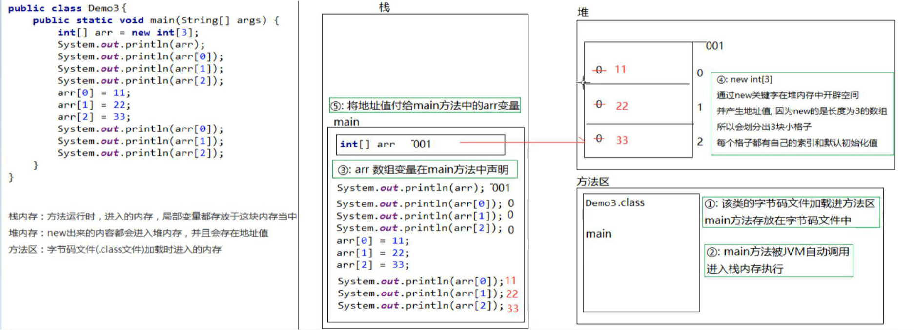

## IDEA

### Java项目目录结构

>			管理java文件的目录结构：
>				 总目录	//`ideaProjects
>					项目目录
>						模块目录
>							包目录
>								java文件

### 快捷键

> 		idea的快捷键：
>			psvm + 回车 快速生成main方法
> 			sout + 回车 快速生成输出语句
> 			Alt + 1 打开 \ 隐藏工程目录结构
> 			Alt + 4 打开 \ 隐藏控制台
> 							
> 			Ctrl + D 向下复制一行
> 				Ctrl + X 剪切当前行
> 			Ctrl + alt + L 格式化代码
> 			Alt+ enter 代码修正提示
> 			Ctrl + / 批量加入单行注释，再按一次就是取消
> 			Ctrl + shift + / 批量加入多行注释，再按一次就是取消
> 			Alt + shift + ↑ 上移当前行
> 			Alt + shift + ↓ 下移当前行
> 			boolean.if
> 			var.fori
> 			xx.var

## 数组

#### 数组的定义

```java
//静态初始化  在创建数组时，直接将元素确定
数据类型[] 数组名 = new 数据类型[{value1,value2,....};
数据类型 数组名[] = {value1,value2,....};
//动态初始化  数组动态初始化就是只给定数组的长度，由系统给出默认初始化值
数据类型[] 数组名 = new 数据类型[数组长度];
数据类型 数组名[] = new 数据类型[数组长度];
```

> 数组索引从0开始，即其第一个元素为`arr[0]`
>
> 访问格式：`数组名[索引]`

#### 数组常见异常

索引越界` ArrayIndexOutOfBoundsException` :超出数组索引范围

空指针`NullPointerException`：引用类型未赋值，即其值为`null`

#### java中内存分配

> - 栈内存：方法运行时，进入的内存，局部变量都存放于这块内存当中
> - 堆内存：`new`出来的内容都会进入堆内存，并且会存在地址值
> - 方法区：字节码文件（.class）加载时进入的内存
> - 本地方法栈：调用操作系统相关资源
> - 寄存器：CPU相关指令

---

#### 数组内存图



---


### 二维数组

```java
int[][] = new int [][];
```

同理还有三维数组，四维数组.....

即数组中在嵌套数组。

