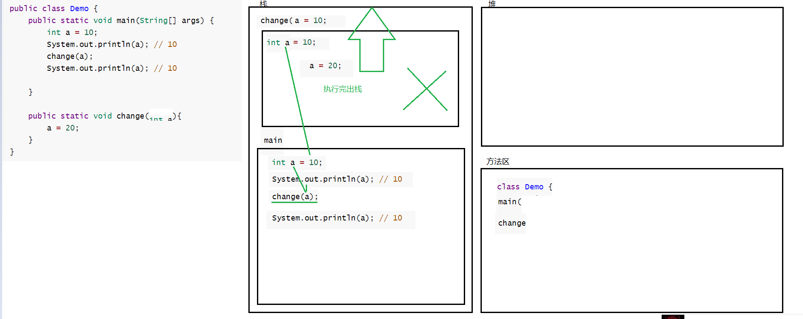

## 方法

方法（method）是将具有独立功能的代码块组织成为一个整体，使其具有特殊功能的代码集

### 定义格式

```java
权限修饰符 修饰符 返回值类型 方法名(方法参数){ 		//方法名命名约定，小驼峰式： methodName
    语句；
    return 返回值类型
} 
```


> **注意：**
>
> 1. 方法不能嵌套
>
> 2. 方法与方法之间没有先后顺序
>
> 3. 方法不调用不执行
>
> 4. void表示这个方法不能有返回值，但是可以有`return;`
>
> 5. 如果一个方法有返回值类型， 那么这个方法 则必须各个逻辑上，都应该有返回值。
>
>    ```java
>    public boolean numEqual(int a,int b){
>        if (a == b){
>            return true;
>        }elif(a != b){
>            return false;
>        }
>        /*会报错，在数学逻辑上方法内不会再有其他的可能性，不管传进的实参是多少，都会有返回值；
>        但是在java虚拟机的机器逻辑中，`if...else if `结构不能保证每次运行都有返回值，所以在结构上来说不能这样书写方法的返回值。
>        即：虚拟机不会去看你值的逻辑， 他只看你结构语句的逻辑。
>        */
>    }
>    ```
>
> 
>
> - 方法必须先创建才可以使用，该过程称为方法定义
> - 方法创建后并不是直接可以运行的，需要手动使用后，才执行，该过程称为方法调用
> - 基本类型的方法返回值可以用比其返回类型更大的类型进行接收，不能用比其小的类型进行接收。

---

### 方法调用过程图解


---

### 方法重载

> 概念： 同一个类中出现了**方法名相同**,**参数列表必须不同**,**返回值类型无关**，这些方法相互重载。
> 作用： 有了重载之后， 方便程序员的记忆。 减少了负担。

```java
/*方法重载:以下几个方法都是重载*/

//1
void Demo(){
    
}

//2
void Demo(int a){
    
}

//3
void Demo(double a){
    
}

//4
void Demo(int a,double b){
    
}

//5
void Demo(double a,int b){
    
}

//6
int Demo(byte a){
    return (int)a;
}

/*以下方法不是上线方法的重载*/
boolean Demo(){
    //报错，重载与返回值类型无关！
}
```

### 方法的值传递问题

```java
public class Demo {
	public static void main(String[] args) {
		int a = 10;
		System.out.println(a); // 10
		change(a);
		System.out.println(a); // 10

	}

	public static void change(int a){   
		a = 20;
	}
}
```

---

> 下图所示：
>
> 在调用`change()`方法时，先将main方法中的`a`赋值给`change()`中的`a`




---

```java
案例1：
			public class Demo14 {
				public static void main(String[] args) {
					int a = 10;
					System.out.println(a); // 10
					change(a);
					System.out.println(a); // 10

				}

				public static void change(int a){   
					a = 20;
				}
			}

		/案例6：
			public class Demo14 {
				public static void main(String[] args) {
					int a = 10;
					System.out.println(a); // 10
					a = change(a);
					System.out.println(a); // 20

				}

				public static int change(int a){   
					a = 20;
					return a;
				}
			}

		
		//案例2：
			public class Demo14 {
				public static void main(String[] args) {
					int[] arr = {10,20,30};
					System.out.println(arr[1]); // 20
					change(arr);
					System.out.println(arr[1]); // 200
				}

				public static void change(int[] arr){   
					arr[1] = 200;
				}
			}
		//案例5：	
			public class Demo14 {
				public static void main(String[] args) {
					int[] arr = {10,20,30};  //0x001
					System.out.println(arr[1]); // 20
					arr = change(arr); // arr = 0x001
					System.out.println(arr[1]); // 200
				}

				public static int[] change(int[] arr){    //arr = 0x001
					arr[1] = 200;
					return arr;  //0x001
				}
			}
		
		//案例3：
			public class Demo14 {
				public static void main(String[] args) {
					int[] arr = {10,20,30};
					System.out.println(arr[1]); // 20
					change(arr);
					System.out.println(arr[1]); // 20
				}

				public static void change(int[] arr){   
					arr = new int[]{100,200,300};
				}
			} // 只有引用类型 传递到另一个方法里面， 去操作了这个引用类型里面的内容的时候， 才会改变的。

		
		//案例4：
			public class Demo14 {
				public static void main(String[] args) {
					int[] arr = {10,20,30};  //oo1 
					System.out.println(arr[1]); // 20
					arr = change(arr); // arr=002
					System.out.println(arr[1]); // 200
				}

				public static int[] change(int[] arr){   //001 
					arr = new int[]{100,200,300};  //002
					return arr; //002
				}
			} 


```

### 参数传递

- 基本数据类型的参数，形式参数的改变，不影响实际参数
  - 每个方法在栈内存中，都会有独立的栈空间，方法运行结束后就会弹栈消失
  - 

---

- 对于引用类型的参数，形式参数的改变，影响实际参数的值
  - 引用数据类型的传参，传入的是地址值，内存中会造成两个引用指向同一个内存的效果，所以即使方法弹栈，堆内存中的数据也已经是改变后的结果
  - 

