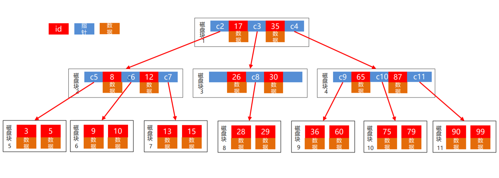
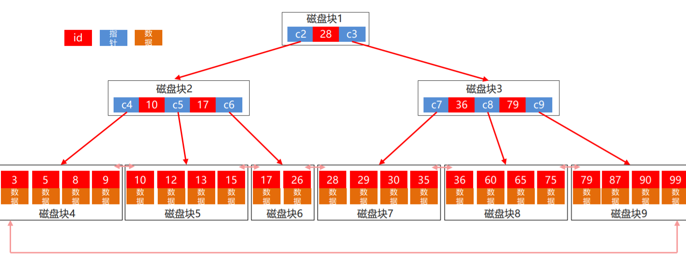
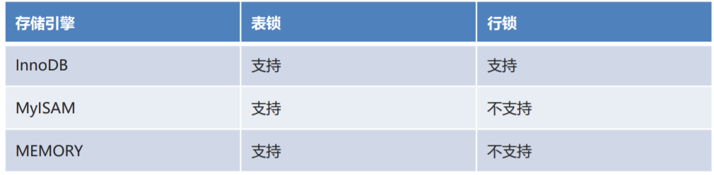

## 存储过程、存储函数

### 存储过程

> sql本身是非过程性的语言，存储过程和存储函数则类似于 Java 当中的方法, 可以对多组 SQL语句,进行封装操作，弥补了sql非过程的缺点。从 MySQL5.0 版本开始, 支持存储过程和存储函数。

- 存储函数和存储过程的区别
  - 存储函数：必须有返回值。
  - 存储过程：可以没有返回值,也可以拥有返回值。
- 存储过程的优缺点
  - 优点
    - 存储过程可以封装 复杂的SQL语句，简化SQL的编写
    - 存储过程可以回传递增，并接受参数
    - 存储过程无法使用select指定来运行，与查看表数据或定义函数不同
    - 存储过程可以用在数据校验，强制实行商业逻辑等。
  - 缺点
    - 存储过程，往往制定在特定的数据库中，因为支持的编程语言不同，当切换其他厂商数据库时候，需要重写原有的存储过程。
    - 存储过程性能调校与撰写，受限于种种数据库系统。

#### 创建存储过程的语法

```sql
DELIMITER $$ #定义结束符

-- 创建存储过程
CREATE PROCEDURE  存储过程名称(参数列表)
BEGIN 
    SQL语句列表;
END $$

-- 修改结束分隔符(⚠️注意：一定要打空格)
DELIMITER ;
```

#### 调用存储过程

```sql
CALL  存储过程名称(实际参数);
```

#### 查看存储过程

```sql
SELECT * FROM mysql.proc WHERE db = '数据库名称';
```

#### 删除存储过程

```sql
DROP PROCEDURE IF EXISTS 存储过程名称;
```

#### 使用变量

```sql
-- 修改结束符
delimiter $$

-- 创建存储过程
create procedure stu_getsum()

-- 开始
begin
	-- 定义变量total，默认值10
	declare total int default 10;
	-- 修改变量total的值
	set total=20;
	-- 查询student表的总分，赋值给变量total
	select sum(score) into total from student;
	-- 查询total的结果
	select total;
-- 结束
end $$

-- 修改结束符
delimiter ;
```

#### 条件判断IF

**语法：**

```sql
IF  判断条件  THEN  条件满足需要执行的语句;
ELSEIF  判断条件  THEN  条件满足需要执行的语句;
ELSE  其他情况下需要执行的语句;
END IF;
```

#### 循环

```sql
初始化语句;
WHILE  	条件判断语句 DO
		循环体语句;
		条件控制语句;
END  WHILE;
```

#### 参数传递

```sql
CREATE  PROCEDURE  存储过程的名称([IN][OUT][INOUT]  参数名称  参数类型)
BEGIN 
		SQL语句列表;
END $
```

```sql
#例：
-- 创建存储过程,设置为参数传递
DELIMITER $
CREATE PROCEDURE stu_param(IN total INT,INOUT message VARCHAR(20))
BEGIN
	IF total>380 THEN SET message = '学习优秀';
	ELSEIF total>=320 AND total<=380 THEN SET message = '学习不错';
	ELSE SET message = '学习一般';
	END IF;
END $
DELIMITER ;

-- 调用存储过程
CALL stu_param(350,@message);

--  查询返回结果
SELECT @message;
```

> @为当前会话参数
>
> @@为全局参数

---

### 存储函数

#### 无参的存储函数

**创建存储函数格式**

```sql
DELIMITER $
CREATE  FUNCTION  函数名称(参数列表)  RETURNS 返回值类型
BEGIN
	SQL 语句列表;
	RETURN  结果;
END $
DELIMITER ;
```

#### 有参的存储函数？？？


## 触发器

当关心的数据表中发生了增删改操作时，会自动触发触发器逻辑的执行。触发器可以在增删改之前或之后触发。

#### 触发器分类

| 触发器类型            | OLD 触发器之前的效果             | NEW 触发器之后的效果             |
| --------------------- | -------------------------------- | -------------------------------- |
| `INSERT` 类型的触发器 | 无（因为插入前，没有之前的数据） | NEW 表示将要或者已经新增的数据   |
| `UPDATE` 类型的触发器 | OLD 表示修改之前的数据           | NEW 表示将要或者已经修改后的数据 |
| `DELETE` 类型的触发器 | OLD 表示将要或者已经修改的数据   | 无（因为删除后，状态无数据）     |

#### INSERT触发器

```sql
-- 创建触发器
DELIMITER $

CREATE TRIGGER  触发器的名称  
AFTER INSERT ON 需要监测的表名称  FOR EACH ROW 
BEGIN
	INSERT INTO 记录结果的表名称 VALUES (值1,值2,值3,值4);
END $

DELIMITER ;
```

#### UPDATE 触发器

```sql
-- 创建触发器, 创建更新的触发器 
DELIMITER $

CREATE TRIGGER  触发器的名称  
AFTER UPDATE ON  需要监测的表名称 FOR EACH ROW 
BEGIN
	INSERT INTO 记录结果的表名称 VALUES (值1,值2,值3,值4);
END $

DELIMITER ;
```

#### DELETE 触发器

```sql
-- 创建触发器, 创建删除的触发器 
DELIMITER $

CREATE TRIGGER 触发器的名称
AFTER DELETE ON 需要监测的表名称 FOR EACH ROW 
BEGIN
	INSERT INTO 记录结果的表名称 VALUES (值1,值2,值3,值4);
END $

DELIMITER ;
```

#### 查看和删除触发器

```sql
-- 1. 查看触发器
SHOW  TRIGGERS;

-- 2. 删除触发器
DROP  TRIGGER  触发器的名称;
```


## 事务

在一个业务中，多条sql语句组合成一个整体，这个整体要同时成功或同时失败，此时我们需要使用事务对这一组sql操作进行管理。

#### 手动管理事务

```sql
start transaction; -- 开启事务.开启事务之后，在事务终止之前，所做的所有操作都是临时性的。
-- 执行一组sql操作
rollback;-- 回滚。把数据库的状态恢复到开启事务的时候的状态，就是还原。
commit;-- 提交。把在事务中操作的所有内容真正写入数据库文件持久化保存。
-- 如果在事务没有提交或者回滚之前，会话中止了，事务会自动中止，事务中的操作自动回滚。
```

> 一个事务只能被终止一次。

#### 事务提交方式

##### 手动提交

执行commit指令

##### 自动提交

MySQL数据库默认就是自动提交，Oracle数据库默认是手动提交。


#### 事务开启的时机

##### 手动开启

start transaction;

##### 自动开启

如果当前我们没有处在一个事务中，当我们执行任意一条sql语句时，MySQL会自动开启一个事务。

在默认的自动提交状态下，每执行一条sql语句，都会先开启一个事务，执行完毕后自动提交此事务。

> 如果要管理一组sql，让它们同时成功和失败，必须把它们放到同一个事务中。

#### 事务的四大特征

##### 原子性

强调事务的不可分割，是一个整体。

##### 一致性

事务操作前后，数据库要保持一致性不变。(事务总是从一个一致性状态转移到另一个一致性状态)

##### 隔离性

在事务并发的时候，事务之间理论上不应该互相影响。

> 实际操作中，考虑到效率问题，我们一般会设置不同的隔离级别。控制事务并发之间的影响。

##### 持久性

当一个事务结束时，它造成的影响就会持久化存储到数据库文件中。

#### 隔离级别

> 指事务之间隔离的程度，隔离的级别越高，并发时事务之间的影响就越低，但是执行效率也会随之降低。
>
> `read uncommitted`：未提交读。可能引发脏读、不可重复读、幻读/虚读。
>
> `read committed`：已提交读。可能引发不可重复读、幻读/虚读。Oracle的默认隔离级别
>
> `repeatable read` ：可重复读。可能引发幻读/虚读。MySQL的默认隔离级别
>
> `serializable`：串行化。可以解决所有并发问题。

>  **脏读**：一个事务读取到了另一个事务未提交的数据。
>
> **不可重复读**：一个事务读取到了另一个事务已经提交的修改。
>
>  **幻读/虚读**：一个事务读取到了另一个事务已经提交的新增或删除操作。


## MySQL引擎

> mysql处理数据，包括存储、管理等各种技术的合体称之为引擎。

- InnoDB：支持事务、支持外键、有表锁和行锁。

​		占据的存储空间大。默认的引擎。

- MyISAM：不支持事务，不支持外键，有表锁。

​		效率高，业务简单的时候适用。

- MEMORY：不支持事务，不支持外键，有表锁。数据存储在内存中，数据是临时的，断电丢失。一般用作缓存。

`存储引擎是设置在表层级上的。`


## 索引

> 1. 使用特定的数据结构，把数据库中的数据进行重新排列存储。使用特定算法，可以在较短时间内稳定的获取我们预期的数据。
> 2. 索引是建立在列上的。

### 分类

#### 按功能分类

- 普通索引：最基本的索引，没有任何限制。 
- 唯一索引：索引列的值必须唯一，但允许有空值。如果是组合索引，则列值组合必须唯一。 
- 主键索引：一种特殊的唯一索引，不允许有空值。在建表时有主键列同时创建主键索引。 
- 联合索引：顾名思义，就是将单列索引进行组合。 
- 外键索引：只有 InnoDB 引擎支持外键索引，用来保证数据的一致性、完整性和实现级联操作。 
- 全文索引：快速匹配全部文档的方式。InnoDB 引擎 5.6 版本后才支持全文索引。MEMORY 引擎不支持。

#### 按照结构分类

- BTree 索引：MySQL 使用最频繁的一个索引数据结构，是 InnoDB 和 MyISAM 存储引擎默认的索引类型， 底层基于 
- B+Tree 数据结构。 Hash 索引：MySQL 中 Memory 存储引擎默认支持的索引类型。

### 语法

#### 创建索引

```sql
CREATE [ UNIQUE | FULLTEXT ] INDEX 索引名称
[USING 索引类型] -- 默认是BTREE
ON 表名(列名...);
```

#### 查看索引

```sql
SHOW INDEX FROM 表名;
```

### 索引底层数据结构

> 索引底层默认是B-Tree，可以使用B+Tree
>
> mysql中以磁盘页为单位从磁盘读取数据，一次IO读取一页数据。一页大小为16K。

#### B-Tree

> 每个节点中不仅包含 key 值，还有数据。会增加查询数据时磁盘的 IO 次数。
>
> 这种数据结构会导致树的高度增加，磁盘IO次数较多。

每个磁盘页中保存了所有数据节点和指针。根据数据的区间，决定指针指向的后续磁盘块，分别为小于最小数据的，在两个数据之间的和大于最大数据的。

缺点：每次读取磁盘块会额外读取出所有的数据，即使是用不上的数据。所以每个页中存储的节点个数比较少，从而树的高度会比较大，导致IO次数比较多。



#### B+Tree

> 非叶子节点只存储 key 值。 所有数据存储在叶子节点。 所有叶子节点之间都有连接指针
>
> B+Tree可以降低竖的高度，减少磁盘IO次数

非叶子节点中不存储数据，仅保持索引的key值及指针。通过算法最终找到叶子节点，才能获取到数据。由于非叶子节点只存储key和指针，所以每个页中可以存储的节点数量大大增加，从而降低了树的高度。这样就节省了遍历过程中获取数据的次数，从而提升效率。

叶子节点是按照链表的结构进行了排列，我们可以非常迅速的根据头和尾节点进行范围查询。



### 索引命中原则

1. mysql命中索引时，从条件的最**左方**开始扫描，直到**遇到范围查询的条件结束**。从扫描出的列中，挑选能够命中索引的列使用索引。

2. 联合索引，匹配规则，是**从最左侧的列进行匹配**，如果**有部分能匹配也会命中**；但是如果最**左侧列不能匹配，则不能命中索引**。
3. 模糊查询中，**%如果在条件的前方，则不命中索引**。在条件的后方是可以走索引的。

### 索引建立的原则

1. 查询多，增删改少的大表建索引。
2. 索引的列中的值越离散越好。
3. 索引一定要建在常作为查询条件的列上，而不要滥用。


## 锁

> 数据库为了保证数据的一致性，在共享的资源被并发访问时变得安全所设计的一种规则。
>
> 锁机制类似多线程中的同步，作用就是可以保证数据的一致性和安全性。

### 分类

- 按操作分类 
  - 共享锁：也叫读锁。针对同一份数据，多个事务读取操作可以同时加锁而不互相影响 ，但是不能修改数据。 
  - 排他锁：也叫写锁。当前的操作没有完成前，会阻断其他操作的读取和写入。

- 按力度分类 
  - 表级锁：会锁定整个表。开销小，加锁快。锁定力度大，发生锁冲突概率高，并发度低。不会出现死锁情况。
  -  行级锁：会锁定当前行。开销大，加锁慢。锁定力度小，发生锁冲突概率低，并发度高。会出现死锁情况。 
  - 

- 按使用方式分类 
  - 悲观锁：每次查询数据时都认为别人会修改，很悲观，所以查询时加锁。 
  - 乐观锁：每次查询数据时都认为别人不会修改，很乐观，但是更新时会判断一下在此期间别人有没有去更新这个数据。

#### 共享锁

> 数据可以被多个事务查询，但是不能修改。
>
> 1. 共享锁加上之后，其他事务数据将只能读取，不能修改
> 2. 共享锁可以加多个，多个锁都释放掉之后才能修改
> 3. 默认情况下，索引列加锁时是行锁，非索引列加锁时是表锁。
> 4. 加锁操作在事务中进行，当事务结束后，自动释放当前事务中的共享锁。

```sql
SELECT语句 LOCK IN SHARE MODE;
```

#### 排他锁

> 加锁的数据，不能被其他事务加锁查询或修改。
>
> 1. 排他锁加上之后，其他事务数据将不能加锁进行查询，也不能修改。普通查询（不加锁的查询是可以的）
>
> 2. 排他锁加上之后，其他事务不能添加任意的锁。
>
> 3. 默认情况下，索引列加锁时是行锁，非索引列加锁时是表锁。
>
> 4. 加锁操作在事务中进行，当事务结束后，自动释放当前事务中的排他锁。
>
>    > 解决幻读问题，可以使用RR隔离级别，手动使用for update加锁的方式避免幻读。

```sql
SELECT语句 FOR UPDATE;
```

#### 乐观锁及悲观锁

悲观锁是使用技术手段加锁的机制保证操作并发时的安全。

乐观锁不会加锁，而是使用逻辑手段尝试操作数据，如果真的在操作过程中因为其他线程操作导致数据发送改变，则进行重试直到成功为止。

> 如果增删改非常少，查询非常多，此时加锁冲突的概率不大，可以使用乐观锁减少系统资源的占用以提升性能。

