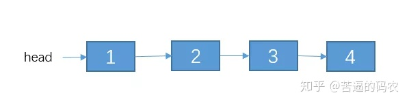
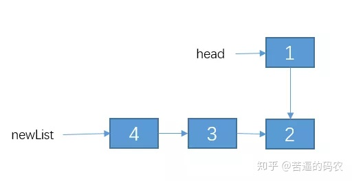
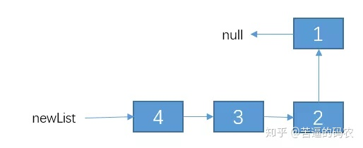

## 递归

方法自身调用自身以解决问题的方法：

```java
求1-number之间的和
public static int sum(int number){
    if (number = 1){
        return 1;
    }else{
        return sum(number-1)+number;
    }
}
```


### 案例：反转单链表

>  反转单链表。例如链表为：1->2->3->4。反转后为 4->3->2->1

链表的节点定义如下：

```text
class Node{
    int date;
    Node next;
}
```

三要素一步一步来

**1、定义递归函数功能**

假设函数 reverseList(head) 的功能是反转单链表，其中 head 表示链表的头节点。代码如下：

```text
Node reverseList(Node head){

}
```

**2. 寻找结束条件**

当链表只有一个节点，或者如果是空表的话，直接把 head 返回。代码如下：

```text
Node reverseList(Node head){
    if(head == null || head.next == null){
        return head;
    }
}
```

**3. 寻找等价关系**

这个的等价关系不像 n 是个数值那样，比较容易寻找。但是它的等价条件中，一定是范围不断在缩小，对于链表来说，就是链表的节点个数不断在变小，所以，如果实在找不出，就先对 reverseList(head.next) 递归走一遍，看看结果是咋样的。例如链表节点如下




我们就缩小范围，先对 2->3->4递归下试试，即代码如下

```text
Node reverseList(Node head){
    if(head == null || head.next == null){
        return head;
    }
    // 我们先把递归的结果保存起来，先不返回，因为我们还不清楚这样递归是对还是错。，
    Node newList = reverseList(head.next);
}
```

我们在第一步的时候，就已经定义了 reverseLis t函数的功能可以把一个单链表反转，所以，我们对 2->3->4反转之后的结果应该是这样：




我们把 2->3->4 递归成 4->3->2。不过，1 这个节点我们并没有去碰它，所以 1 的 next 节点仍然是连接这 2。

接下来呢？该怎么办？

其实，接下来就简单了，我们接下来只需要**把节点 2 的 next 指向 1，然后把 1 的 next 指向 null,不就行了？**，即通过改变 newList 链表之后的结果如下：



也就是说，reverseList(head) 等价于  **reverseList(head.next)** + **改变一下1，2两个节点的指向**。好了，等价关系找出来了，代码如下(有详细的解释)：

```text
//用递归的方法反转链表
public static Node reverseList2(Node head){
    // 1.递归结束条件
    if (head == null || head.next == null) {
             return head;
         }
         // 递归反转 子链表
         Node newList = reverseList2(head.next);
         // 改变 1，2节点的指向。
         // 通过 head.next获取节点2
         Node t1  = head.next;
         // 让 2 的 next 指向 2
         t1.next = head;
         // 1 的 next 指向 null.
        head.next = null;
        // 把调整之后的链表返回。
        return newList;
    }
```

