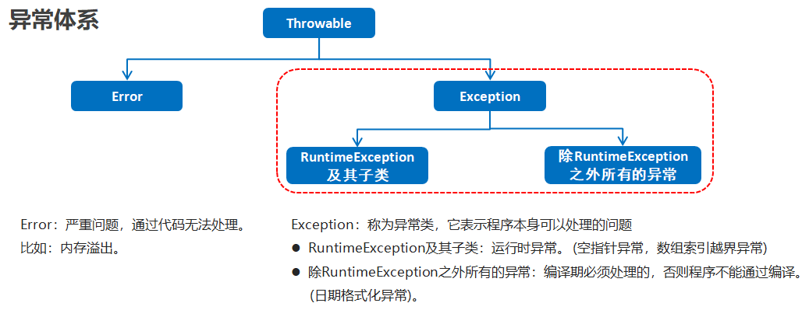
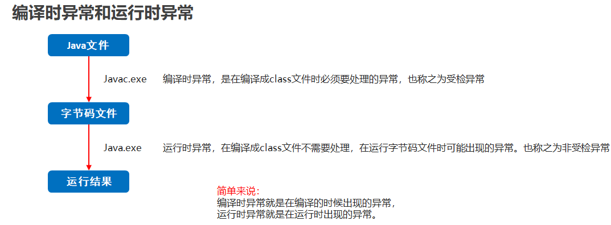

### 异常



---

#### 编译时异常和运行时异常的区别

- 编译时异常

  - 都是Exception类及其子类
  - 必须显示处理`throws`，否则程序就会发生错误，无法通过编译

- 运行时异常

  - 都是RuntimeException类及其子类
  - 无需显示处理，也可以和编译时异常一样处理



---

#### JVM默认处理异常的方式

- 如果程序出现了问题，我们没有做任何处理，最终JVM 会做默认的处理，处理方式有如下两个步骤：
  - 把异常的名称，错误原因及异常出现的位置等信息输出在了控制台
  - 程序停止执行

---

#### 查看异常信息

控制台在打印异常信息时,会打印异常类名,异常出现的原因,异常出现的位置

调bug时,可以根据提示,找到异常出现的位置,分析原因,修改异常代码


---

#### throws方式处理异常

编译时（受检）异常必须要在调用的方法中声明`throws`，或者使用`try...catch`捕获处理

##### 定义格式

```java
public void 方法() throws 异常类名 {
    
}
```

##### 注意事项

- throws格式是跟在方法的括号后面的
- 编译时异常必须要进行处理，两种处理方案：try...catch …或者 throws，如果采用 throws 这种方案，在方法上进行显示声明,将来谁调用这个方法谁处理
- 运行时异常因为在运行时才会发生,所以在方法后面可以不声明,运行时出现异常默认交给jvm处理

---

#### throw抛出异常

+ 格式

  `throw new XxxException();`

+ 注意

  这个格式是在方法内的，表示当前代码手动抛出一个异常，下面的代码不再执行

+ throws和throw的区别

  | throws                                         | throw                                      |
  | ---------------------------------------------- | ------------------------------------------ |
  | 用在方法声明后面，跟的是异常类名               | 用在方法体内，跟的是异常对象名             |
  | 表示声明异常，调用该方法有可能会出现这样的异常 | 表示手动抛出异常对象，由方法体内的语句处理 |

#### try-catch方式处理异常

##### 定义格式

```java
try {
	可能出现异常的代码;
} catch(异常类名 变量名) {
	异常的处理代码;
}
```

##### 执行流程

- 程序从 try 里面的代码开始执行
- 出现异常，就会跳转到对应异常的 `catch`分支语句里面去执行
- 执行完毕之后，程序还可以继续往下执行

##### 问

1. 如果 `try` 中没有遇到问题，怎么执行？

   会把`try`中所有的代码全部执行完毕,不会执行`catch`里面的代码

2. 如果` try` 中遇到了问题，那么 `try` 下面的代码还会执行吗？

   那么直接跳转到对应的`catch`语句中,`try`中出现异常的语句下面的代码就不会再执行了
   当`catch`里面的语句全部执行完毕,表示整个体系全部执行完全,继续执行下面的代码

3. 如果出现的问题没有被捕获，那么程序如何运行？

   那么`try...catch`就相当于没有写.那么也就是自己没有处理，默认交给虚拟机处理
   
4. 同时有可能出现多个异常怎么处理？

   出现多个异常,那么就写多个`catch`就可以了.
   注意点：如果多个异常之间存在子父类关系，那么父类一定要写在下面，不然父类会拦截其子类异常

##### try... catch ...finally

`finally`中语句不管怎么都会执行，即使在`catch`语句中抛出了新的异常仍然会执行

---

#### Throwable成员方法

| 方法名                        | 说明                              |
| ----------------------------- | --------------------------------- |
| public String getMessage()    | 返回此 throwable 的详细消息字符串 |
| public String toString()      | 返回此可抛出的简短描述            |
| public void printStackTrace() | 把异常的错误信息输出在控制台      |

#### 自定义异常

实现步骤

1. 定义异常类
2. 写继承关系
3. 提供空参构造
4. 提供带参构造

---

### 扩展

#### 异常转换

在`catch`语句中抛出新的异常相当于将原来的异常转换了，异常栈不会打印原来的异常

可以通过在`新抛出的异常`中传入之前的异常实例来获取根源异常信息`throw new Exception(e);`

```java
public class Main {
    public static void main(String[] args) {
        try {
            process1();
        } catch (Exception e) {
            e.printStackTrace();
        }
    }

    static void process1() {
        try {
            process2();
        } catch (NullPointerException e) {
            throw new IllegalArgumentException();// throw new IllegalArgumentException(e);
        }
    }

    static void process2() {
        throw new NullPointerException();
    }
}
```

#### Caused  by: xxx

```
java.lang.IllegalArgumentException: java.lang.NullPointerException
    at Main.process1(Main.java:15)
    at Main.main(Main.java:5)
Caused by: java.lang.NullPointerException
    at Main.process2(Main.java:20)
    at Main.process1(Main.java:13)
```

注意到`Caused by: Xxx`，说明捕获的`IllegalArgumentException`并不是造成问题的根源，根源在于`NullPointerException`，是在`Main.process2()`方法抛出的。

在代码中获取原始异常可以使用`Throwable.getCause()`方法。如果返回`null`，说明已经是“根异常”了。

#### 异常屏蔽

如果在执行`finally`语句时抛出异常，那么，`catch`语句的异常就不能正常抛出

```x-java
public class Main {
    public static void main(String[] args) {
        try {
            Integer.parseInt("abc");
        } catch (Exception e) {
            System.out.println("catched");
            throw new RuntimeException(e);
        } finally {
            System.out.println("finally");
            throw new IllegalArgumentException();
        }
    }
}

//执行结果
catched
finally
Exception in thread "main" java.lang.IllegalArgumentException
    at Main.main(Main.java:11)
```

在极少数的情况下，需要获知所有的异常，保存所有的异常信息的方法：

先用`origin`变量保存原始异常，然后调用`Throwable.addSuppressed()`，把原始异常添加进来，最后在`finally`抛出

```x-java
public class Main {
    public static void main(String[] args) throws Exception {
        Exception origin = null;
        try {
            System.out.println(Integer.parseInt("abc"));
        } catch (Exception e) {
            origin = e;
            throw e;
        } finally {
            Exception e = new IllegalArgumentException();
            if (origin != null) {
                e.addSuppressed(origin);
            }
            throw e;
        }
    }
}
```

