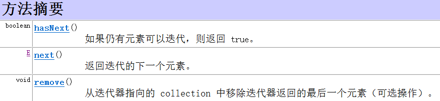
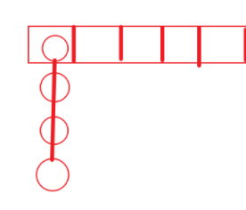

## 集合


​																								*蓝框代表接口，红框代表实现类*

### Collection的共性方法

`boolean add(E e)`								添加元素

`boolean remove(E o)`	   				  从集合中移除指定的元素

`boolean removeIf(Prodicate o)`	根据条件进行删除

`void clear()`										清空集合

`boolean contains(Object o)`		   判断集合中是否存在指定的元素

`boolean isEmpty()`							  判断集合是否为空

`int size()`											集合的长度，也就是集合中元素的个数	

#### removeIf的底层

```java
//----------------------Predicate
interface Predicate<T>{		
    boolean test(T t);
}
//----------------------Collection --> removeIf(Predicate<? super E> filter);
interface Collection {
    default boolean removeIf(Predicate<? super E> filter) {
        Objects.requireNonNull(filter);			//判断是否为Null,如果为null则报NPE;
        boolean removed = false;				//声明一个boolean值，目的为返回是否按规则删除成功
        final Iterator<E> each = iterator();	//调用iterator()方法生成一个final的Iterator对象，用于迭代当前集合的所有元素
        while (each.hasNext()) {				//利用迭代器遍历集合
            if (filter.test(each.next())) {		//调用Predicate接口中的test方法，判断元素是否符合自定义的规则
                each.remove();					//符合规则删除元素
                removed = true;					//返回值标记为true，表示有元素被匹配，删除成功
            }
        }
        return removed;							//返回是否有元素被匹配删除
    }
}
```

---

### 单列集合的通用遍历方式

#### 迭代器

实现了`Iterable`接口的类`(Collection的所有实现类：List、Set)`可以调用`iterator()`方法生成迭代器对象

##### Iterator的方法

---



---

#### 增强for

实现了`Iterable`接口的实现类可以使用`（foreach）`增强`for`来遍历

---

### List

#### 特点

- 可以存储重复元素
- 有索引
- 存取有序

#### 特有方法

**共性：** *有索引*

`void add(int index, E e);` 增

`E remove(int index);`删

`E set(int index , E e)`改

`E get(int index);`查

---

#### ArrayList ：底层数组结构

---

#### LinkedList ：链表结构的集合

`LinkedList` 的`get(int index)`方法底层

```java
//
	public E get(int index) {
        checkElementIndex(index);
        return node(index).item;
    }
//-----------------------------------------------------
//检查索引是否合法
    private void checkElementIndex(int index) {
        if (!isElementIndex(index))
            throw new IndexOutOfBoundsException(outOfBoundsMsg(index));
    }
//
    private boolean isElementIndex(int index) {
        return index >= 0 && index < size;
    }
//------------------------------------------------------
//查找
    Node<E> node(int index) {
        // assert isElementIndex(index);

        if (index < (size >> 1)) {
            Node<E> x = first;
            for (int i = 0; i < index; i++)
                x = x.next;
            return x;
        } else {
            Node<E> x = last;
            for (int i = size - 1; i > index; i--)
                x = x.prev;
            return x;
        }
    }

```

---

### Set

**Set的特点**

- 可以去除重复
- 存取顺序不一致
- 没有索引，不能通过索引操作元素


#### TreeSet

链表+红黑树

##### 特点

- 不能存储重复元素
- 没有索引
- 会将元素按规则排序

##### 自然排序

`TreeSet`默认按照自然排序进行排序，使用自然排序要求`TreeSet`中存入的类型必须实现了`Comparable`接口，此时存储数据时TreeSet会按照重写后的`compareTo`方法进行排序

以`Integer`为例：

```java
//实现Comparable
public final class Integer extends Number implements Comparable<Integer>{		
    //重写compareTo方法    
    public int compareTo(Integer anotherInteger) {				
        return compare(this.value, anotherInteger.value);
    }
    
    //
    public static int compare(int x, int y) {
        return (x < y) ? -1 : ((x == y) ? 0 : 1);
    }
}
```

##### 比较器排序	Comparator

比较器排序的使用优先级高于自然排序，如果使用了比较器，则自然排序失效。

比较器排序的使用场景：在自然排序不满足当前的排序需求时，可以使用比较器自定义规则进行排序

比较器的使用时在TreeSet的构造方法中传入一个`Comparator`对象：`TreeSet(Comparator<? super E> comparator)`

例：将存入的`Integer`按倒序排序：

```java
//使用匿名内部类
TreeSet<Integer> treeset = new Treeset<>(new Comparator<Integer>{
    @Override
    public int compare(Integer I1, Integer I2){
        return I2 - I1;
    }
});
//使用Lambda表达式
TreeSet<Integer> treeset1 = new Treeset<>(
    (Integer I1, Integer I2) -> {//数据类型Integer可以省略
        return I2 - I1;		//return和{}可以省略
    }
);
```

---

#### HashSet



数组+链表+红黑树	//hash算法

- 不可以存储重复元素
- 存取不一致
- 没有索引

##### 存储流程

根据`元素的hash值与数组的长度`按照`hash算法`计算出元素应该存的位置，判断该位置是否为空，为空则直接添加，不为空则依次根据`equals()方法`判断链表中的元素是否相等，全部元素都不相等则添加，有元素相等则替换元素。链表中长度如果大于等于8，则将链表转成红黑树结构。

##### 相关方法

`hashCode()`返回哈希值，可以重写	

```java
public int hashCode() {
	int result = name != null ? name.hashCode() : 0;
	result = 31 * result + age;			//通常将元素的相关值*31
	return result;
}
```

`equals()`

---

##### LinkedHashSet

`HashSet`的子类，因为多加入了一个链表结构，所以其特点是：不可以存储重复元素，存取有序，无索引

---

### Map

#### 特点

- 双列集合，存储键值对
- 键不可以重复，值可以重复，键可以看作是所索引的角色

---

#### HashMap

##### 遍历方式

1. 根据键找值

   调用`keySet()`方法将HashMap中的键存为一个集合，遍历键的集合，再调用`HashMap`的`get(<E> key)`方法获取对应值

```java
HashMap<Integer,Integer> hashmap = new HashMap<>();
Set<Integer> keys = hashmap.keySet();
for(Integer key : keys){
    System.out.println(key + " = " + hashmap.get(key));
}
```

2. 根据键值对找键和值

   ```java
   HashMap<Integer,Integer> hashmap = new HashMap<>();
   Set<Entry<Integer, Integer>> entries = hashmap.entrySet();
   for(Entry<Integer,Integer> entry : entries){
       System.out.println(entry.getKey+" "+entry.getValue);
   }
   ```

3. forEach遍历

   ```java
   class Map{
   	default void forEach(BiConsumer<? super K, ? super V> action)
   }
   ```

   ```java
   HashMap<Integer,Integer> hashmap = new HashMap<>();
   hashmap.forEach(key, value -> System.out.println(key + " = " + value))
   
   ```
   
   底层源码
   
   ```java
   	default void forEach(BiConsumer<? super K, ? super V> action) {	//接受参数为BiConsumer的实现类对象
           Objects.requireNonNull(action);
           for (Map.Entry<K, V> entry : entrySet()) {
               K k;
               V v;
               try {
                   k = entry.getKey();
                   v = entry.getValue();
               } catch (IllegalStateException ise) {
                   // this usually means the entry is no longer in the map.
                   throw new ConcurrentModificationException(ise);
               }
               action.accept(k, v);		//调用BiConsumer接口中的accept(T t,U u)方法,执行重写后方法的动作
           }
       }
   
   //
   public interface BiConsumer<T, U> {
       void accept(T t, U u);
   ```
   
   

---

### 数据结构

栈 ： 先进后出
队列： 先进先出
数组： 查询快 增删慢。
链表 ： 查询慢 增删快。
	单向链表 ： 只能从前往后查，节约空间
	双向链表： 既可以往前查找，也可以往后去查，浪费空间。

数据的存储设计： 拿时间换空间， 拿空间换时间

#### 红黑树

- 不允许两个红链接连续

- 红链接必须在左侧

- 根节点是黑链接

- 新添加的节点都是红链接


左旋：红连接在右侧

右旋：两个连续的红连接

右旋后还需要将颜色反转

