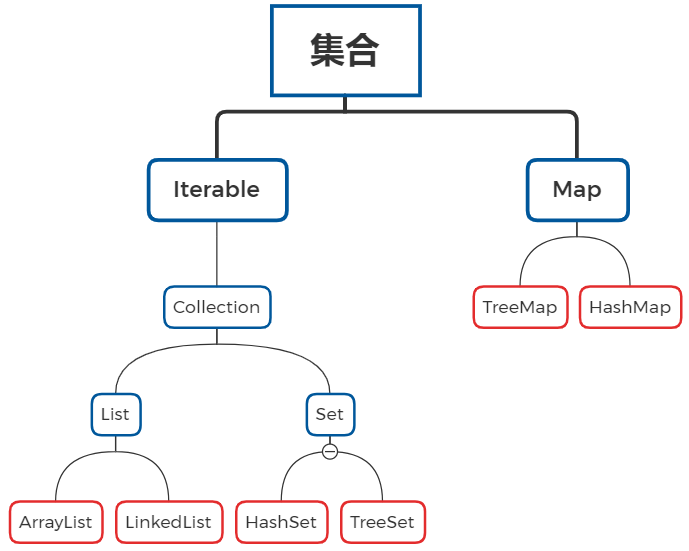

## 集合



​																								*蓝框代表接口，红框代表实现类*

### Collection的共性方法

`boolean add(E e)`								添加元素

`boolean remove(E o)`	   				  从集合中移除指定的元素

`boolean removeIf(Prodicate o)`	根据条件进行删除

`void clear()`										清空集合

`boolean contains(Object o)`		   判断集合中是否存在指定的元素

`boolean isEmpty()`							  判断集合是否为空

`int size()`											集合的长度，也就是集合中元素的个数	

#### removeIf的底层

```java
//----------------------Predicate
interface Predicate<T>{		
    boolean test(T t);
}
//----------------------Collection --> removeIf(Predicate<? super E> filter);
interface Collection {
    default boolean removeIf(Predicate<? super E> filter) {
        Objects.requireNonNull(filter);			//判断是否为Null,如果为null则报NPE;
        boolean removed = false;				//声明一个boolean值，目的为返回是否按规则删除成功
        final Iterator<E> each = iterator();	//调用iterator()方法生成一个final的Iterator对象，用于迭代当前集合的所有元素
        while (each.hasNext()) {				//利用迭代器遍历集合
            if (filter.test(each.next())) {		//调用Predicate接口中的test方法，判断元素是否符合自定义的规则
                each.remove();					//符合规则删除元素
                removed = true;					//返回值标记为true，表示有元素被匹配，删除成功
            }
        }
        return removed;							//返回是否有元素被匹配删除
    }
}
```

---

### 单列集合的通用遍历方式

#### 迭代器

实现了`Collection`接口的类可以调用`iterator()`方法生成迭代器对象

#### foreach（增强for）

实现了`Iterable`接口的实现类可以使用`foreach`增强`for`来遍历

---

### List接口

#### List接口实现类的特点：

- 可以存储重复元素
- 有索引
- 存取有序

#### 特有方法

**共性：** *有索引*

`void add(int index, E e);` 增

`E remove(int index);`删

`E set(int index , E e)`改

`E get(int index);`查

---

### 数据结构

栈 ： 先进后出
队列： 先进先出
数组： 查询快 增删慢。
链表 ： 查询慢 增删快。
	单向链表 ： 只能从前往后查，节约空间
	双向链表： 既可以往前查找，也可以往后去查，浪费空间。

数据的存储设计： 拿时间换空间， 拿空间换时间

##### ArrayList ：底层是数组结构

---

##### LinkedList ：链表结构的集合

`LinkedList` 的`get(int index)`方法底层

```java
//
	public E get(int index) {
        checkElementIndex(index);
        return node(index).item;
    }
//-----------------------------------------------------
//检查索引是否合法
    private void checkElementIndex(int index) {
        if (!isElementIndex(index))
            throw new IndexOutOfBoundsException(outOfBoundsMsg(index));
    }
//
    private boolean isElementIndex(int index) {
        return index >= 0 && index < size;
    }
//------------------------------------------------------
//查找
    Node<E> node(int index) {
        // assert isElementIndex(index);

        if (index < (size >> 1)) {
            Node<E> x = first;
            for (int i = 0; i < index; i++)
                x = x.next;
            return x;
        } else {
            Node<E> x = last;
            for (int i = size - 1; i > index; i--)
                x = x.prev;
            return x;
        }
    }

```

