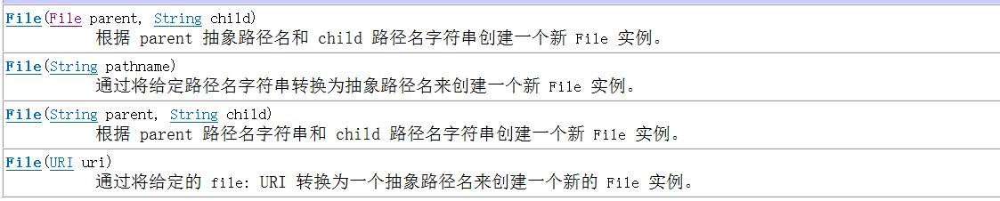
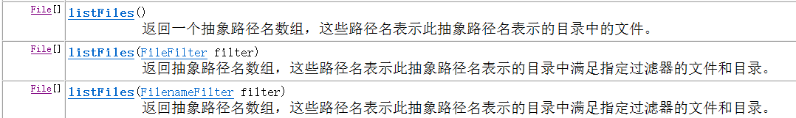
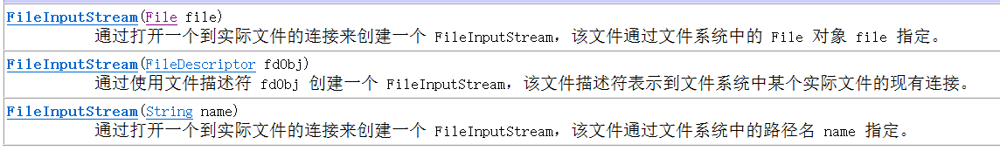
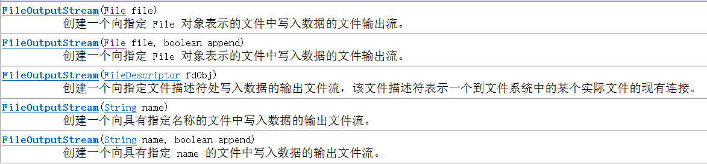
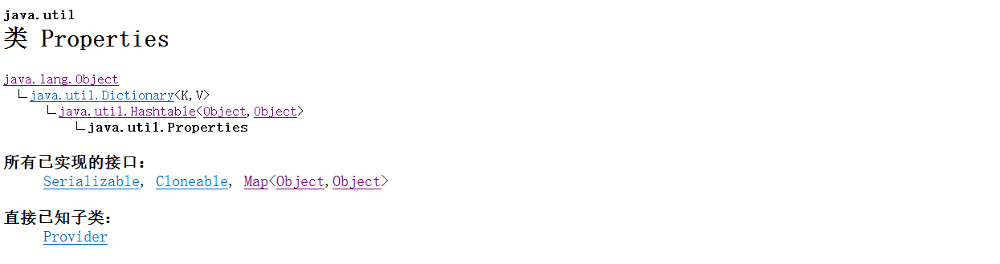
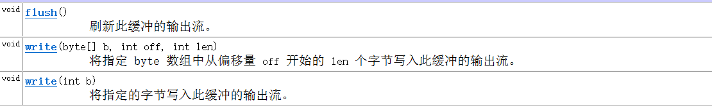

## 输入输出流

`java`中的输入输出是相对于正在对流操作的程序内存而言的，可以理解为输入即硬盘向内存中输入内容，输出则反之。

#### 注意事项

- IO流在被使用完后必须要调用`close()`方法关闭流，否则将产生不必要的资源占用，jvm也不会自动回收


---

#### 相对路径和绝对路径


---


### File

#### 构造方法



#### 常用方法

`boolean createNewFile()`		当且仅当不存在具有此抽象路径名指定名称的文件时，不可分地创建一个新的空文件。

`boolean delete()`       删除此抽象路径名表示的文件或目录。

`boolean exists()`	  测试此抽象路径名表示的文件或目录是否存在。

 `String getName()`		返回由此抽象路径名表示的文件或目录的名称。

`String getPath()`		将此抽象路径名转换为一个路径名字符串。

`boolean ifFile()`		测试此抽象路径名表示的文件是否是一个标准文件。

`boolean isDirctory()`		测试此抽象路径名表示的文件是否是一个目录。

`boolean mkdir()`			创建此抽象路径名指定的目录。

`boolean mkdirs()`			创建此抽象路径名指定的目录，包括所有必需但不存在的父目录。



---


---

---

### 字节输入流

`FileInputStream`

#### 构造方法



#### 常用方法

| 方法                                  | 作用                                                         |
| :------------------------------------ | ------------------------------------------------------------ |
| `int read()`                          | 从此输入流中读取一个数据字节。                               |
| `int read(byte[] b)`                  | 从此输入流中将最多 `b.length` 个字节的数据读入一个 byte 数组中 |
| `int read(byte[] b, int off,int len)` | 从此输入流中将最多 `len` 个字节的数据读入一个 byte 数组中。  |
| `void close()`                        | 关闭流                                                       |

#### 注意事项

- 如果文件不存在，调用`read()`方法时会报错

#### 读取文件

```java
		FileInputStream fis = new FileInputStream("a.txt")
        byte[] bys = new byte[1024 * 8];
        int len;
        while ((len = fis.read(bys)) != -1) {
            System.out.println(new String(bys, 0, len));
        }
        fis.close();
```


---

---

### 字节输出流

`FileOutputStream`

#### 构造方法



`FileOutputStream(String name, boolean append)`和`FileOutputStream(File file, boolean append)`两个方法可以指定是否续写文件内容还是将文件清空后重新写入。

#### 常用方法

| 方法                                     | 作用                                                         |
| ---------------------------------------- | ------------------------------------------------------------ |
| `void write(int b)`                      | 将指定字节写入此文件输出流。                                 |
| `void write(byte[] b)`                   | 将 `b.length` 个字节从指定 byte 数组写入此文件输出流中。     |
| `void write(byte[] b, int off, int len)` | 将指定 byte 数组中从偏移量 `off` 开始的 `len` 个字节写入此文件输出流。 |
| `void close()`                           | 关闭流                                                       |

#### 注意事项

- 字节输出流创建对象的时候 如果传入的路径文件存在 则清空的内容， 如果不存在则新建一个
- 追加写入的话 需要在`FileOutputStream`的构造方法里面加一个`true`
  - 写出换行
    - \   字符转义
    - \\\  代表	\
    - \t  table键
    - \r  return  返回 --- 把光标返回到行首位置
    - \n  newLine 新一行


---

### 字节缓冲流

#### `BufferedOutputStream`&`BufferedInputStream`

复制文件：

```java
BufferedInputStream bufferedInputStream = new BufferedInputStream(new FileInputStream(""));
BufferedOutputStream bufferedOutputStream = new BufferedOutputStream(new FileOutputStream(""));
int len;
while ((len = bufferedInputStream.read()) != -1){
    bufferedOutputStream.write(len);
}
bufferedInputStream.close();
bufferedOutputStream.close();
```


---

---


### 字符流

FileReadStream

FileWriteStream

BufferedReadStream

BufferedWriteStream

### 对象流

ObjectInputStream

ObjectOutputStream

`Serializable `

### 转换流

OutputStreamWriter

InputStreamReader


### Properties集合

#### 继承关系



---

---

#### -

- `Properties`不需要有泛型，在继承`HashTable`时已经明确了泛型类型是`Object`
  - `public class Properties extends Hashtable<Object,Object> {}`

---

#### 特有方法

`Object setProperty(String key, String value)`添加、修改元素

`Set<String> stringPropertyNames()`返回键的集合

`String getProperty(String key)`返回该键对应的值

#### 与IO流结合的方法

`void store(Writer writer, String comments)`以适合使用 [`load(Reader)`](../../java/util/Properties.html#load(java.io.Reader))  方法的格式，将此 `Properties` 表中的属性列表（键和元素对）写入输出字符。

`void store(OutputStream out, String comments)`以适合使用 [`load(InputStream)`](../../java/util/Properties.html#load(java.io.InputStream))  方法加载到 `Properties` 表中的格式，将此 `Properties`  表中的属性列表（键和元素对）写入输出流。

`void load(Reader reader)`把文件中的键值对读取到程序里面的集合中(字符流)

`void load(InputStream inStream)`把文件中的键值对 读取到程序里面的集合中（字节流不支持中文）

`save(OutputStream out, String comments) 已过时`把集合中的键值对 写出到文件中（字节流不支持中文） 已过时。如果在保存属性列表时发生`I / O`错误，此方法不会抛出`IOException`。 保存属性列表的首选方法是通过`store(OutputStream out, String comments)`方法。

`void list(PrintWriter out)`把集合中的键值对 写出到文件中（字符流）

`void list(PrintStream out)`把集合中的键值对 写出到文件中（字节流不支持中文）


---

## 理解

#### 字节流

**字节流是所有IO流的基础，只负责字节的搬运，用于复制文件**

```
//字节流
FileOutputStream fileOutputStream = new FileOutputStream("");
FileInputStream fileInputStream = new FileInputStream("");
```


#### 字节缓冲流

**字节缓冲流是更高效的字节流，其原理是在底层创建了一个用于缓存的byte数组**

```java
//字节缓冲流
BufferedOutputStream bufferedOutputStream = new BufferedOutputStream(fileOutputStream);
BufferedInputStream bufferedInputStream = new BufferedInputStream(fileInputStream);
```



##### 字符缓冲输出流的两种写入方法

```java
//缓冲区大小
protected byte buf[];
//底层使用字节流写入
protected OutputStream out;
//缓冲区中的有效字节数。 该值始终在0到buf.length的范围内； 元素buf[0]到buf[count-1]包含有效的字节数据
protected int count;

public synchronized void write(byte b[], int off, int len) throws IOException {
    if (len >= buf.length) {
        /* If the request length exceeds the size of the output buffer,
           flush the output buffer and then write the data directly.
           In this way buffered streams will cascade harmlessly. */
        flushBuffer();
        out.write(b, off, len);
        return;
    }
    if (len > buf.length - count) {
        flushBuffer();
    }
    System.arraycopy(b, off, buf, count, len);
    count += len;
}
```

```java
public synchronized void write(int b) throws IOException {
    if (count >= buf.length) {
        flushBuffer();
    }
    buf[count++] = (byte)b;
}
//----------------
    private void flushBuffer() throws IOException {
        if (count > 0) {
            out.write(buf, 0, count);
            count = 0;
        }
    }
```

#### 转换流

不常用，可用`FileWriter、FileReader`代替

```java
//转换流
OutputStreamWriter outputStreamWriter = new OutputStreamWriter(fileOutputStream);

InputStreamReader inputStreamReader = new InputStreamReader(fileInputStream);
```


#### 字符流

字符流继承自`OutputStreamWriter、InputStreamReader`，类中无特有方法


```java
//字符流
FileWriter fileWriter = new FileWriter(new File(""), Charset.forName("gbk"));
FileReader fileReader = new FileReader(new File(""),Charset.forName("gbk"));
```

```java
//继承自OutputStreamWriter
public class FileWriter extends OutputStreamWriter {

}
```


#### 字符缓冲流

```java
//字符缓冲流
BufferedWriter bufferedWriter = new BufferedWriter(fileWriter);
//特有方法 写入新行
bufferedWriter.newLine();
//------------------------------

BufferedReader bufferedReader = new BufferedReader(fileReader);
//特有方法，读取一整行
bufferedReader.readLine();
```

#### 对象流

将对象转换为流存储在本地，将对象永久保存

```java
//对象流
ObjectOutputStream objectOutputStream = new ObjectOutputStream(fileOutputStream);
ObjectInputStream objectInputStream = new ObjectInputStream(fileInputStream);
```

在遍历读取时，需要处理一个异常，`EOFException`,

