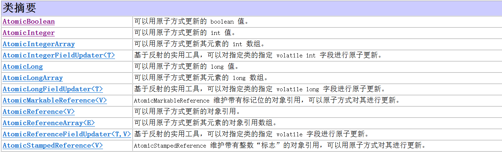

### 多线程

### 概念

- 并发
- 并行
- 进程
- 线程

#### java中线程的调度方式

抢占式调度（随机分配CPU资源）


### 多线程的三种实现方式

- 高耦合

```java
public class Main {
    public static void main(String[] args) {
        Mythread t1 = new Mythread();
        Mythread t2 = new Mythread();

        t1.start();
        t2.start();
    }
}

class Mythread extends Thread{
    @Override
    public void run() {
        //DoSomeThing
    }
}
```

- 低耦合

```java
public class Demo03 {
    public static void main(String[] args) {
        Thread t1 = new Thread(new MyRunnable());
        t1.start();

        Thread t2 = new Thread(new MyRunnable());
        t2.start();


    }
}
class MyRunnable implements Runnable{
    @Override
    public void run() {
        //DoSomeThing
    }
}
```

- 可以具备返回值

```java
import java.util.concurrent.Callable;
import java.util.concurrent.FutureTask;

public class Main {
    public static void main(String[] args) {
        MyCallable mc = new MyCallable();
        FutureTask ft = new FutureTask(mc);
        Thread t = new Thread(ft);
        t.start();

        Ft.get()//获取方法的返回值
    }
}

class MyCallable implements Callable<String>{

    @Override
    public String call() throws Exception {
        for (int i = 0; i < 100; i++) {
            System.out.println(Thread.currentThread().getName()+"@@"+i);
        }
        return "return";
    }
}
```

### 线程的常用方法

`String getName()`返回该线程的名称

`void setName()`设置该线程的名称		可以在`Thread`类的子类中创建有参构造，传入线程名

`static Thread currentThread()`获取线程对象

`void setPriority(int newPriority)`更改线程的优先级		线程的优先级范围为（1-10）

`int getPriority()`获取线程的优先级		线程的优先级范围为（1-10）

`void setDaemon(boolean on)`将该线程标记为守护线程或者用户线程

`void sleep(long millis)`使当前线程休眠millis毫秒

`long getId()`返回该线程的标识符

### 什么是线程安全？

[图解线程安全]:https://juejin.cn/post/6844903890224152584


### 线程不安全的原因


### synchronized

**同步** ：如果多个线程在同步代码块上使用的锁对象是同一个，那么这个几个线程是同步的。

#### 同步代码块

在同步代码块中的代码每次只允许最多一个线程进入执行，需要保证多个线程所执行的代码用的是一个锁对象

```java
synchronized (锁对象){
    
}
```

#### 同步方法

非静态的同步方法的锁对象是`this`，静态同步方法的锁对象是`类名.class`

**非静态**

```java
synchronized void Demo(){
    ...
}
```

**静态**

```java
static synchronized void Demo1(){
    ...
}
```


### lock 接口

如果想让多个线程同步，则多个线程必须用同一个lock对象。

创建锁接口实现类对象 `Lock lock = new ReentrantLock();`

`void lock()`上锁

`void unlock()`开锁


### 死锁

锁的嵌套会很容易出现死锁的情况，开发中应当尽量避免锁的嵌套

```java
Object objA = new Object();
Object objB = new Object();

new Thread(() -> {
    while (true) {
        synchronized (objA) {
            System.out.println("线程1A");  //第一步： 线程1 执行到此处 被线程2抢到了cpu  此时 objA已经被锁上了。
            synchronized (objB) {            //第三步：线程1抢到cpu之后 进不去了因为 objB已经被线程2锁上了。只好让出cpu给线程2
                System.out.println("线程1B");
            }
        }
    }
}).start();

new Thread(() -> {
    while (true) {
        synchronized (objB) {
            System.out.println("线程2B"); // 第二步： 线程2 进来之后 执行到此处 被线程1抢到了cpu  此时objB被锁上了。
            synchronized (objA) {          // 第四步：线程2 拿到cpu之后 进不去了因为 objA已经被线程1锁上了。 也只能把cpu让给线程1......就这样让来让去    这就是死锁。
                System.out.println("线程2A");
            }
        }
    }
}).start();
```


### 线程间通信问题

**生产者消费者模式**


### wait、sleep、notify

- 区别：`wait`会将锁打开，`sleep`不会
- `wait`和`notify`必须使用锁对象来调用  (`wait`和`notify`是Object中的方法)
- `wait`和`notify`方法必须在同步代码块中被调用,在其他地方被调用就会报错
- `notify`是唤醒锁对象上的等待线程的随机一个，`notifiAll`是唤醒锁对象上的全部睡眠线程


### 阻塞队列

实现了Map接口，故有Map中的所有方法

构造方法：

```java
ArrayBlockingQueue<String> arrayBlockingQueue = new ArrayBlockingQueue<>(int capacity);
//capacity:阻塞队列的固定容量
```

方法：

`void put(E e)`将元素添加到队列尾部，如果队列已满，则等待可用空间

`E take()`获取并移除此队列的头部，在元素变得可用之前一直等待（如果有必要）。


### 线程的几种状态

NEW 
		尚未启动的线程处于此状态。 
RUNNABLE 
		在Java虚拟机中执行的线程处于此状态。 
BLOCKED 
		被阻塞等待监视器锁定的线程处于此状态。 
WAITING 
		正在等待另一个线程执行特定动作的线程处于此状态。 
TIMED_WAITING 
		正在等待另一个线程执行动作达到指定等待时间的线程处于此状态。 
TERMINATED 
		已退出的线程处于此状态。


### 线程池

#### ExecutorService接口

创建实例对象的方法：

`ExecutorService executorService = Executors.newCachedThreadPool();`创建一个最多容纳`int`类型的最大值的线程池

`ExecutorService executorService = Executors.newFixedThreadPool(10);`创建一个指定容量的线程池

创建新线程

```java
executorService.submit(()->{
				//重写方法
			});
```

销毁线程池

`executorService .shutdown()`


#### ExecutorService的实现类：ThreadPoolExecutor

构造方法：

```java
ThreadPoolExecutor(int corePoolSize,
                   int maximumPoolSize, 
                   long keepAliveTime,
                   TimeUnit unit, 
                   BlockingQueue<Runnable> workQueue, 
                   ThreadFactory threadFactory, 
                   RejectedExecutionHandler handler)

//参数一：核心线程数量
//参数二：最大线程数
//参数三：空闲线程最大存活时间
//参数四：时间单位
//参数五：任务队列
//参数六：创建线程工厂
//参数七：任务的拒绝策略   
    
/*	拒绝策略：
ThreadPoolExecutor.AbortPolicy: 	丢弃任务并抛出RejectedExecutionException异常。是默认的策略。
ThreadPoolExecutor.DiscardPolicy： 	丢弃任务，但是不抛出异常 这是不推荐的做法。
ThreadPoolExecutor.DiscardOldestPolicy： 抛弃队列中等待最久的任务 然后把当前任务加入队列中。
ThreadPoolExecutor.CallerRunsPolicy:         调用任务的run()方法绕过线程池直接执行。
*/
```


### volatile


### 原子类（乐观锁）

针对多线程中数据的修改，使数据具备原子性

****

`CAS`算法

方法查`API`


### 悲观锁与乐观锁

**悲观锁**
总是假设最坏的情况，每次去拿数据的时候都认为别人会修改，所以每次在拿数据的时候都会上锁，这样别人想拿这个数据就会阻塞直到它拿到锁（共享资源每次只给一个线程使用，其它线程阻塞，用完后再把资源转让给其它线程）。传统的关系型数据库里边就用到了很多这种锁机制，比如行锁，表锁等，读锁，写锁等，都是在做操作之前先上锁。Java中`synchronized`和`ReentrantLock`等独占锁就是悲观锁思想的实现。

**乐观锁**
总是假设最好的情况，每次去拿数据的时候都认为别人不会修改，所以不会上锁，但是在更新的时候会判断一下在此期间别人有没有去更新这个数据，可以使用版本号机制和`CAS`算法实现。乐观锁适用于多读的应用类型，这样可以提高吞吐量，像数据库提供的类似于`write_condition`机制，其实都是提供的乐观锁。在`Java`中`java.util.concurrent.atomic`包下面的原子变量类就是使用了乐观锁的一种实现方式`CAS`实现的。

**两种锁的使用场景**
从上面对两种锁的介绍，我们知道两种锁各有优缺点，不可认为一种好于另一种，像乐观锁适用于写比较少的情况下（多读场景），即冲突真的很少发生的时候，这样可以省去了锁的开销，加大了系统的整个吞吐量。但如果是多写的情况，一般会经常产生冲突，这就会导致上层应用会不断的进行`retry`，这样反倒是降低了性能，所以一般多写的场景下用悲观锁就比较合适。

https://blog.csdn.net/qq_34337272/article/details/81072874


### 并发工具类

#### 双列集合类：HashTable

因为`HashMap`是线程不安全的，所以在开发多线程时，可以使用`HashTable`类来保证程序的线程安全

`Properties`是`HashTable`的子类，所以`Properties`也是线程安全的

`HashTable`在操作集合数据时，会将整个`hash`表都锁起来，所以效率特别低下


#### ConcurrentHashMap

jdk1.7之前原理：
				使用的哈希表的嵌套， 并使用悲观锁synchronized对小哈希表进行局部锁定，所以他可以同时使用16条线程共同操作此集合。
jdk1.8之后的原理：
				对横向的数组数据 使用乐观锁CAS
				对竖向的链表和红黑树 使用悲观锁synchronized 锁对象是红黑树或者链表的头结点。	


### CountDownLatch

可以设置某一线程 等待其他几条线程结束之后 再开始执行

`countDown()`

`await()`


#### Semaphore

限制同一时间线程执行的个数

`acquire()`

`release()`
