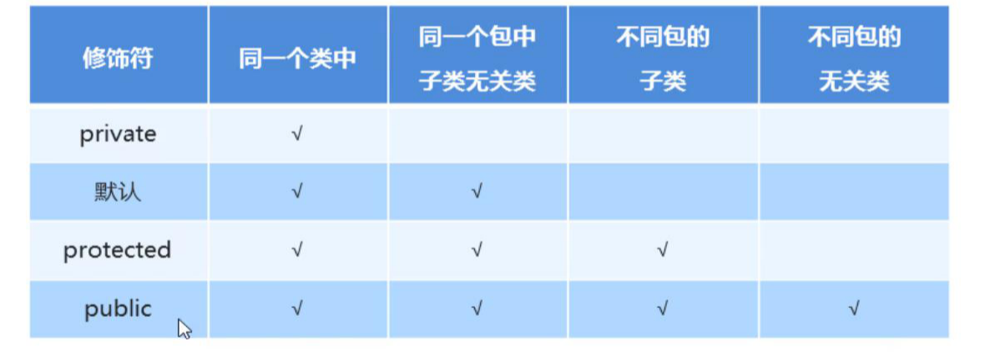
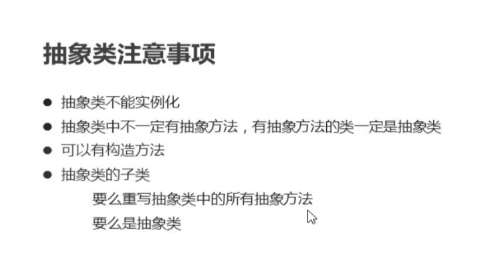

### 继承

> 继承关键字：extends
>
> 父类、超类、基类
>
> 子类、派生类

#### 注意事项：

子类继承父类 不能访问父类 私有的内容（权限不足）

#### 继承的好处和弊端

> 好处： 提高代码的复用性  
> 弊端： 加剧了代码的耦合性
> 开发中设计程序的原则： 高内聚 低耦合

#### 方法的重写

> 方法的重写：
> 			重写 和重载的区别：
> 					重写: 子父类关系中，子类出现了 方法声明 和父类的方法 一模一样的方法 ， 就是方法的重写。
> 					重载:  在同一个类中 方法名相同  参数列表不同  返回值类型无关
>
> **重写的注意事项**
>
> - 私有的方法不能重写--
>   - 是因为 子类访问不了父类的私有方法 ，访问不了 也就重写不到。 并不是 只有父类私有的子类访问不了， 父类其他权限修饰符的 的一些方法 子类也有可能访问不到。
> - 静态的方法 不能被重写
> - 子类重写父类方法权限修饰符大于等于父类方法的权限修饰符
>
> **构造方法**
>
> - 子类在创建对象的时候，必须去调用父类的构造方法（语法规定）
>
>   - 是因为：子类创建对象要使用的时候，保不准就会用到父类的内容， 所以一定是先去把父类在内存中初始化
>     - 如何把父类在内存中初始化？
>       - 就是访问父类的构造方法，在内存中初始化。 父类初始化完了之后，子类再继续初始化子类的。
>         		
>
> - 所以构造方法的访问特点有如下几个：
>   	1: 子类的所有构造方法的第一行 ，都默认有一个 `super();`（不写父类构造方法时jvm会自动添加父类空参构造）用于访问  父类的无参构造。
>   	2：当手动给出  `super();`,  `super(参数);`父类构造方法时， 系统就不再提供默认的 `super();`
>   	3：访问构造方法的语句，必须放在构造方法的第一行。
>   	4：当父类没有无参构造方法的时候，必须要做 **子类初始化之前先初始化父类**这一点，
>   		- 访问 父类的其他有参构造。
>   	 - 访问 子类其他的构造方法。 无论哪一种，做到子类初始化之前 必须先初始化父类就可以。
>   	
>   	5：子类初始化之前，必须先初始化父类，初始化一次（必须一次），所以  this() 和super() 都必须放在第一行，所以他俩不能共存。
>   	
>   	```java
>   	class Fu{
>   		public Fu(int a){
>   			System.out.println("Fu类有参构造方法");
>   		}
>   	}
>   					
>   	class Zi extends Fu{
>   		public Zi(){ 
>   			super(10); // 编译成功了， 这是在手动的访问父类的有参构造
>   			System.out.println("zi类构造方法");
>   		}
>   		public Zi(int a){ 
>   			super(10);// 编译成功了， 这是在手动的访问父类的有参构造
>   			System.out.println("zi类有参构造方法");
>   		}
>   	}
>   					
>   	class Test{
>   		public static void main(String[] args){
>   			Zi z = new Zi();	
>   			/*打印内容：
>   				Fu类有参构造方法
>   				zi类构造方法
>   			*/
>   		}
>   	}
>   	```
>   	
>   	

#### 抽象类

> 抽象类使用`abstract`修饰
>
> 一个类中如果包含抽象方法，那么这个类就必须要定义为抽象类

**特点**

> 1、抽象类不能被实例化
>
> 2、抽象类里面可以没抽象方法，但是有抽象方法的类必须是抽象类
>
> 3、普通的类继承抽象类，则必须全部重写里面的抽象方法。


### 权限修饰符



### 抽象类



